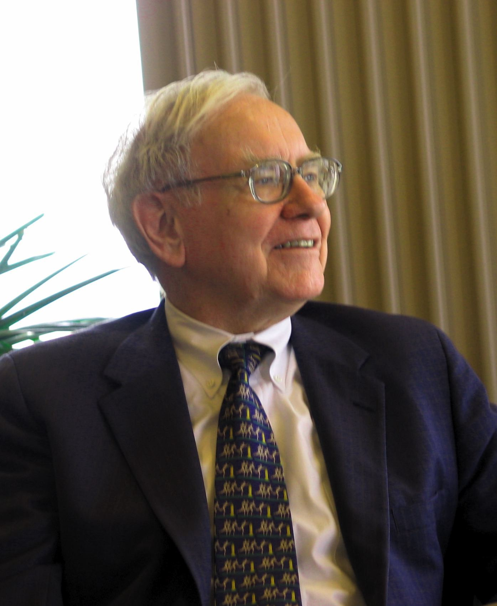

<figure>

<figcaption>

Warren Buffet - By Mark Hirschey — Work of Mark Hirschey, CC BY-SA 2.0, [https://commons.wikimedia.org/w/index.php?curid=2581999](https://commons.wikimedia.org/w/index.php?curid=2581999)

</figcaption>

</figure>

**Warren Buffett** is renowned for being the most successful investor ever. At the time of this writing his net-worth is **85 Billion USD** and is the third richest man in the world. He made his money through investing.

He is known to _pick value stocks_ and keep them in his portfolio for a _very long time_ and generate returns in multiples. He is also known for his simple living and self discipline when it comes to spending money.

More than anything he has given away several Billions of dollars to charity and has inspired others _(Bill Gates)_ to do the same.

Although Warren Buffett’s investment career is inspiring, his methods of investing are not useful or even down-right counterproductive to the vast majority of investors. Here are the reasons why?

## **1\. Buffett started out big**

Size does matter. His starting capital in today’s $s is well over a Million Dollars. The power of compounding produces _exponential differences_ with time.

Assume a small investor who started at the same time as Mr. Buffett but with **50,000$** while Buffett started off with **1,000,000$**. Let’s say that both investments make **10%** compounded for **25 years**.

After 25 years Buffett’s investment is worth **10,834,705$** whereas the investment of the small investor is worth **541,735$**. The initial difference in wealth between Buffett and the small investor was **950,000$**, the difference after 25 years is a phenomenal **10,292,970 $**!!!

Starting out big has the advantage of being able to **_diversify_** better thus allowing to reduce risk for a comparable amount of return.

Most small investors have a concentrated investment portfolio represented mainly by the mortgage which is a **_leveraged real-estate exposure_**. It is hard to diversify away the risk presented by such a large investment which is typically **15x times annual gross income**.

Starting Big has advantages beyond size. It gives the **_power to influence_** your investment targets, especially when you invest in smaller business. This is something that Mr. Buffett did early on. He is even bigger now, to the level that he has board level presence to influence the course of business decisions.

As a small investor, there is very little influence one can have over the management of the companies one invests in. Sure, as an investor one has a vote that can be exercised in shareholder’s meetings on important management decisions, but, these are mostly ineffective.

Primarily because unlike a political democracy the number of votes allocated are proportional to the size of the investments i.e. **One Share One Vote** ( There are a few alternate systems where the paradigm is One Shareholder One Vote but not as prevalent)

## **2\. Buffett had the right connections**

He was well connected to the investment world having worked for **Benjamin Graham**, the guru of value investing. His father **Howard Buffett** was a four time Republican Representative for the state of Nebraska.

Even though there is no direct evidence that Warren Buffett benefited from his father’s credentials it is immensely helpful especially when you are raising capital to invest.

## **3\. Buffett used leverage differently**

In simple terms, leverage is the use of other people’s money to invest. For small investors, borrowing from a broker or borrowing from the bank are some of the only few ways one can use leverage.

The disadvantage of this type of borrowing is that the small investor has to take on all gains and losses with the lenders accepting _minimal to no risk_.

Buffett had the advantage of a much more safer way to gain leverage. It was leverage through equity. Essentially Buffett invested on behalf of his partners and the gains and losses were shared. This structure continues to be used today where the investors indirectly own investments through investing in Berkshire Hathaway.

## **4\. Buffett was plain Lucky**

There is a reason why there is only **1 Warren Buffett**, because **_there can be only one_**.

Allow me to explain using a thought experiment.

Let’s say we put **1000 people** into a room to find out who is the best coin flipper.We can set an arbitrary rule to define success in coin flipping as **_being able to consistently flip heads_**.

With 1000 people in the room and 1000 coins in their hands the experiment begins. All the Coin Flippers are asked to flip the coin once. Assuming a fair coin, approximately half of the Coin Flippers would have heads and half of them tails.

Let’s say we have **_500 people who came up with heads_**. We ask the remaining 500 people who got tails to leave the room.

Then the experiment is repeated again. We have 250 people remain in the room who got heads and the remaining 250 leave the room. This experiment is repeated multiple times and we have fewer and fewer people left in the room i,e **250,125, 63,31,16,8, 4,2,1**.

So, in about 10 runs of the experiment **_we went from 1000 to 1_**. So the last remaining person was able to **_flip the coin to land heads 10 times in a row_**. What is the probability of that happening? It is 1 in a 1000 or about 0.1%.

The question now is — is that person special?

**_Our common sense says no._**

The reason is that if we repeat this experiment again, starting off with the same 1000 people the last remaining person will **_be very likely different_**.

Stock picking is a similar endeavor. There are several studies that show that stellar fund managers many do well in the short term but being consistent **_over the long term is very rare_**. Using our previous example there were 250 people who got heads twice in a row but only one of them survived 10 iterations.

With millions upon millions of investors trying to pick stocks it is only inevitable to have 1 or a very few investors that end up having made all the right decisions at the right time. This, however, **_does not imply any specific skill_**.

This seems counter-intuitive but there are several peer reviewed publications that support this point of view.

## **5\. Finally, Because Buffett says so!**

Don’t take my word for it. In one of his recent letters to the Shareholders of Berkshire Hathway, Warren Buffett stated that upon his death, he wants the trustee of his Wife’s inheritance to invest [**90% in low-cost Index Funds**](https://seekingalpha.com/article/4239453-buffetts-barbell-90-percent-equities-10-percent-cash-wife-berkshire-maybe-retirees) and the remaining **10% in short-term government debt**.

Buffett himself seems to be aware that it is nearly impossible to find someone to replicate his amount of success to manage his own Wife’s portfolio!!!

If passive investing is the next best thing to being Mr Buffett then I think it should work for the _vast majority of investors_.

## **Does it mean we have nothing to learn from Warren Buffett?**

Not really, I think there are a few things that are worth emulating. Firstly it is his **_investment discipline_** and taking a **_long-term view_** and not trading often.

Warren Buffett is the broker’s _worst nightmare_. He buys a stock and then does not churn it for decades. His success proves that **_Buy and hold_** outperforms trading or market timing over the long run.

One other very important trait is his humility in accepting the fact that he is wrong and getting out of losing positions instead of holding on to them for egotistic reasons.

This is reflected in his letter to the shareholders of Berkshire Hathaway after the estimated losses of **3.5Billion $** on Dexter Shoes in the 90s.

> **“Dexter is the worst deal that I’ve made. But I’ll make more mistakes in the future — you can bet on that.”**
