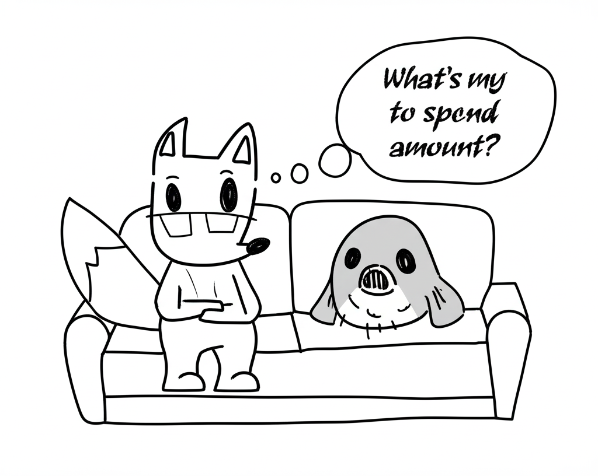

I think there are three levels of spending—or withdrawal—from a corpus after achieving FIRE (Financial Independence, Retire Early). These three levels can be categorized as **Must**, **Should**, and **Could** spend.

Let’s start by exploring the **Must** and **Could** spend categories before diving into the more nuanced **Should** spend.

<figure>



<figcaption>

Fox and Fugoon in deep contemplation

</figcaption>

</figure>

---

## Must Spend

This is the minimum amount needed to live a **comfortable** life. What constitutes "comfortable" is subjective, but regardless of how you define it, your withdrawal rate should align with this minimum level of spending. Depending on your corpus and lifestyle, this could be 1%, 2%, or even 4% of your portfolio.

**Example:**  
If someone has a $2M portfolio and requires $50K per year to meet their basic needs, the withdrawal rate would be 2.5%.

---

## Could Spend

This is the **maximum** amount you could withdraw and still stay safely FIRE’d. According to the well-known Bengen study, this is around a 4% withdrawal rate. However, it's essential to note that your **realized** withdrawal rate will vary based on portfolio fluctuations and inflation.

> Realized withdrawal rate varies with portfolio fluctuations and inflation.

**Example:**  
Suppose someone retires with a $1.25M portfolio and plans to withdraw 4%, which gives them $50K/year (adjusted for inflation). A year later, their portfolio grows to $2M. Even if they stick to the same $50K/year withdrawal, it now represents just 2.5%.  
Conversely, if the market dips and the portfolio shrinks to $1M, then $50K/year becomes a 5% withdrawal—exceeding the safe 4% threshold.

However, the Bengen study accounts for such volatility, including historical events like the Great Depression and multiple recessions. Over a 30+ year period, a 4% withdrawal rate has been shown to be sustainable.

---

## Should Spend

Now, let’s consider a scenario where someone retires with a portfolio larger than needed for a 4% withdrawal rate.

Reusing the earlier example:  
The person is withdrawing $50K/year from a $2M portfolio—just a 2.5% withdrawal rate, which is well below the 4% "Could Spend" ceiling.

The key point:  
If they consistently withdraw only this amount, the portfolio will likely **outlive** them. That’s fine if your goal isn’t to [die with zero](https://happypathfire.com/post/die-with-zero/).  
But if your aim is to **optimize spending during your lifetime**, then you enter a unique zone: the **Should Spend** zone.

**Should Spend** lies somewhere between _Must_ and _Could_ spend—provided the “Could Spend” amount is meaningfully higher than the “Must Spend” amount.

Here’s a simple rule of thumb:

```
If (Could Spend) > 2 × (Must Spend) → Start considering Should Spend.
```

---

### Why Should You “Should Spend”?

Let’s explore what happens if you _don’t_ spend this in-between amount.

#### 1. Exceeding Reasonable Spend

Under-spending can lead to portfolio growth that exceeds what you can **reasonably** spend in your lifetime. Sure, no money is truly “unspendable” (unless you're a billionaire), but everyone has a mental benchmark for what feels like a _reasonable_ level of consumption.

#### 2. Mental Health

The FIRE journey is tough. The community is full of people who go to extreme lengths to save—some even live minimalist lifestyles on less than $10K/year. For example, Jacob Fisker from [Early Retirement Extreme](https://earlyretirementextreme.com/) reportedly lives on less than $10K a year in the U.S.

No judgment here, but for many, maintaining such frugality over decades—especially **after** reaching FIRE—can take a toll on mental health. It's one thing to live frugally during the accumulation phase with a better future in sight, but quite another to continue the same lifestyle during the consumption phase when your portfolio can clearly support more.

#### 3. Opportunity Cost

Only two things in life are certain: **death and taxes**. After death, your assets will:

1. Be inherited
2. Be taxed
3. Be donated

That’s it. That’s the **entire list**. All the infinite ways you could have used your money while alive collapse into these three posthumous outcomes.

This stark reduction in options represents lost opportunities. You could use your “Should Spend” to:

- Enjoy more experiences
- Help friends and family
- Support causes (non-profit or even for-profit)

You’re not obligated to donate or spend recklessly—but just know that after you're gone, the flexibility is lost. Your wealth’s **utility drops dramatically**.

---

## Closing Thoughts

The FIRE movement emphasizes _freedom_, not just frugality. Once you’ve secured your _Must Spend_, and confirmed that your _Could Spend_ is comfortably within safe bounds, it’s worth thinking seriously about your _Should Spend_. Not just for the numbers, but for your happiness, fulfillment, and peace of mind.

Post-FIRE isn’t just about survival—it’s about **thriving**.

**Welcome to HappypathFIRE.**