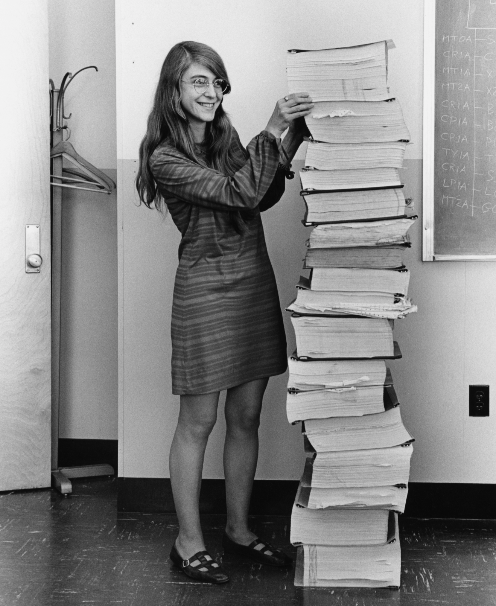
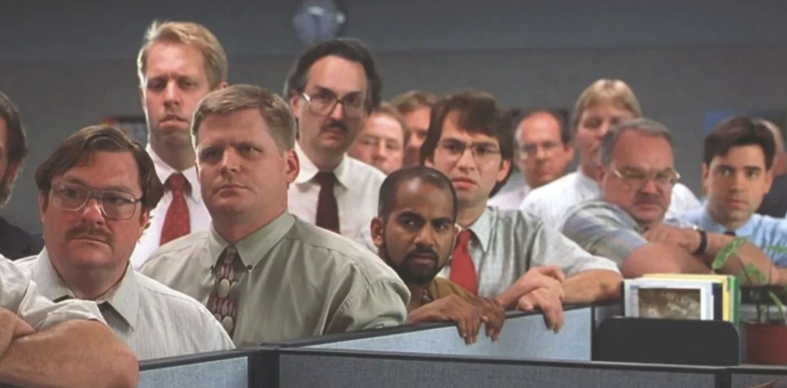

## They took our jobs!!!

***AI will take our jobs!!!*** - This has now become a slogan that has become universal. It is taken seriously in some professions. But, in few other professions people counter it by saying *AI will never take **MY** job*, people like chemical plant workers, farmers, plumbers or electricians etc.  - i.e. those who work with atoms.

The ones taking it seriously are *knowledge workers*, like Software Engineers, Digital Product Managers, BPO (Business Process Outsourcing) workers, Copy writers, Data Analysts/Scientists, accountants, legal assistants etc. - people who work with electrons i.e. computers on a desk.

No knowledge worker is taking it more seriously with the highest conviction borne out of actual everyday use than Software Engineers(SWEs).
The so-called term ***AI Psychosis*** is a very real and tangible state description for how many Software Engineers feel about AI. The simple reason being AI in the form LLM based Coding Agents are great at all coding tasks and more importantly, they are improving at an exponential pace.

### Why are LLMs great at coding tasks?
There are 3 main reasons for this. 

First, there is the availability of really high quality data in the form of public GitHub repos and StackOverflow threads that are rich in content that is public, organised and ranked by the collective work of millions of Software Engineers (As of mid 2025 StackOverflow had 29Million registered users and Github has 30Million repos and 180Million users).

Second, it is easier to train on this high quality data during the RL(Reinforcement Learning) phase. Code is testable and the results are binary. (*Only in very specific cases like Self-driving where code interfaces with real-world physics with near zero fault tolerance is where it is a bit behind the curve.*)

A LLM Agent can spin up thousands of VMs(Virtual Machines) and run millions of versions of the problems to be solved, test the results and improve the Model. 

Finally, during the course of real-world implementation, the LLMs get 'coached' on the job by the same SWEs. Where real users patiently and inadvertently train their replacements.

Everyday, across every IT team in every industry around the world SWEs are having the same conversation at water-coolers and lunch-breaks. These conversations are along the lines of: 

>'*AI did more of my tasks today with minimal guidance than it did a week ago. I am not sure what is left for me to do....*' . 

This leads to a brief and pensive silence in the group before acknowledging the collective sense of doom and some gallows humour. This repeats day after day - *ad infinitum*.

## A brief history of Coding
I think this is a unique time in history to reflect upon how we got here from a SWE perspective.
Here is a (very) brief and non-comprehensive history of Software Engineering.
This is a broad strokes outline of the pivotal moments in the brief history of coding or to be really specific - ***Human hand-written code***
### Von NeuMann Machines
In 1945, John von Neumann described the architecture of a computer in the [First Draft of a report on the EDVAC](https://en.wikipedia.org/wiki/First_Draft_of_a_Report_on_the_EDVAC) . The core concept in the architecture was that both the inputs for the computation and the instructions for the computation were stored as data in memory. This is popularly known as the ***Stored program computer***. I think this marks the advent of programming or 'coding'. 
The powerful insight here is that the instructions or the code can be written ahead of time, edited, saved, copied and in some cases letting the code itself be modified by the data.

According to [wikipedia](https://en.wikipedia.org/wiki/History_of_software):
>The very first time a stored-program computer held a piece of software in electronic memory and executed it successfully, was **11 am, 21 June, 1948,** at the University of Manchester
### Women in tech
These days there is quite a passionate movement regarding involving women in *tech*. The tech the members of this movement are predominantly concerned about refers only to the lucrative parts of technology, which currently is Software Engineering and related roles and does not refer to Off-shore-rig welding, High-voltage transmission line installation, Blast-furnace operation, Block caving and shaft mining etc.

<figure>

<figcaption>

Margret Hamilton (1969) - The first SWE

</figcaption>

</figure>

Not very long ago ***Women were tech***. During WW2, a computer was a human being, almost always women. Large groups of women would painstakingly perform computations manually to calculate ballistic trajectories, crypto cyphers etc .
As technology improved and the first computers using the Von Neumann architecture were built, women became the first software engineers and completely dominated the field. 
In fact, Margaret Hamilton is credited with coining the term '**software engineering**' during her time at NASA during the Apollo missions. 
Ever wondered why the NVIDIA AI chip is called *Grace Hopper*?

### The PC
During WW2 computing was expensive and required budgets of powerful nations to build and operate. The cold-war and especially the Space-Race gave software an additional boost. However, coding was something one performed at an institution, like a government body, a large corporation or a well endowed academic institution. 
All of this changed with the advent of the PC - Personal Computer in the 1970s.
The fact that the word computer needing a prefix ***'Personal'*** implies how *impersonal* computers were until that point.

### Coding is for losers
Towards the end of the 1970s and the early 80s, personal computers became widely available. Corporations of all shapes and sizes were able to access and utilize computers. Software Engineering became a reasonable career option.
 IT (Information Technology) departments were formed and were assigned the pejorative category of **cost-center**.  Coding was seen as a necessary evil at these companies. The coder was seen as an anti-social nerd who had an obsessive compulsive need to work with abstract things called 'code'. 
 
 I guess one of the reasons that kept women away from coding during this period after the heydays of WW2 and Apollo missions was that coding became an unglamorous profession. It was underpaid, under-appreciated grunt-work performed in windowless cubicles under noxious fluorescent lights and a million miles from being called 'sexy'.

Popular culture depicted this stereotypical character in several movies and TV shows. The 1993 movie **Jurassic Park** depicts one such disgruntled software engineer.  The 1999 movie **Office Space** is one of the most accurate depictions of the coder stereotype in popular culture.

<figure>

<figcaption>

Nerds in a cubicle farm - from Office Space (1999)

</figcaption>

</figure>

### Y2K - You broke it, You fix it

Y2K - Year 2000 issue in coding refers to the problem of storing years in a date using the last 2 digits of the year i.e. 1905 stored as 05. This would be a problem when the year becomes 2005. This simple issue required the debugging of millions of lines of code. **Manually**. There was a global scare during this time. 

Some people thought nukes would go off due to this software bug and Bank Mainframes would crash with people losing all their life-savings. 
The 'fix' required a global effort. It was the largest software spend until that time. About 500 Billion dollars(in today's dollars) were spent globally to solve this issue.
It also marked the beginning of importing lower-cost engineers from developing countries, outsourcing, offshoring etc. 
Coding became important for a brief period of time. However there was no social status yet. The general attitude was 'you broke it, you fix it'

### 15 minutes of fame

The dot-com bubble of the 90s that ended with the crash in the 2000s put coding into the lime-light, however briefly. This was the first brush with fame for coders.
The crash put the profession back into its place until the emergence of giants like Google, Amazon, Facebook. 
### Clouds and beyond

I think Google under Larry and Sergey should be credited with making the job of the coder cool. The company provided something that coders for decades coveted and deserved - **respect and dignity**. The cream of the cream wanted to work at Google and the results were there to see. Google became a formidable giant in a very short period of time and wall-street took notice (again). 

The rise of coding started in the 2010s and this time it was no longer a passing fad. The nerds were in-charge. Thanks to the convergence of several mega-trends like the iPhone, high-speed internet, social media, e-commerce and cloud computing the need for code and coders became insatiable.
Management was no longer looking at IT as a cost-center but as a revenue generator or core differentiator.

### Hubris

This trend continued up into the right and really peaked during the pandemic and post-pandemic era where salaries for coders at Mega-Cap tech companies reached **10X of the median wage in the US**.
Thanks to the likes of Google and Meta, coders were treated like super-stars. Offices had catered lunches, designer furniture, massage and in some extreme versions in China , hot female cheer-leaders. 

Coders had come a long long way from the despicable sterile windowless cubicle.
This period also coincided with talent wars where the pent up demand from the pandemic was creating a shortage of everything and most importantly SWEs. 
It was not uncommon for SWEs to demand and command respect AND \$$s
along with flexible timings, unlimited vacations and truly grotesque sign-on bonuses. 
This prosperity of course attracted attention and thus began opportunistic socialist movements like 'women in tech', 'DEI' to grab a slice of the cake.

As a product manager at a big tech company I had the regrettable experience of catering to and cajoling my engineering teams to deliver. An estimate for a drop-down was at least 1 week. As a former SWE myself, I knew this was just absurd but my management had to reel in my vocal outcry as SWEs were beyond criticism. They were **Nietzsche's *Ubermench*** indeed.
### ChatGPT moment
Towards the end of 2022 while most of us were still recovering from the ravages of the pandemic, a little known company called OpenAI released ChatGPT. This was just *yet another version* of earlier models by the same company from earlier years.

The most common way to access it was through a chat interface. 
People used it playfully, asking it to add two numbers or count the number of 'r's in Strawberry and laughing at the erroneous results. 

However, very quickly careful observers realised its potential and more people were getting convinced of its utility as evidenced by the exponential curve of adoption.

This is referred to as the *ChatGPT moment*. 

I think it is not one universal date. Every individual has had a personal experience with these LLMs. Maybe not in 2022, perhaps in 2024 or last week. But, it doesn't matter. Once someone has had the experience of '***Oh! this thing is way smarter than I had thought***', that is the *ChatGPT* moment for *that* person. A baptism of sorts.

### Deflation
The *ChatGPT moment* experience has sufficiently percolated across the economy. Especially in the context of coding. This implies that the premium paid to the skill of coding will deflate rapidly. It is no longer conceivable to pay 400,000$s to a computer science grad fresh out of school while an aerospace engineer (way more smarter and hardworking) gets 40,000\$s.  

SWEs should now accept the fact that their wages will converge to the median over time. This requires lifestyle adjustment. Understandably, a hard pill to swallow.

## RIP Coding - 1948-2026
Early on LLMs were useful for code completion. Snippets of code or making small tweaks to existing components. This felt like working with a fresh off the school intern.
But, unlike human interns, LLMs have been really fast learners and here we are at this current moment where **it is probably writing 90% of all code written in any 24 hour period**. 

This is just my estimate and I might be under-shooting. **By a lot**.

At this pace, I think coding by human hands will be a rare exception than the norm by the end of 2026.

Since building AI itself is a form of coding the question arises if AI is so good at coding then can it build itself? [Anthropic thinks](https://www.anthropic.com/institute/recursive-self-improvement) that they are already there.

So, it's doomer time now???

## Not the first, Not the last
The existential crisis that SWEs are currently going through is not unprecedented. 

Until the late 19th century Painters were some-what like Software Engineers at their peak. Painting was a vocation. It was artisanal and skill levels varied vastly. People went to school to learn painting and hoped to make a reasonable living out of it.

Painters prided themselves in being able to recreate scenes like coronations, baptisms, grand banquets, historical events with **life-like reality**.

Portrait painting was the most common art form. Getting your portrait done needed money and influence. Getting a portrait done by a star painter needed more than mere money. These painters demanded and commanded respect. 

An estimate for a portrait could be a few days to several months if the 'divine' inspiration was not forthcoming. i.e. the familiar ***Ubermensch*** attitude.

Enter **Photography**. The invention and rapid improvements in photography was a death-blow to the painting 'industry'. A photograph, especially in color, was infinitely more precise than whatever any painter could ever hope to paint.

This led to a sense of doom and existential soul-searching in the painting 'industry'.
This ultimately led to the birth of modern art. Painters started painting stuff that is anything but reality. As time went on painting became more and more divorced from reality into the realm of the truly absurd.

This is what Picasso drew at age 13:

<figure>

<figcaption>

First Communion (1896)- His sister Lola in the old style (from: Museu Picasso, Barcelona)

</figcaption>

</figure>

And this is what he drew later:

<figure>

<figcaption>

Lola, the Artist's Sister, in the Studio (1900)- His sister Lola in Modern art (from: Museu Picasso, Barcelona)

</figcaption>

</figure>

These days painting is seen as something queer. Getting your portrait done is met with eye-rolls at a minimum if not outright disdain. Yes, modern art exists, kinda. But no one really cares. At least not the vast majority of people. Their lives are not impacted by it. People don't get into painting universities in large numbers hoping to make a living out of it.

## The modern art of Coding

Coding or more precisely human-hand-coding has already become like portrait painting. **Expensive, error-prone and slow**. 

Does it mean the end of SWE as a role? i.e. not mere layoffs but extinction like elevator operators?

Here, I think and speculate that there are reasons to be hopeful.

### Software Engineering >> Coding

SWEs have been the most pragmatic of engineering disciplines to build and adopt tools to improve their productivity. First came the High-level languages to break the tyranny of assembly level coding. Then came innovations like Object Oriented programming. 

Powerful IDEs(Integrated Development Environments) supercharged software building.
LLMs are the ultimate upgrade to the TASK of coding.
With LLMs SWEs no longer have to concern themselves with coding and spend their time at doing better and more useful things.

IMHO, there are, broadly speaking, 2 main categories of these things - **Computer Science** and **Systems Thinking**.
### Infinity Game
Historically speaking, computer science was a part of the mathematics department before being elevated to its own branch thanks to generous private funding and notoriety.
I think it is time for computer science to come home. Back to the realm of mathematics. In this home lie infinities. 

The set of all theorems in mathematics is infinite. A sub-set of this infinity, the set of theorems within computer science is also infinite. This is a game of infinities.

Even if the entire mass of the universe were to be converted to GPUs and all forms of energy available in the universe applied to generating and proving theorems until the heat death of the known universe, the percentage complete will be 0%.

Computer science is not an easy discipline to grok but for the ones who are motivated and interested it is a truly infinite game. The doomer question of '***What is left for me to do?***' no longer arises. Because, the answer is '**actually, an awful lot!**'
### Systems Thinking
Software Engineers build systems. Coding is a means to achieving this. By *Systems* I include software, humans, societies, culture etc. This is a broad and open definition and intentional. 

For example, Uber is not lines of code. It is a system. It includes commuters, drivers, banks, insurance, governments, taxi unions etc.
*Uberification* - a word that indicates a change in culture, a new way of organizing human society. 
Building, growing, adapting to emergent behaviours in complex systems is a countable infinite game. 

>Countable infinite - consider a hypothetical simple web page with 10 drop-downs with 10 items in each drop-down. This single page has 10^10 possible states. Now, consider Uber as a system. The number of states of the systems are extremely large. A countable infinity. Something that is untractable for LLMs. Human intuition and the ability to lead with *vision* is required to tackle the untractable. Not brute force. 

A new form of SWEs is required to rise above the mundane act of merely coding and transition into building systems. **Not just building but thinking in systems**. 

Seasoned Software Engineers are especially at an advantage as they have a code level understanding of the components. Freed from the drudgery of coding, fixing bugs, deployment ops etc, they can now focus on larger, more comprehensive and ambitious abstractions of SWE. 

I don't know what such a new role would look like exactly. However, intuitively, I think it will no longer be building and maintaining specific components like billing, onboarding etc or parts of processes like deployment, security etc. 

I think it will be something along the lines of ***complete and comprehensive ownership at a system level in an extremely flat organisation***. I think creative people should come up with a new name for this role.
*Systems Envisioner* or *Product Engineer* perhaps?

It may be insensitive to say this but I think this is the most exciting time to be a SWE. I am sure there are at least some SWEs who will agree with me. So many ideas in the backlog, so many pet projects all of them are now a prompt away from implementation. 
Once the list is empty, it leaves a blank slate. An invitation to new ideas!!! and **the set of ideas is a larger infinity than the set of mathematical theorems!!!!**