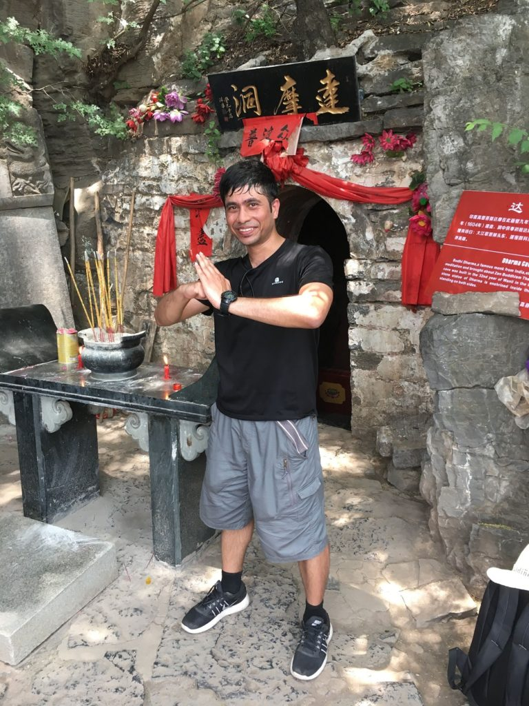

I have always been a fan of the Martial Arts. I grew up watching and idolizing Bruce Lee, Jackie Chan etc. Mom and I were fans of Bruce Lee! This prompted me to pursue the learning of Kung-Fu for several years in my childhood. 

As my career began to take its toll, I had to stop going to class and had no time or the space to practise. However, I continued to have a special place in my heart for martial arts.

In 2017 on my first visit to China, I made sure that I took a detour along the popular tourist route to visit the Shaolin Temple. I was the only foreigner on the bus to the temple. Most Chinese were content with just visiting the temple and the Kung-Fu school. But, I pushed myself to hike the Shaolin mountain to reach the cave of [Bodhi Dharma,](https://en.wikipedia.org/wiki/Bodhidharma) the Indian monk credited with the invention of Kung-Fu. 

<figure>

<figcaption>

yours truly at the Bodhi Dharma Cave in Shaolin, China

</figcaption>

</figure>

## Martial Arts as a Competitive Sport

Recently I discovered that the Olympics features a lot of martial arts as part of the Games - ex: Karate, Taekwondo, Judo, Fencing etc, (Kung-Fu is not part of the Games although it has its own World Championship)

I was watching a few Olympic matches from the recent games. These were not qualifiers but finals, semi-finals for Medals. I expected elite level performance. But, to my dismay, it was anything but ‘elite’.

The 2020 Olympic Gold medal Taekwondo finals for example was almost funny. Both players have torso guards and helmets. There are sensors embedded in the helmet, torso guard and also the socks. The points are primarily determined by the sensor readings and only exceptions go to the game referee.

This means that the players are simply trying to score points by hitting their ‘targets’. It was like an adult version of knee tag. 

I could not believe myself that a martial art at such an Elite level would be so technical devoid of any spirit. So, I watched other Olympic finals events for several other martial arts. They were all disappointingly similar. 

None of them were martial arts but just some version of “Point touching”.

## Incentives determine behavior

I would not blame the participants in the games. The incentive for winning Gold for their respective countries is to score as many points as possible. It has nothing to do with the founding principles or the spirit of martial arts.

Martial Arts, especially the ones that originated from the east embodied aspects of art, spirituality, honour and practicality.

Because of such gamification, martial arts in the Olympics and many other international tournaments has been reduced to some sort of a dance of Cowards with a desperate pursuit of a metal disc also known as a medal.

> ..reduced to some sort of a dance of Cowards with a desperate pursuit of a metal disc also known as a medal.

## Implications to FIRE

The insight from martial arts kept me thinking. I believe there are a lot of similarities that can be drawn to the modern workplace.

The modern workplace is gamified in a similar manner to competitive sports. They are all mostly zero-sum, meaning, if your colleague gets the promotion then you will not get the promotion.

## FIREd employees make the best Employees

I believe that employees who are close to FIRE or even the ones that have already FIREd make the best employees (yes, FIRE means ‘retired’, but [my definition is a bit more nuance](https://happypathfire.com/start-here/)d, ‘Retired’ from the pursuit of employment for the sake of income)

Just like in the games, a regular employee is more focused on making the Boss happy and appear productive. The FIREd employee instead focuses on solving problems as there is no incentive to impress anyone.

Similarly the regular employee plays politics to get ahead of his/her colleagues whereas a FIREs employee just focuses on doing what is right. 

One of the most impactful differences is ‘expressing opinions’. A regular employee is survival conscious and is careful not to contradict the boss even if he/she knows that he boss is wrong. A FIREd employee has little to lose and is free to express his/her opinion even if it goes against the grain.

I think, just like martial arts, when there are no competitive points based incentives(money in the workplace context),  the true spirit of work comes out. A FIREd employee, if they choose to work, they do so in an area that they are genuinely interested in and they just don't follow the hottest fad that pays the most.

I am aware that practically speaking, not everyone is FIREd or near FIRE. One may have to participate in the rat race for a multitude of reasons. But, the pursuit of FIRE has this added incentive of freedom to pursue work in areas of genuine interest and passion. This is a strong motivation factor to seriously pursue FIRE. Happy FIRE!!!!
