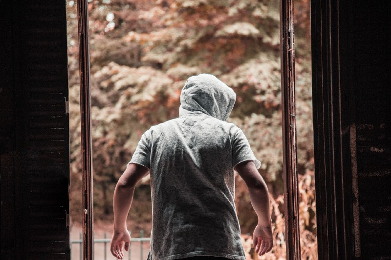

### **Introduction**

In this article I would like to describe the nature of one of the most powerful factors that one has to consider from a Personal Finance perspective. I have kept the discussion as non-academic and practical as possible. Any violations are purely accidental, probably a matter of habit. My apologies in advance.

### **Daylight Robbery!**

Imagine a hypothetical scenario. Your grandparents love you a lot and leave you a substantial inheritance which includes a sub-urban house. You decide to sell the house because the house is in a different city and being an absent landlord is too much work given your current circumstances.

The sale of the House yields **a Million dollars in cash** after accounting for all sorts of inheritance taxes. You are a diligent person and to be safe, you deposit your money in a reputable bank and carefully store your documents and digital passwords.

The friendly bank teller informs you that you will earn 2% per year in interest after tax. A quick mental math tell you that it amounts to 20,000$ every year! You are pleased with your decision, the rent that you could have earned from the house would be 10,000$s after accounting for maintenance costs and property and income taxes.

A guaranteed **extra income of 20,000$** of spending money with no additional work is amazing to say the least. You spend it on travel, lattes and other luxuries that you could not have spent on earlier.

Life has been good this past 5 years after making that great decision. You tell yourself that despite the lifestyle upgrade you are being conservative because you are not spending your inheritance which is safely deposited in the bank where **_no one can lay their hands on, Right?_**

Just to make sure, you go to your bank and ask the teller for your balance, it is still 1 Million dollars at the end of 5 years.

What if I told you that there is a thief who is invisible and **steals 40,000$ every year or 200,000$ over 5 years** from you without you noticing! Even if the money was at the safest of Banks! Hard to believe? Of course it is!

### **Reality Check**

At the outset you may disagree with my claims as you just checked your balance and it still says **_1 Million dollars in your account_**.

Allow me to back-up my statements, let us continue our hypothetical scenario. Imagine you withdrew your 1 Million dollars from the bank. The Bank Manager is a little upset but he allows you to take your money out.

You decide to buy the same sub-urban house that your grandparents left you. As luck would have it, the house is back in the market for sale. The only trouble is, **the asking price is 1.2 Million dollars** and was eventually sold at that price within the week!

You needed 200,000$ more to buy back the same house that you sold. **_This is the money that the Silent Thief stole from you_** _(200,000$ over 5 years or 40,000$ per year!)_

Even in the case that you do not spend the interest that you earned over these 5 years and used it towards buying the house, you would still need 100,000$ more!

### **Know your enemy**

It is important to know the nature of this thief if you would want to stop being robbed.

The official name for the thief is — **Inflation**!

A basic definition of inflation is increase in prices of things. We all know this from our experience. Almost everything goes up in price over a period of time, say 5+ years. Price of gas, price of tomatoes, milk, eggs, the Big Mac, MacBook Pro etc. Ever wondered why? The answer is inflation.

To understand inflation let’s visit the tiny island nation of **_Infland_**. There are 10,000 gold coins in total on this island, no more, no less. This includes all the coins in the wallets and purses of the people, the coins in the banks, in the lockers etc. These **_10,000 gold coins represent the total value of everything_** that can be bought and sold in infland, i.e. the total land, houses, grains, cattle, ships, carts etc. For example the cost of 10 acres of land is 1 gold coin.

One day, while trying to till the land, a farmer finds a huge treasure chest of a pirate. It contains 10,000 gold coins. The government of Infland confiscates this quickly. Now Infland has 20,000 gold coins. So, the total value of everything in Infland is **_now represented by 20,000 gold coins instead of 10,000 gold coins_**. Overnight the price everything is doubled. The 10 acres of land now costs 2 gold coins.

> If someone had only gold coins then their gold coins would have allowed them to purchase half as many things as the day before!

This is a very simple example of inflation. Something very similar to this happened in Western Europe between 1550 — 1750 A.D. It is called the **_Price Revolution._** This was mainly because of the influx of gold and silver from the newly discovered and conquered New World. Especially from current day Mexico and Peru. Prices increased by about 500% in this period!

It is OK to not understand it clearly as to what? and why? inflation comes to be. Even Nobel laureates in Economics still debate about the what? why? and how? of inflation. In fact, when it comes to inflation there are **_a bunch of theories, points of view and schools of thought_** instead of something clear and predictable like the gravitational laws of physics.

It is however important to know the implications from a **_FIRE perspective_**.

### **Protect your Hard Earned Money!**

So, based on the examples above it implies that having money either in cash or in the bank means that inflation silently steals from you. This leads to three possible alternatives to save your money from inflation.

1. Have no money
2. Have loans
3. Assets that compensate for inflation

The first alternative seems obvious. Having no money is the best way to ensure that no one can steal from us. It is the ultimate defense. It is probably the reason why **_monks with no money sleep well at night_**. In any case, this is not an alternative for regular people like you and me.

The second alternative is slightly evil. Having no money is like having 0, which means one cannot subtract anything from it. **_But having a loan is like having negative money_**. Inflation steals negative money , and negative of negative is positive.

Let’s look at an example. Assume that you have a 10 year fixed rate loan from a lender which requires you to pay 1000$ every month. This means you pay the **same amount** from the first month of the first year to the last month of the last year.

You pay 1000$s the first month, this allows the lender to buy **10 bags of rice**. At the end of 5 years for example, you still pay 1000$ a month but this allows the lender to buy **only 8 bags of rice!** This is because the price of rice went up and the lender can only buy 8 bags of rice with 1000$s. Who stole the 2 bags of rice from a lender point of view? **_It is the silent thief — Inflation._**

This alternative is interesting but from a FIRE perspective, a smart lender includes the expected rate of inflation into the interest that is charged. Unless the inflation goes up by more than this expectation the lender is protected.

If you were to borrow money, especially in an economy with relatively higher inflation, it is better to use fixed rates if possible. Of course, it is best to _avoid borrowing money in the first place as a general rule_ subject to a few exceptions.

The third alternative is the most relevant to personal finance and **_can protect you on your journey to FIRE_**. An Asset is something that can hold and potentially increase in value over a long period of time.

> Land, Gold, Stocks are examples of Assets. Cars, Large screen TVs, Designer furniture, Lattes etc. are not assets.

In our hypothetical example, if you had invested the 1 Million$s in a piece of land in your city, in 5 years it would have increased in value. As a rule of thumb it would have at least increased by as much as inflation i.e. 200,000$ .

It looks like you made a profit of 200,000$s but that is not the case. If you wanted to buy back your grandparents house you could sell this land for 1.2 Million $ and buy the house back for the list price of 1.2 Million $.

You were back at where you started, inflation increased the price of your land but also the price of your grandparent’s house. This is better than the initial situation where you were worse off as you **were short of 100,000$** to buy back the same house you sold 5 years ago.

I know that this is a rather _simple description of inflation_ but the basic concepts and the implications **are relevant to FIRE**. Like all things in life it is all about choice, especially in the matters of personal finance. There is no one right answer for everyone.

If you are a person who values Travel, Lattes, Life experiences higher than preserving wealth, then living off the interest from your deposit is one of the right choices for you. This could be true for someone who is retired and wants to spend one’s life in relative luxury after a long life of hard-work.

On the other hand, if you would want to preserve and grow wealth, then duly considering how you spend your money and saving it from the hidden thief of inflation is important for you. I hope this article was helpful in gaining a better insight on this topic and useful on your **FIRE journey!**
