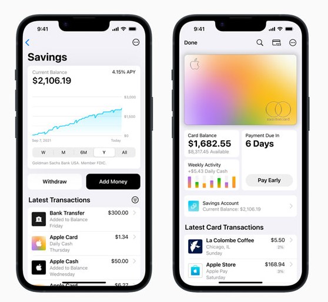

Yesterday, [Apple announced](https://www.apple.com/newsroom/2023/04/apple-cards-new-high-yield-savings-account-is-now-available-offering-a-4-point-15-percent-apy/) a Savings Account with a mouth watering 4.15% APY (Annual Percentage Yield). Meanwhile a typical US bank offers 0% on checking and negligible interest on Savings Accounts. 

To be critical, if you consider the monthly fees charged by the banks the effective interest rate is negative. 

## So, the Apple deal sounds too good to be true. Should you jump on it?

Here are a few things you need to know and consider before making your decision.

## First the fine print

### Rates can change any time

We are currently in a high interest rate environment. Treasuries are yielding upwards of 5%. But, this interest rate environment is not guaranteed to last forever. In fact many economists predict rate cuts towards the end of the year.

If that happens then the interest rate that you would receive from the Apple's Savings Account is almost guaranteed to come down.

### Maximum limit is 250k

This is not much of a problem if you are just planning to save a smaller amount but it would be a problem for people who might be contemplating moving in larger amounts.

### It is taxed!

The interest earned is taxed. In fact the taxes are withheld at source. So don't expect to get paid all of the advertised 4.15%. The tax bill depends on your state and your personal tax situation.

### Still lower than inflation

Even though the interest rate seems high. It is still lower than inflation. By, putting money into this account you are of course doing better than keeping it in your bank account but over a long time horizon you are still losing out.

## You can and should still take advantage of this

Now that you know the important fine print, here is how you could take advantage of this.

### Move money from Bank Savings Account

Move money that is in your Savings Account at your bank into Apple's Savings Account. Check the rate that you are getting at your Bank. I am almost certain that it would be lower (shockingly lower) than what Apple is offering.

I would even suggest moving your emergency funds into Apple's Savings Account. 

It is safe to do so as the money in the account will be in a real bank account (At Goldman Sachs) and will be FDIC insured up to 250k$. 

### What about uninvested cash in your brokerage?

I would suggest **not to move** these funds over for two main reasons. First, most brokerages are now offering some kind of interest rate on uninvested cash. Some brokers are even offering upwards of 4%+. 

Second, it is not an investment. 

As mentioned earlier, the rate that Apple is offering is still lower than the inflation rate. So, over the long run it is not an “investment”. Your purchasing power will erode over time. You are better off investing in a diversified stock portfolio over the long term.

## The biggest catch!

In personal finance, there is a huge behavioral and emotional aspect that is often ignored. This is the biggest catch that you need to be mindful about when you use this feature.

Apple has always been at the top of the user experience game. Their products are made to be easy to use and hard to give up. Addictive in other words.

The Apple savings account is available only for people who have an Apple card. Having an Apple card and getting into the behavior pattern of using it could alter the way you make purchasing decisions.

By removing the friction to make a purchase, Apple makes it even easier to spend money rather than helping you save money. 

So, be very mindful when it comes to using this offering from Apple! Use strategies like locking the card and hiding it once you have deposited your money into Apple's Savings Account etc.

If you enjoyed this post and are interested in learning more about [behavioral finance](https://happypathfire.com/tag/behavioral-finance/). Check out these other articles - [What is Hyperbolic Discounting?](https://happypathfire.com/what-is-hyperbolic-discounting/)  [The Diderot effect](https://happypathfire.com/the-diderot-effect-and-how-to-manage-it/)
