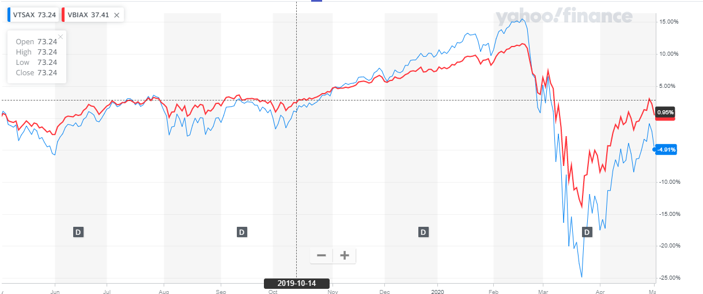

# **Do Balanced Funds work?**

Previously I wrote about the advantages of having bonds and the effects of rebalancing. (You can read the article [here](https://happypathfire.com/rebalancing-portfolio/)) The current COVID-19 stock market crash was useful to show the practical implications of having bonds in the portfolio. The article has detailed examples, do check it out for more context.

In this article I take a look at Balanced Funds and see how they performed in the recent stock market crash.

## **Balanced Funds**

There are a type of Funds often referred to as **Balanced Funds** or **Asset Allocation Funds**. The actual names may vary based on the company that is selling them and the country where these funds are listed.

Under the hood, all these types of Funds have some mix of Bonds and Stocks. The ratio is usually fixed. For example, 70% Stocks and 30% Bonds. The main advantage of these funds is that the rebalancing is built into the funds. 

This means that if the stocks go up in value the fund managers sell the stocks and buy bonds to keep the ratio of stocks and bonds in the ratio as mandated by the fund prospectus.

## **Did they actually work?**

In theory, this looks all smart and awesome but did these funds actually work? The current COVID-19 crash is an interesting opportunity to test these funds.

I was curious to see how these funds actually performed.

For the purpose of this test I use 2 Funds.

1. [VBIAX](https://investor.vanguard.com/mutual-funds/profile/VBIAX) - This is a fund from Vanguard. This fund has a target asset allocation of 60% Stocks and 40% Bonds.
2. [VTSAX](https://investor.vanguard.com/mutual-funds/profile/vtsax) \- This fund, also from Vanguard, has a target asset allocation of 100% stocks. It is spread over the broader US market.

## **Apples to Apples**

For the sake of comparing apples to apples, I have chosen funds from the same Asset Manager. Also given the size of these funds, I assume they are broadly representative. VTSAX - 700+Billion USD and VBIAX 39 Billion USD.  Also, I have chosen the same timelines i.e. the past 1 year for the sake of this comparison. 

<figure>

<figcaption>

Assume you invested 100$ into each of the funds 1 year ago.

</figcaption>

</figure>

The blue line is the VTSAX, and the VBIAX is in red. Starting off from an year ago at the same place you can see that the VTSAX peaked in FEB to about +15%. The VBIAX on the other hand peaked at around +11%. This is kind of as expected as the stocks were at a peak at this time and since VTSAX is 100% stocks, it benefited from this.

## **The COVID-19 crash**

Now observed the low-point. VTSAX with all stocks, hit a low of -25% while the balanced fund VBIAX hit a low of only -12%!!!

If you follow the path along the drop too, you can see that the steeper the stock market falls the more is the difference between the balanced and the stock only fund.

On the recovery side, you can see the balanced fund has recovered sooner too!!! This is because, through rebalancing one ends up buying stocks for cheap and gains when there is a rebounce. 

At the time of this writing, the balanced fund VBIAX was about -0.44% down for the past year while the VTSAX was down about -5% for the past year.

## **Key takeaways**

As mentioned in my previous article having bonds in your portfolio helps you take advantage of a stock market crash. It also helps reduce the volatility of your portfolio.

Based on this high-level analysis, it seems like the balanced fund performs better in the event of a crash than a stock only fund. This provides more evidence and support to the idea of having bonds and rebalancing your portfolio.
