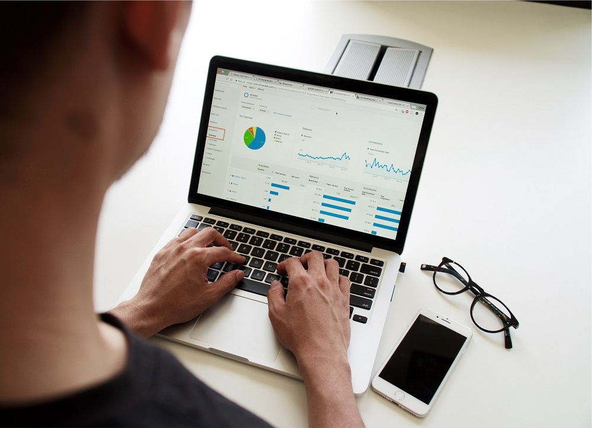

# Yes, you need to Budget

<figure>

<figcaption>

Budgeting - Easier than it looks!

</figcaption>

</figure>

## What is a Budget?

The word Budget comes from the French word _Bougette_, meaning a leather purse. The term was originally used within bureaucratic circles before taking on a more general meaning. 

A budget,within the financial context,  when used as a noun, is an **_estimate_** of **_Income_** and **_Expenses_** over a period of **_Time_**. The key letters that define a budget are highlighted. 

A Budget is an estimate, meaning that it is a statement about the future and like all things that can be said about the future, there is always some uncertainty. Hence the word estimate is used.

A Budget has estimates of incoming and outgoing resources. These resources are usually measured in the form of money. Finally, Budgets are time-bound, they have a start date and an end date. 

In the rest of this article, when I refer to Budget, I mean the _personal or household financial budget_.

## What is a personal or household budget?

Estimates of your sources of income like Salary, Commissions, Rents etc. and your sources of expenses like Rent, Mortgage, Groceries, eating out etc.

A budget sets limits for expenses in each category. For example, Coffee budget is set to 60$/month. This budget is then used as a point of reference when comparing with the actual incomes and expenses. For example Actual Coffee expense is 65$.

## Why Should You Budget?

> Plans are useless but planning is indispensable
> 
> Eisenhower

‘_You should budget_’, something people always advise without telling Why?. Upon asking why? The quick reply is , ‘_It is good for you_’. Well, this does not help. It feels just like yet another phrase like ‘_You should get some exercise_’.

Let’s look at some of the reasons Why you should Budget?

## Limited Resources

Everyone has their limits to resources i.e. wealth or income regardless of how rich or poor they are. Given the limits of resources means that there will be limits to how much we can allocate these resources to different needs and wants. The goal is to keep the overall expenses below income to enable wealth building or even mere financial survival.

Even Multi-millionaires have a number (a big but finite number) that they have to spend within if they want to stay rich. For the not-so well off, keeping expenses lower than income is a matter of financial life and death.

## Financial Discipline

Budgeting means setting your own rules and then following them with constant feedback. As budgeting is a forward looking exercise it gives you the ability to envision the future and be planned and prepared for it. The ability to [create a plan and follow it](https://happypathfire.com/course/) is one of the foundations to achieve long term financial success.

## Financial Security

One of the most common [sources of anxiety is Personal Finance](https://www.psychologytoday.com/ca/blog/i-hear-you/201907/why-are-millennials-so-anxious-and-unhappy). Budgeting helps you keep track of your financial life. It also helps you to accurately predict your financial future. If you have already budgeted and saved for Emergencies for example. You will be better prepared to face life’s uncertainties.

## Better Planning

Being better able to manage the day to day is foundational practice that allows you to improve your ability to plan and execute for the longer term. Things like saving for a retirement, saving for a house requires you to plan ahead and execute over a long time horizon.

## Better Health

This follows directly from reduced anxiety about the future. There are a number of studies that indicate the positive benefits from reduced anxiety. Some of the benefits include better sleep, better immunity etc.

## Higher Self-awareness

Budgeting involves prioritizing. The way you prioritize tells a lot about you. For example, if Coffee is more important to you than Alcohol, then you allocate more money to Coffee than to Alcohol. This cuts across categories making it much more interesting like watching movies vs buying more clothes.

When we have to make a choice, we have to really know what we want or what is more important for us. This forces us to do more introspection and understand ourselves better.

## How to Budget?

There are a lot of apps available that help you budget with near real-time tracking of your incomes and expenses. Ex Mint, Wealthica, YNAB etc.

Instead of going into the details of How to budget? (Will write a follow-up article on this) all I can say is, **start small**. Set a budget and start tracking your expenses of just a single category for a few weeks to a month .

Coffee for example. You will be surprised the first time around when you see **How much you are spending** vs **how much you _think_ you should be spending**. I surely was surprised.
