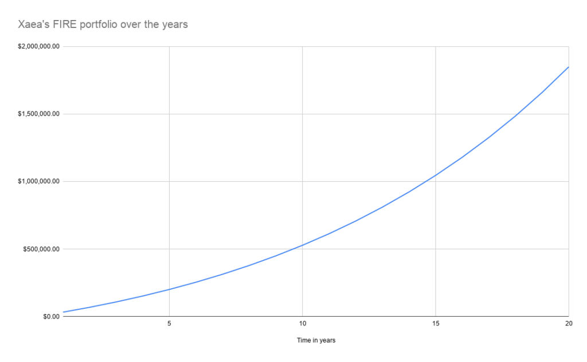
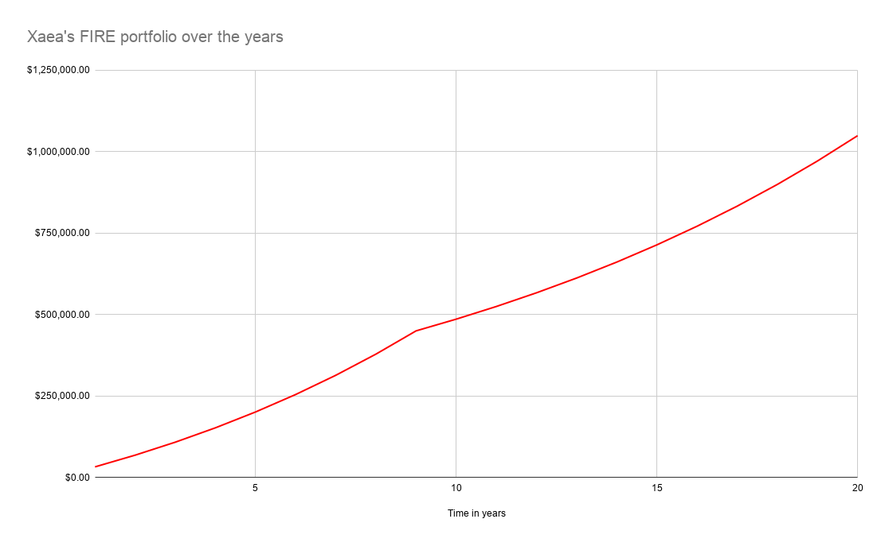
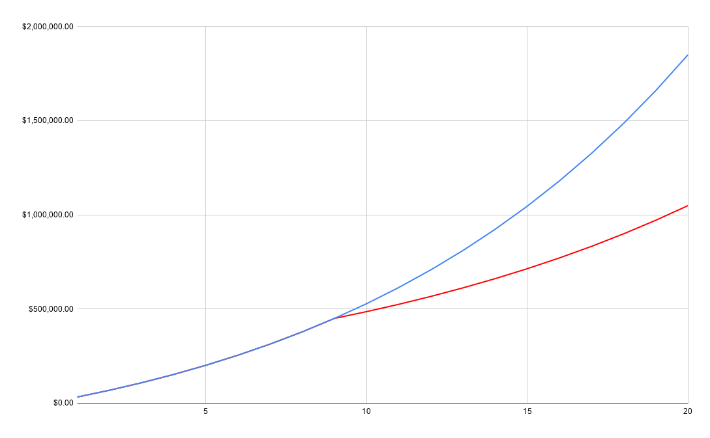

I have written about FIRE and different kinds of FIRE like [leanFIRE and fatFIRE](https://happypathfire.com/the-fat-and-lean-of-fire/). There are of course several forms of FIRE. The one that I think is the most interesting to consider is Coast FIRE. 

Before getting into the details of Cost FIRE, I will try to explain the intuition behind it so that the concepts are easier to grasp as we go along.

## **Life is Finite and Short**

We do not know when we will die. If we knew then we would be able to plan everything accurately so that at the moment of dying we have 0$s left or the precise amount that we want to bequeath left. Unfortunately that is not possible.

Instead, what we have is the ability to know the maximum life expectancy. This makes things relatively easier to plan. This means that the planning horizon is not for hundreds or thousands of years but , assuming that you are at least 20 when you start thinking about FIRE, the maximum time horizon is 100 years. This is assuming total life expectancy through medical breakthroughs is 120 years.

This means that we have to plan in such a way that we maximize the time spent in freedom, which is the overall goal of FIRE.

This is the key intuition. We know that post FIRE there is a lot of freedom when it comes to how you can lead your life especially when it comes to choosing what work, if any, that you do. So, in other words, post FIRE your freedom consists of working versus not working at all.

Cost FIRE is when you give up the freedom of not working at all while retaining the freedom of choosing what work you like to do for the coasting period. (don’t worry if some of these ideas make no sense, I have tried to clarify in the rest of this article)

## **Example**

Before I load up on more philosophy and concepts I think an example can make things clearer.

Assume Xaea is 25 years old. His networth is 0$ as of now. He wants to FIRE by the age of 45. His target FIRE portfolio size is 1M$. For the sake of simplicity, assume that Xaea can save 30,000$ every year and the amount of these savings grow at 3% every year because of increases in his salary. Also, for the purpose of this calculation we assume that the investments grow at an uniform annual rate of 8% per year. Note that this rate of investment returns has proven to be quite possible based on [historical data spanning several decades](https://www.investopedia.com/ask/answers/042415/what-average-annual-return-sp-500.asp). 

This is how his portfolio would grow over the next 20 years. There are two things to note here.

<figure>

<figcaption>

Note the exponential curve. The magic of compounding!

</figcaption>

</figure>

First is the exponential nature of the growth a.k.a the magic of compounding and the second is the fact that Xaea actually achieved his 1M$ goal way earlier than anticipated, around year 15 or when he was about 40 years old.

## **Traditional FIRE**

If Xaea was following traditional FIRE then, he would pedal to the metal until he achieved his 1M$ portfolio. This means that he is grinding at his job for the next 15 years. In terms of years of freedom between now and his targeted retirement age of 45, he got about 5 years of freedom. 

## **Coast FIRE**

Let us see if we can improve upon this situation by coasting. Let’s say Xaea starts off and continues to save and invest as usual but after year 9, when his portfolio is at 449,000$ , he stops contributing or saving into his FIRE portfolio.

Instead he lets his portfolio coast for the next 11 years. In the meanwhile, he takes up a job that he really likes. This job does not pay as well, but it allows him to make rent and pay the bills. 

Xaea is having the time of his life while also being all set for retirement.

How?

> **The power of compounding. Leaving the portfolio at a size of 449,000$ after year 9 for the next 11 years means that his portfolio will be worth 1M$ by age 45.**

<figure>

<figcaption>

The curve is still exponential but the rate of exponential growth changes

</figcaption>

</figure>

Now, let us look at the years of freedom he got in coast FIRE before the age of 45.

The number of years of freedom are from year 10 i.e. when he will be 35 years old until the age of 45. So a total of 11 years.

We are not going to account for time after the age of 45 as in both cases Xaea has FIREd.

So 5 years of freedom in traditional FIRE vs 11 years in coast FIRE. A difference of 6 years!!! 

This is the benefit and the advantage of coast FIRE. You can maximize the time available to you to do your own thing.

Before diving into the philosophy and the concepts, I would like to highlight the subtle difference between coast FIRE and traditional FIRE. During the coasting phase there is freedom to choose what kind of work you do but there is no option to not work at all, something that a person who has FIREd can choose to do.

Of course, this is a trade-off and something that you need to take into account based on your own personal circumstances.

## **Three Phases**

In the traditional FIRE approach there are two phases. The first phase is the accumulation phase. In this phase you mostly concentrate on two things. Increase income and decrease spending. The goal is to accumulate assets as fast as you can.

The second phase is the consumption phase. In this phase you are living off of your FIRE portfolio through withdrawals. Your main focus is to maintain your lifestyle in accordance with your available passive incomes.

In the Coast FIRE, there are three instead of two phases. The accumulation phase which is similar to the traditional FIRE approach. This is followed by the Coast Phase. In this phase your focus is to not touch your FIRE portfolio while you work enough to pay the bills.

Not touching your FIRE portfolio needs a lot of discipline and one way to achieve this is to know the impact of a withdrawal in terms of the number of years of work that will add before you can FIRE.

The third phase is the consumption phase which is once again similar to the traditional FIRE.

## **Key takeaways**

These are some of the key concepts pertaining to coast FIRE:

1. Earlier the start the better. For the purpose of coasting, the more time your money has to reach your target the smaller the initial amount can be, which translates to faster coast FIRE
2. Later the FIRE date the better. In case you extend the date of your retirement. It not only increases the time available during the coasting phase where your money can grow but also reduces the time during FIRE where you would need to live off your FIRE portfolio. This means lower FIRE portfolio size and longer coast and shorter accumulation phase.
3. Higher the returns the better. Higher returns are obviously better in any scenario but they are best during the coasting phase. Rates of return time to work the magic of compounding. All things being equal, having a higher average rate of return means that shorter coasting phase and longer FIRE phase. I would recommend using a conservative return estimate when you plan.

<figure>

<figcaption>

The curve in blue is the tradition FIRE, Red is the Coast FIRE. Which one do you like more?

</figcaption>

</figure>

If this article has piqued your interest in coast FIRE, I would suggest you take stock of your current finances, career, family situation and then use those inputs to project FIRE and coast FIRE scenarios. This will enable you to make choices that best suit your personal preferences.
