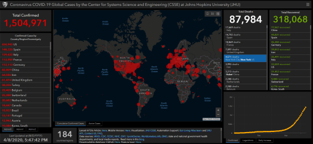
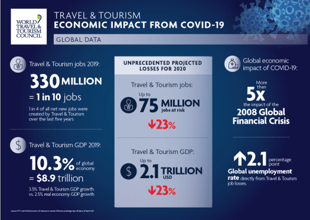

# **Corona Virus - the impact on the Tourism Industry and what it means to your FIRE journey?**

I have previously written about Geographic Arbitrage as one of the strategies to achieve FIRE. ( See the Article [Here](https://happypathfire.com/geographic-arbitrage/)). In summary, I wrote about moving to a relatively lower cost of living country or region can help accelerate your FIRE journey.

In addition to the financial benefits I briefly mentioned about other side-benefits like better climate, affordable healthcare,tax-benefits, unique life experiences etc.

I intended to write a series of articles under the category of geographic arbitrage detailing the pros and cons of different regions and countries. I started off with the Philippines as one of the possible destinations (See the Philippines article [here](https://happypathfire.com/retire-in-philippines/).)

But then… 

<figure>

<figcaption>

There are actual people behind those numbers!

</figcaption>

</figure>

## **Corona Pandemic**

At a time when the scars of the Great Recession of 2008 were finally behind us and the world was looking into the future with optimism, the Black Swan Event of the Corona Virus Pandemic hit us hard. (Astute philosophers like Taleb call it the _White Swan_ but this is no time to entertain and indulge in silly semantics)

## **1-2 Punch** 

The whole world is reeling under the 1-2 Punch of the Economy and Health crisis. God-forbid the virus mutates into something more sinister then we would be very well looking at the [6th Mass Extinction event](https://en.wikipedia.org/wiki/Holocene_extinction).

Well, enough of wild speculation. Coming back to the topic of Geographic Arbitrage. The primary enabler for the strategy of Geographic Arbitrage is the Global Tourism Industry. It seems like this industry is in dire straits and it makes sense to look at the current and potential future of this industry much more closely.

## **A Golden Age**

Until the end of the year 2019 we were literally living in the absolute Golden Age of world travel. 

As a travel enthusiast, I personally experienced it. Imagine, without even knowing the language and having few friends in China. I was able to travel to the remote region of Inner-Mongolia using only public transport. I was able to book all the Flights, trains, hostels, and experiences months in advance. 

Looking back, the value chains and the people who made this possible along the way were absolutely crucial.

The Corona Virus Pandemic has literally nuked the entire tourism industry in an instant. Planes are grounded all over the world. Hotel and AirBnB bookings in mass cancellation and no one is taking Uber or Lyft rides anymore.

## **Larger than what meets the eye**

It is really hard to gauge the true size of the Tourism Industry and the contribution of this one industry to the world. 

The Global Tourism Industry contributes to the world economy at multiple levels.

The primary layer is what actually meets the eye. The Airlines companies, Hotels, Restaurants, Resorts, Cruises, Theme Parks, Rental Car companies etc.

Then comes the next layer AirBnBs, OYO and other p2p hosting companies. Ride sharing companies Uber, Lyft, Grab, Ola, Didi etc. Airline manufacturing companies like Boeing, AirBus, Bombardier etc. Camera, Drone, Luggage, Selfie-Stick (kidding, I am sure they are sizeable enough to have their own trade show) and other traveller accessory manufacturers.

Then there is one more layer of travel related service companies like Klook, Trip, Expedia, Booking, Agoda etc.

Then there is this whole segment of professional travelers who use portals like Instagram and YouTube to publish travel related content like pictures, stories, Blogs and Vlogs.

From a fintech point of view travel is a huge area of focus for every major card issuer. In fact, sites like the [Points Guy](https://thepointsguy.com/) are completely dedicated to working the offerings of these fintechs to get travel related benefits.

With this massive disclaimer in place this is how the impact to the world economy looks like

<figure>

<figcaption>

10% of the world GDP plus unknown percentage indirectly impacted and not accounted for here

</figcaption>

</figure>

The numbers speak for themselves. I would like to add and remind you about the other dependent layers that are not included in these numbers. 

## **Some countries are hurt more harder than others**

The impact of the Tourism industry downturn is not evenly spread across countries. Some will see a relatively higher impact than others. It depends on the size of the Tourism industry relative to the size of the nation’s economy.

For example, the share of tourism in the GDP of India is about 10% whereas it is 20% in Thailand, 25% in the Philippines and 32% in Cambodia and Iceland. 

## **Implications to FIRE**

Just like the World is taking a 1-2 punch from the Corona Virus. The FIRE movement (Is it right to call it a movement?) is taking the 1-2 punch of Crashing stock markets and world travel restrictions.

Not to mention the raising potential of unexpected medical costs and eventual increases in health insurance premiums.

From a stock market point of view I have written several articles in the recent past. The main idea is ‘Do not Panic’ (You can find the article [here](https://happypathfire.com/covid-19/))

## **What should you do from a Geographic Arbitrage perspective?**

As far as the geographic arbitrage concept is concerned. I think it needs to be reconsidered. The benefits of relocating to a different region has its advantages and these have not changed fundamentally.

The cost of living, which is the major driver has not changed, at least relatively. 

In fact I would say that if anything the cost benefits may be more in favour of geographic arbitrage.

The actual risk is the break-down of the supporting supply chains and tourism Infrastructure.

Imagine if multiple budget airlines go bankrupt and flying once again becomes the domain of the rich.

Imagine if ride hailing apps like Uber, Lyft, Grab etc go bankrupt. It is hard to believe, but for several billions of people in the underdeveloped world, a car-ride is a thing of privilege.

The direct impact is the reduced mobility. The indirect impact is the degradation of tourism infrastructure and associated services that can make Geographic Arbitrage that much more difficult.

Just a drastic example. Imagine that the service providers in your target retirement region stop learning English because there are few jobs in tourism.

This means you will have a hard time to go about your daily life. You would now be forced to learn the local language, which may not always be your priority.

## **Healthcare**

Yet another reason for Geographic Arbitrage is the access to affordable and reliable healthcare services. The Corona Virus pandemic has exposed the true colors of the efficacy of the global healthcare systems.

For example, several US citizens are surprised at the dependence on foreign support for crucial health supplies like medicines and equipment.

I think the performance of the health care sector in the country/region of your target retirement is something to analyse and look into more closely. Use this pandemic as a _test_ and rate/rank your destination choices.

## **What else should/could you do?**

It took years to build the tourism infrastructure and democratize access to travel. This enabled people to think beyond the trappings of the location where they were born. Be it in search of better employment or better retirement. 

If you are in a position to help some of the people who were part of your journey then I would recommend you to take direct action. 

Assuming the travel restrictions come to an end,I would recommend you to consider traveling if you have budgeted for it.

I believe this is far more efficient than giving to any charity. Depending on the cause as much as 50% of amounts donated are used up in administrative and fundraising expenses. 

I believe your money and time is far more _well spent_  if you visit that _mom&pop_ or _Grandma_ food cart in that alley you _discovered_  on that awesome trip!

Go forth and spend those tourism dollars! 

[Go Corona! Corona Go!!!](https://www.youtube.com/watch?v=cspF9QK5FlA)
