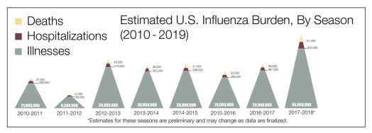
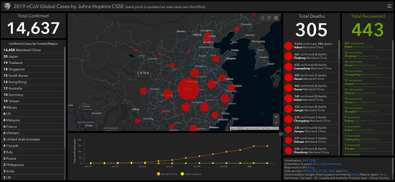

# Corona Virus - Should you be worried  about your Investments?

## What is the Corona Virus Outbreak?

In late 2019 and early 2020 a new Corona Virus infection originated in the city of Wuhan in China. The ability of the virus to spread rapidly from human to human is causing global panic. Governments are imposing severe restrictions on any travel to China and also within China. As a result the global Financial Markets are facing uncertainty and turbulence. 

In this article I try to address the various aspects around the impact of the outbreak from a **purely Financial perspective**. I know that the impact of this outbreak will be long lasting culturally and politically. More so in the era of live updates and digital echo-chambers like twitter, facebook, whatsapp, reddit etc.

## The Ugly side of the Wuhan Corona Virus

I think I have to address the ugly side of things before getting into the financial aspects. I believe **fear** brings out the worst in humanity. 

> “When the **chips are down**, these... these civilized people, they'll eat each other.”
> 
> The Joker from the Dark Knight, 2008.

There have been several fake news and conspiracy theories that are circulating in the media that show the Chinese as uncivilized, in-human, degenerate, inferior etc. The most common is the allegation that the disease broke out because the Chinese people eat wild-life , more specifically bats. (The Batman quote was not an intentional pun) 

The source often cited as an example is the video of a [Chinese woman eating a bat](https://www.youtube.com/watch?v=VAQqE5jmV1I). This was later proven to be mis-information as the video was shot in far-off Palau and also it was more than 4 years ago.

The topic of what constitutes **_right food_** is a sensitive topic. It is almost impossible to be politically correct and appease everyone.

Vegans think eating any kind of animal protein, including milk and eggs is supporting animal cruelty, whereas vegetarians think killing animals is cruel while drinking milk is not.

Even among people who eat meat, eating domesticated animals is _OK_ but eating wild-life is not. I think it is a topic that is beyond the scope of this article and website. In general, all I can say is that **looking down upon people because of their food-habits is racism 101**. 

There are several other conspiracy theories like the virus is a mis-handled bio-weapons experiment, a Chinese Communist Party master-stroke for resolving the Hong-Kong protests and the trade war etc.

All of these are unsubstantiated, **_yet_**. This means that there is enough fuel to ignite financial market turbulence. 

### Not blameless either

I do have to set the record straight. The Chinese government and the public are not entirely blameless. Trading in live and exotic wild-life in public places with limited to no health and safety measures is asking for trouble.

They have put the whole world at risk. The outrage against this practice is understandable. I think, as humans we have enough existential threats as it is and the ones that can be avoided, should be avoided. For example, In India, where the water-bodies are saturated with antibiotics leading to super-bugs, anti-biotic resistant bacteria. Something that _can and should be_ avoided.

## The Wuhan Corona Virus in context

It is very important to contextualize the Corona Virus. It helps us to better understand the risks and make better judgements on the course of action.

The Wuhan Corona Virus, designated as nCoV-2019 belongs to a family of corona viruses that infects Mammals and Birds.

The symptoms in humans are mostly respiratory like the common cold. Like all viruses, the Corona Virus evolves much more rapidly given the shorter lifecycle. It often jumps specie boundaries. It exchanges genetic material with different strains from different sources.

Many a times this is often a flu, a common phenomenon during fall and early summer in the colder parts of the world. But, sometimes they can evolve into a lethal strain that can spread rapidly and cause high mortality.

### SARS

The closest thing we have for reference is the 2003 SARS(Severe Acute Respiratory Syndrome) breakout. Like the Wuhan Corona Virus, it too originated in China and spread rapidly. There were about 8000 reported cases of infection with ~800 deaths due to the disease. 

The impact of the SARS outbreak was almost immediate. The [Chinese GDP went down by 2% in just a quarter](https://www.bloomberg.com/news/articles/2020-01-31/the-coronavirus-is-more-dangerous-for-the-economy-than-sars). It is important to note that, once the outbreak was contained, the economy recovered just as quickly.

### Seasonal Flu

In Colder climates like Canada, parts of USA and Europe, the Flu is an annual phenomenon. It is seasonal and occurs around the fall and early spring. 

Here are some of the numbers for context.

<figure>

<figcaption>

Source: [https://www.cdc.gov/flu/about/burden/index.html](https://www.cdc.gov/flu/about/burden/index.html)

</figcaption>

</figure>

The above graph shows only the numbers in the USA. Most recently in 2017-2018 about **45 Million** people were infected by various strains of the Flu virus. With a total death rate of **61,000!!!**

## Corona Virus in numbers

Given the context of the scale from the Seasonal Flu and the economic impact of SARS. We can now better understand the numbers that are available to us as of this writing. 

<figure>

<figcaption>

Source : [https://gisanddata.maps.arcgis.com/apps/opsdashboard/index.html#/bda7594740fd40299423467b48e9ecf6](https://gisanddata.maps.arcgis.com/apps/opsdashboard/index.html#/bda7594740fd40299423467b48e9ecf6)

</figcaption>

</figure>

As of this writing, there are about 14,000 reported infections globally and about 305 deaths. In terms of fatality rate, the corona virus is far less(2%) lethal than SARS(11%).  The lethality of the corona virus depends on the age of the affected person as well. [Older males are experiencing higher rates of mortality](https://www.nytimes.com/2020/01/23/world/asia/coronavirus-victims-wuhan.html) than women.

Just going by the number of fatalities it seems like the total cost of lives is much lower than SARS. It is substantially lower than the regular seasonal Flu. But this is not the end of the story on the Corona Virus as it is still actively spreading and has not been contained yet.

## There is Hope

When the SARS broke out the Chinese government was very secretive. It reported the epidemic nearly 3 months after it was first detected!

This was about 17 years ago when the Chinese economic juggernaut was just taking off. 17 years later, now, the Chinese government has taken unprecedented steps that I strongly believe no other government in the world can dare take. 

It has placed Millions of people, entire cities on quarantine, has isolated the strains and published the genome for research access and has cooperated closely with the WHO.

While there are still a few shortcomings and room for improvements, the attitude and approach of the Chinese government as a whole in being a responsible member of the nations of the world is commendable.

This gives me hope that the spread of the virus will be contained soon with a viable solution like a vaccine created and distributed globally.

## Financial Impact

When SARS broke out in 2003, China and its position in the world was very different from today. In 2003 Chinese economy was mostly based on manufacturing with a lower service industry component. Chinese economy was also a smaller part of the global economy at about **4% of the global GDP** total whereas now it is about **17% of the global GDP**.

A slow down in China means a global slowdown. We are already seeing delays in supply chains of prominent companies like Apple, Amazon, Google etc.

Once again, going by the SARS model, there will be a reduction in China and hence the world GDP in the short term. [Some predictions go as far as a 1% drop in China's GDP](https://www.bloomberg.com/news/articles/2020-01-31/the-coronavirus-is-more-dangerous-for-the-economy-than-sars). I believe the long-term growth expectations of China and the World remains largely unchanged.

The extent of the short-term GDP drops depend on how the infection spreads or gets contained. I believe that as we get closer to the warmer times of the year - May, June and beyond, we should see more containment given the high seasonality of the Viral infection life-cycle.

## Threat or Opportunity

I think that the slowdown in **real** but **not forever**. The world economy will bounce back. Healthcare spending by the government and the general public will boost both government and public spending and help the economy.

Assuming a full-blown zombie apocalypse is unlikely. In which case one needs to consider a completely different set of _assets_. I would be **_cautiously optimistic_** and **stay put** with my investments. Weathering the storm so to speak. In fact any strong market downturns are great opportunities to invest.

Quoting the Joker once again

> “That which doesn't kill you, makes you stronger”
> 
> or richer when it comes to investing.
