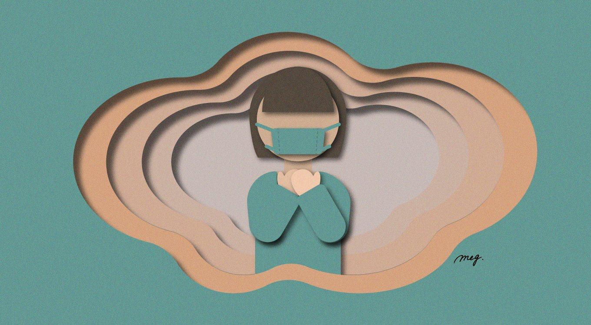

# Covid-19 and what it means to your FIRE journey

<figure>

<figcaption>

Stay Calm and Invest!

</figcaption>

</figure>

The recent few weeks have been devastating for investors all over the world. Even the Major indices like the Dow and S&P 500 have lost well over 10% from their peaks. Individual stocks, especially in tourism and transport have almost halved in price. It seems like we are close to Armageddon. There is panic in the _air_ literally!It is all being driven by the fears over the Corona Virus a.k.a **Covid-19** contagion.

The title of this article comes from the guide book mentioned in the book (Yes, this is meta) - [The Hitchhiker’s Guide to the Galaxy by Douglas Adams](https://amzn.to/2vlczzS). 

These famous words are on the cover of the guide and are used like a _mantra_  in all the adventures of the protagonists throughout the Galaxy!

I think this is something that is also relevant to the world of Investing. In these circumstances in the world of investing, it is useful to remember the useful words **‘Don’t Panic!’** 

Now that we have contained our panic, let us calm down and look at some of the likely scenarios this whole situation could pan out to. 

I have grouped the scenarios into three broad categories ranging from low to high impact. 

Let me walk you through each of the scenarios and along the way, figure out our course of action from a FIRE (Financial Independence Retire Early) perspective.

## **All is Well**

In this scenario, Covid-19 is mostly prevalent in China with relatively less transmission in other countries. The mortality rate is scientifically validated and found to be well below the SARS level approaching the mortality rates of the common flu   (read my [related article on this topic for more details](https://happypathfire.com/corona-virus-investing/)). 

A global race to vaccine results in a Vaccine in 6 months. The coming of summer in the northern hemisphere slows down transmission drastically.

The global supply chains are indeed affected with supply side constraints to economic growth. But, in the following quarter the productivity and consumption both spike to higher levels leading to a flat to even positive year in terms of global GDP growth rate.

The market is going to see some panic sell, but it would be only a short term phenomenon with no accompanying structural changes. A so called **_V-Shaped_** recovery takes place. 

The implication to you as an investor is to not follow the herd and panic sell. Your ability to take risk will be tested but not to the levels of the Great Depression or the Great Recession.

## **Down but not Out**

In this scenario, Covid-19 now has epicentres of transmission beyond Wuhan. With at least 1Million+ Infected and 20,000+ dead. The mortality and transmission rates are comparable and probably even higher than the SARS outbreak (read my [related article on this topic for more details](https://happypathfire.com/corona-virus-investing/)). Effective vaccination is delayed upto an year or more. 

Nevertheless, the infection rates stabilize and the transmission is subdued due to the onset of Summer and the outbreak follows the similar pattern as SARS, H1N1 among others.

The global economy re-adjusts to the lower supply scenario. The broken supply chains take longer to recover leading to lower productivity across the world. The global GDP may end up negative for the year 2020.

The market will panic-sell followed by cautious optimism. This means the sky-high valuations that we saw in early 2020 would not return until at least towards the end of 2020. 

The implication to you differs based on which stage you are in your FIRE journey. If you are in the accumulation phase then this period, however long it lasts, is an excellent opportunity to invest more into stocks. You should be highly motivated to take advantage of this situation to the max.

In case you are in the consumption phase, especially if you are in the early years (<5years since FIRE) then, it is recommended to try and reduce your withdrawal.

If you have already made your withdrawal, see if you can make a few lifestyle compromises and squirrel away some money back into your stock portfolio. 

Also, this is an opportunity to re-balance your portfolio by moving from Bonds to Stocks. As you may have seen, Bond prices are at their peak with yields being at historical lows. 

## **Armageddon** - A true Black Swan Event

In this scenario, the Covid-19 has been completely misunderstood and it is a very different type of virus. It mutates rapidly and crosses and re-crosses several species and becomes much more virulent. 

Covid-19 reaches and may even exceed the [1918 Spanish Flu](https://en.wikipedia.org/wiki/Spanish_flu). In the 1918 Spanish flu 500 Million people were infected with an estimated ~100Million dead. 

Going by the current human population which is nearly 4X more, the estimated infected population could be around **2 Billion with 400Million dead!!!** Even celebrities and world leaders are not spared (No, not even the Orange man!) 

Needless to say, the Global Economy is shattered with fundamental changes to social and cultural structures. Negative side-effects like Resource based wars, Opportunistic dictatorships can only make matters worse.

The Global GDP contracts to the pre-globalization size. Several decades of progress is wiped out. The whole tourism industry is wiped out along with the related industries like aircraft manufacturing, automobiles, Uber type businesses etc. 

From a FIRE perspective, I believe that in case you survive, you are in a better position than the vast majority.

Firstly, you may still have some assets even though they are severely undervalued. Secondly, and more importantly, you have the attitude to be able to live well within your means. This will lessen the impact of the negative effects of living in a resource constrained world.

Well, all of this is valid assuming capitalism and right to property survives. If the monetary system also fails then the go-to is real assets i.e. Guns, gangs and gold, in that order. 

## **Don’t Panic**

I believe that the most likely scenario is the ‘**Down but not Out**’ and I hope it is ‘**All is Well**’. As I am still in the accumulation phase, I see this downturn as an excellent opportunity to do some bargain hunting.

Having lived through the Great Recession of 2008-09, I have faith in my conviction that the **Global Economy will continue to grow well into the foreseeable future**.
