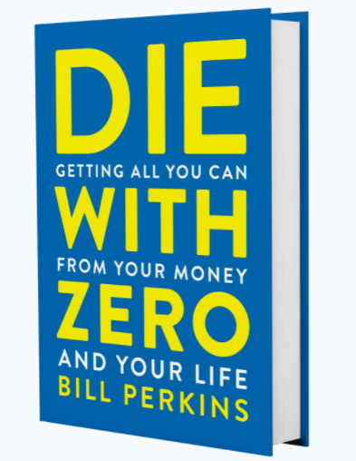

This is my personal take on the book titled [‘Die with Zero](https://www.diewithzerobook.com/welcome?utm_term=die%20with%20zero&utm_campaign=Search+-+Branded+Keywords&utm_source=adwords&utm_medium=ppc&hsa_acc=2381919388&hsa_cam=10708584875&hsa_grp=104559517566&hsa_ad=453102599706&hsa_src=g&hsa_tgt=kwd-908303434017&hsa_kw=die%20with%20zero&hsa_mt=p&hsa_net=adwords&hsa_ver=3&gclid=CjwKCAjwloCSBhAeEiwA3hVo_Y7KWwUDX8i83R7WRQOa7EBvuui_dBgUbx3pdz3LwogceYZ1PetR6RoCueQQAvD_BwE)’ by Bill Perkins. Although I don't agree with all the ideas presented in the book there are some really useful ones that I would like to summarize in this article. I would recommend reading this book as it is a light read and well structured in a way that makes it easy to understand the author’s perspective.

## **To Die with Zero**

The core concept in the book, as the title suggests, is ‘Die with Zero’. According to the author, one has to ensure that at the time of dying all the wealth that was earned or inherited during a lifetime is used up in having life experiences or given away to causes and/or as inheritances.

<figure>

<figcaption>

Die with Zero by Bill Perkins

</figcaption>

</figure>

The author argues that dying with a large networth implies that there were inefficiencies in two places, 1) Earning 2) Spending.

Earning, because it means one has spent more time than necessary working at a job that one might not really like. Spending, because the money was not spent in an intentional way by the person who worked hard earning it.

I agree with the author in general on the point that money is a means to achieve things in life and it is not an end in itself. There are scenarios where people end up working to their dying day without planning or choosing how their wealth should be used.

Some of the ideas that I liked in the book are :

## **Annuity**

Annuities are financial instruments that provide a steady stream of income until the person who purchased it is alive. In that sense it is like **reverse insurance**. In insurance, the insurance buyer pays a fixed monthly premium and receives a payment in case the person dies or has a health care emergency etc.

(actually the nominees receive the amount in case of life insurance)

In the case of an annuity, the annuity buyer pays a lump sum amount in the beginning and then receives fixed amounts monthly until they are alive. I think this is an interesting tool to consider as part of a FIRE portfolio.

I would like to write more about it in the near future. Stay tuned.

## **Experience Points**

Another concept I liked was - experience points. A simple exercise of assigning points to experiences based on a subjective rating scale. Going on a trip to Antarctica with a partner might be rated at 1000 Experience points while a weekend roadtrip with a partner might be rated at 50 Experience points. The author suggests maximizing experience points. I think it is not necessarily true that higher experience points always have to be more expensive.

## **Giving well at the right time**

This is my favourite idea in the book. Most inheritances are involuntary, i.e. a person with wealth dies and the legal process will run its course and distribute the wealth according to a will or legal rules to eligible inheritors.

Inheritances can be really helpful, especially if they happen at the right time. Imagine someone in their twenties who is struggling with student debt and also is trying to get a home to raise their children while his parents are well off and in no position to spend all their wealth, but they do nothing to help their child. Of Course when the parents die of natural causes their child will stand to inherit all of the wealth, but now, the child is in his sixties and this inheritance is immaterial in terms of usefulness.

Inheriting a smaller amount earlier in life is vastly more impactful than inheriting a bigger amount later in life. I agree with the author’s suggestion to make plans to give away when alive while spending what is left. Making giving voluntary instead of involuntary can have a positive impact on society at large if this method is widely adopted.

## **Peak Networth**

Networth is the _sum of all assets_ minus the _sum of all liabilities_. This number generally increases with time during the years when people are employed. It later decreases as they dip into the nest egg during retirement. This means that there is a peak. Most retirement advisory is based on a dollar amount or target networth. In fact I myself have suggested in [several posts on ways to come up with A FIRE number based on the 4% rule.](https://happypathfire.com/tag/4-rule/)

The author suggests an additional nuance to this. He suggests thinking of the **peak networth in terms of time**. I think this is an important perspective to have. Imagine hypothetically that the Networth number is arbitrarily 2Million Dollars. What if one is 65 years old and is at 1.5Million Dollar networth? Should the person retire or still keep working at places that still employ seniors?

I think having the time perspective is important as it is pragmatic and realistic. Using the above example, let's say the person comes up with a peak Networth date in addition to the amount and says ‘my survival minimum is 800k for a 30 year retirement, assuming I live until 90, I will retire at 60 as long as my Networth is above 800k’. If the networth at the age 60 is 1.2Million then it is just a bonus. The person should retire and choose life experiences that minimize regret.

## **Bucket-list on a Timeline**

Most of us have a vague idea of a bucket-list. Some of the more diligent ones will have a formal documented bucket-list. The author suggests adding the dimension of time to the bucket-list. I think this is once again a pragmatic approach. There are certain activities that can only be had at certain life stages. 

Bungee Jumping is probably something one could try in their 20s and 30s instead of their 70s and 80s. On the other hand, enjoying a relaxing cruise with a partner can be planned in their 60s or 70s. I think the idea of adding a time dimension to the bucket-list can be a powerful planning tool. It not only optimizes the use of money but also allows for the optimal allocation of time at the right stage of life.

## **Privilege game**

In terms of criticism of the book, I feel this book is written from a place of privilege. Most of the anecdotal examples stated in the book are relevant to the western privileged class. The author, for example, advises that all 20 year olds should not save and should maximize spending in order to collect experiences in life. In a developing economy this is foolish advice and completely irrelevant. I think the author should have clearly stated that the target audience for the book is **privileged people in developed countries**.

Most of the world's populace is just trying to survive. Poverty runs across generations and every generation in a lineage of poverty is hustling real hard to break away from it. This means saving as much as one can, while just managing to stay afloat.

The author is almost insensitive in assuming that everyone is going to die with a surplus, whereas in reality even in a developed economy like the US, old age poverty and destitution is real. 

In summary, there are several useful ideas in the book that can be incorporated in your FIRE journey. I intend to dive deeper into a few of those in my upcoming posts.
