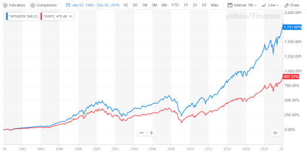

# A simple guide to Dividends on FIRE

## What are Dividends?

Dividends are cash distributions paid to Shareholders of Companies. Well, that is a lot of jargon, so let me try and unpack it as much as possible.

Say, you invested in Apple. This makes you the ‘owner’ of Apple even though the relative size of your ownership is small. Investing a Million $s into Apple would buy you about 0.0001% of Apple as of this writing. 

Like any business, Apple sells stuff and collects money, pays its employees and also makes interest payments, pays taxes and all other bills and then it is still left with some cash. 

It has a couple of options to use the cash. One is to use it to research and develop newer and better devices. The other option is to **_distribute_** the profits to the owners. 

In reality, Apple does both. Apple yields about 1% Annual dividend. On a Million $s invested into Apple you would get paid about 10,000$ in cash every year.

Note that Dividends are not a given like an interest rate but it depends a lot on the financial and business circumstances that the company is exposed to.

## Why do companies pay Dividends?

There may be a lot of considerations behind the payment of dividends but the main economic intuition is that of capital efficiency.

If a company is mature and the management team cannot find projects and initiatives within the company that are _good_ investments, then it is better to return the money to the owners who can then utilize the cash in an efficient manner.  

## The Market is right - **always**

Technically speaking, **_the markets_** (markets refer to the emergent phenomenon of all the participants in the stock markets and their actions, interactions) can override any sort of management thinking. 

Here is how. Let’s say the management decides to pay dividends but the market thinks that the company is in the growth phase and should not give out dividends. In this case, _the market_ forces investors to simply reinvest the dividends paid out to them.

In the alternate case, let’s say the management does not pay a dividend or pays lower than market expected rate and the market decides that company _has to_ pay dividends.

Then the investors simply sell a portion of their investment to create cash which is artificial dividend. There are a few other structures using options that can achieve a similar result.  

## As an individual investor what should you do about dividends?

The literature out there makes it seem like it is a matter of personal choice. I agree, but not entirely. Throwing money away is also a personal choice but, may be, not a good one.

I believe as an individual on the journey of FIRE the choice of what to do with dividends depends on which stage of your FIRE journey you are in.

## In the accumulation phase

In case you are in the wealth accumulation phase then it is vital that you should **aggressively reinvest all of your dividends** back into your portfolio. 

## Why Reinvest Dividends?

Take a look at the chart below. 

<figure>

<figcaption>

The difference in returns is massive!

</figcaption>

</figure>

The line in blue is the S&P 500 index with dividends reinvested and the line in red is the S&P 500 index with no dividend reinvestment. The time period is the last 3 decades, i.e. 1990-2019. 

You can see very clearly that reinvesting yields substantially higher returns than taking those dividends out.

Just for context, 10,000$s invested at the beginning of 1990 without dividend reinvestment would be worth about 100,000$s but with reinvestment it would be worth 185,000$!!! Almost **DOUBLE!!!!**

of course, I have to caveat this. In the case where the dividends were not reinvested into the index but were instead invested in bonds or even just plain cash then the actual performance of the case without re-investment would be relatively better.

## How to reinvest?

There are specific programs that allow for automating dividend reinvestment called **DRIPs - Dividend Reinvestment Program**. 

Once you register for DRIPs on a specific stock or an ETF, then all the dividends received are automatically invested back into that specific stock or ETF.

I would recommend this option because it enforces the **reinvestment discipline** with very little effort. 

The other advantage of using DRIPs is that there are **no commissions** upon reinvestment as they do not go through your broker thus giving you the additional benefit of saving on brokerage fees and other charges.

Further still, few companies even offer discounts on stock prices ( [as high as 5%](https://www.nasdaq.com/articles/these-3-dividend-stocks-offer-shares-discount-2018-02-24)) if you enable DRIPs on their stocks.

Note that Dividend withholding taxation rules do not change even if you choose DRIPs. 

Some people also suggest using the dividends received to be used to invest in non-dividend paying growth stocks. I would not support this as much because it involves [**stock picking** or **trading**](https://happypathfire.com/trading%e2%80%8a-%e2%80%8ahow-to-sustainably-lose-money-in-capital-markets/). This is something that I would discourage you from doing as part of your FIRE portfolio.

## In the withdrawal Phase

After achieving FIRE, I would recommend firstly, **cancel all your enrollments into DRIPs**. Secondly, account for the dividends when implementing your annual withdrawal from your portfolio. 

For example, if your withdrawal rate is 4% and you receive 2% in dividends then you should adjust your withdrawal to 2%. 

**Dividends are withdrawals from your portfolio**. Remember that dividend income and capital gains from selling stocks are treated differently for tax purposes. These differences are to be considered when you do your tax planning.   

## Take Action

So go ahead, find out which stocks and funds that you own give out dividends and how much. Try and enroll into DRIPs in case you are in the accumulation phase and take advantage of the power of compounding of returns. 

Be mindful of Dividend payouts in case you are in the consumption phase from a taxation and withdrawal rate perspective.
