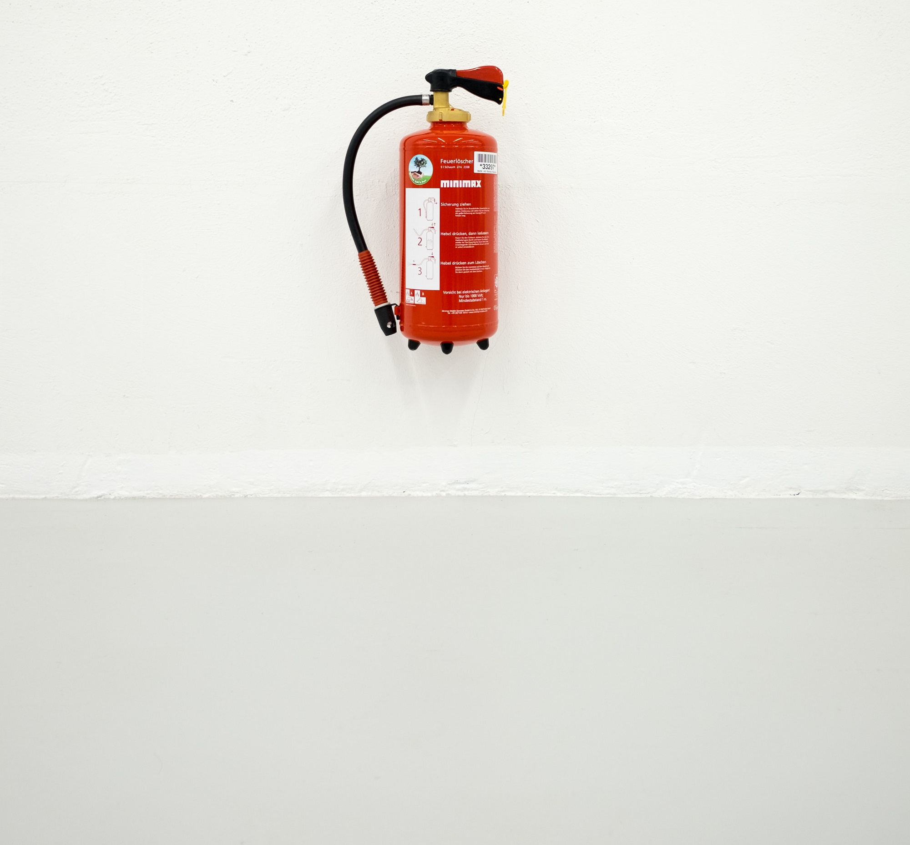

# **Emergency Fund and the FIRE portfolio**

<figure>

<figcaption>

An Emergency Fund is like a Fire Extinguisher (Pun - unintended) Photo by [Paul Hanaoka](https://unsplash.com/@plhnk?utm_source=unsplash&utm_medium=referral&utm_content=creditCopyText) on [Unsplash](https://unsplash.com/s/photos/fire-extinguishers?utm_source=unsplash&utm_medium=referral&utm_content=creditCopyText)

</figcaption>

</figure>

The ongoing Covid-19 crisis has unfortunately caused many households across the world to dip into their Savings. A few financially savvy and fortunate people may have prepared for this situation with what is referred to as an Emergency Fund. A vast majority of people are not prepared for this. For ex: [Only 41% of Americans can meet a 1000$ expense from their savings](https://www.cnbc.com/2020/01/21/41-percent-of-americans-would-be-able-to-cover-1000-dollar-emergency-with-savings.html).

## **What is an Emergency Fund?**

As the name suggests it is an amount that is set aside to meet the Emergency needs that arise due to the uncertainties of Life. 

The uncertainties include job-loss, health and medical emergencies, Natural calamities, Man-made calamities like war, political instability etc. The Covid-19 pandemic belongs to the Natural Calamity category.

The basic idea is that if due to some unexpected reason the stream of income source/s stop one has sufficient Funds/Amount set aside that can be used to meet the daily expenses.

## **Where should the Funds be invested?**

The main criteria for investing your emergency funds are **Safety** and **Availability.** Sure, bank notes under the mattress are readily available whenever you may need them but they are not safe. 

Cash that is invested in long term stocks is neither safe nor available.  It is not safe because stocks are risky investments and the prices fluctuate. This is more evident in the current Covid-19 crisis where the stocks are down about 30% on average. 

Availability is low because it takes at least 3-4 days at the earliest to sell your stocks and get the cash. Not to forget the tax implications of selling your stocks.

Typically, emergency funds are Cash in Savings or other high interest savings accounts that are backed by Government guarantee. In the US this could be the US Treasury Bills, in Canada these would be the Canadian GICs (guaranteed investment certificate).

## **What should be the size of your Emergency Fund?**

It depends on your average monthly fixed expenses. Expenses that are absolutely necessary like Rent, Mortgage, Groceries, Insurance etc. Discretionary expenses like Entertainment, Vacations are not included.

As a rule of thumb [3-6 months of average monthly expenses are recommended](https://investor.vanguard.com/emergency-fund/amount). For example, if the average monthly household expenses are about 4000$ then about 12,000$-24,000$ should be the size of the emergency funds.

## **FIRE portfolio and Emergency Funds**

This is a very interesting situation for people who are on their FIRE journey or for someone who is already FIREd.

> **FIRE portfolio is like an Emergency Fund that lasts a lifetime**

For people who have FIREd, they are in a constant state of no income. I.e. no income from a job or business. They are _unemployed_ in the normal sense_._ I.e. not employed to make a living for oneself or family. In this situation, the impact of an emergency that leads to a loss of income is less relevant. 

The key assumption being that their FIRE portfolio is well thought out. The portfolio should be diversified, have insurance, tax-efficient etc.

For people who are in the FIRE journey the FIRE portfolio provides an additional cushion in case of an emergency.

For example, if you have 100,000$ in your FIRE portfolio and your monthly expenses are 4000$s then you can support yourself and family for at least ~ 2 Years!

## **Is a FIRE portfolio and the Emergency Fund one and the same?**

Strictly speaking they are not the same. The key reason being that the FIRE portfolio investments are focused on long term growth assets like stocks. Whereas Emergency Funds are mainly Cash and cash equivalents.

I think it is hard to draw the line. It depends a lot on your net worth to begin with. I would use the following mental model to think about it.

If one is on the journey to FIRE then having an Emergency Fund is necessary. But, if one is already FIREd then the FIRE portfolio should be designed in such a way that it can handle Emergencies. ( see the [Udemy course on FIRE](https://happypathfire.com/course/), and how to build  FIRE portfolio)

So, it is like a continuous spectrum. When you are starting off with 0 Savings, then your first step is to create an Emergency Fund. Once you have that setup then you can start investing in your FIRE portfolio. 

As time goes on, your FIRE portfolio grows relatively larger and larger. It will reach a point where the Emergency Fund simply becomes part of the cash component of your larger FIRE portfolio.

## **Key Takeaways** 

If you have 0 or low savings start off with building an Emergency Fund. Remember, in case of an emergency, it is cheapest to borrow money from yourself. 

Use budgeting apps to identify areas where you could save to build the Emergency Fund

If you have an Emergency Fund funded, then grow your FIRE portfolio.

On your FIRE journey, there will be situations where you may have to use your Emergency Funds. Remember to replenish your Emergency Funds once your income sources are back before investing spending.
