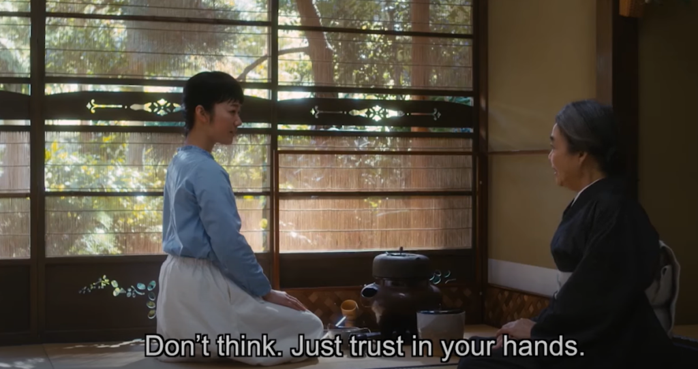

_Spoiler alert: ‘[Every Day is a Good Day](https://www.imdb.com/title/tt7575778/plotsummary/?ref_=tt_ov_pl)’ is a Japanese movie that I watched recently. This article is based on my reflections on the movie. I highly recommend watching the movie._

## Her life has not yet started

Noriko, the protagonist, lives with her parents. As a university student her life seems to be going nowhere. She constantly has this lingering feeling that **_her life has not yet started_**.

 She is awkward, has low self-esteem and is a klutz. (It reminded me of [Woo Young Woo, a character in a Korean drama.](https://happypathfire.com/extraordinary-attorney-woo-young-woo/))

Her cousin, Michiko, seems to be the exact opposite. She is confident, and has ambitious plans for her future.

## Traditional Japanese Tea ceremony

Noriko starts learning the art of traditional Japanese Tea ceremony. It starts out as a casual hobby that she participates in along with her cousin, Michiko. 

The teacher is a senior lady who has a beautiful house and lives all by herself while teaching women the art of Japanese tea making. 

Initially, Noriko finds the teacher a bit annoying because of her constant corrections on the process of making tea. But, over time Noriko gets better but at a very slow pace compared to her cousin Michiko.

<figure>

<figcaption>

The teacher with Noriko

</figcaption>

</figure>

## The Tea ceremony is that one constant in her life

Life happens, and Noriko goes through a hard breakup. Yet, she attends her tea ceremony classes.

Michiko eventually quits classes as she gets married and starts a family. Noriko still attends her classes. 

Noriko gets married and lives with her husband, still she attends her classes.

Her father passes away and she processes her grief through this one constant in her life, the tea classes.

## Every Day a Good Day

The teacher has a wall hanging with the words, ‘ **Every Day a Good Day**’. In the beginning she wonders what it meant. At first glance it seems like a simple and straight forward message. But over time, a span of over 24 years, she is able to understand its meaning. 

Over the span of 24 years, Noriko experiences various ups and downs in life. She experiences various seasons. She realizes that she has to live through life by experiencing it, without longing for change. In the winter, she has to experience the cold, in the summer, the heat and in the rainy season the rains. 

## Her life has now started

It has been 24 years now since she started attending the tea ceremony classes and her now 88 year old teacher suggests that she should now start teaching the tea ceremony. She opines that teaching is a great way to continue to learn. Noriko agrees and now has this feeling that **_her life has now started_**

## Here are my three reflections on the movie

1. **Cherish the moment and also have something to look forward to** - 

Noriko’s teacher has tea bowls that are used once every twelve years. This means that there are only 4-5 opportunities to use a bowl in a lifetime. 

I was really impressed by the teacher who looks at a bowl at the age of 88 and wonders that the next time she uses the bowl she will be a 100. 

This leads to the perspective that every experience is special and important. I believe this perspective is useful to fight boredom and routine both during the accumulation period and post FIRE period. 

2. **Form over Spirit**

The teacher repeatedly instructs her students to not think about the spirit of the work first and to focus only on the form instead. 

The _how_ of doing things instead of the _what_ and the _why_. This can be a very liberating practice. Freed from justifying or optimizing every move, our actions become dynamic and fluid. In my opinion, finding some form of a similar physical activity especially post FIRE is very important. Something that can get you into a state of flow, it could be sports, painting, DIY projects etc.

3. **Become a creature of habit**

Becoming a creature of habit means that there are few decisions to be made on a day to day basis. Leaving you to be free to focus on experiencing life in the **now** and **here.** Making only important and material decisions. I think cultivating good habits, both during and after FIRE would be very useful on your FIRE journey.
