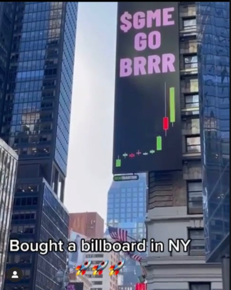
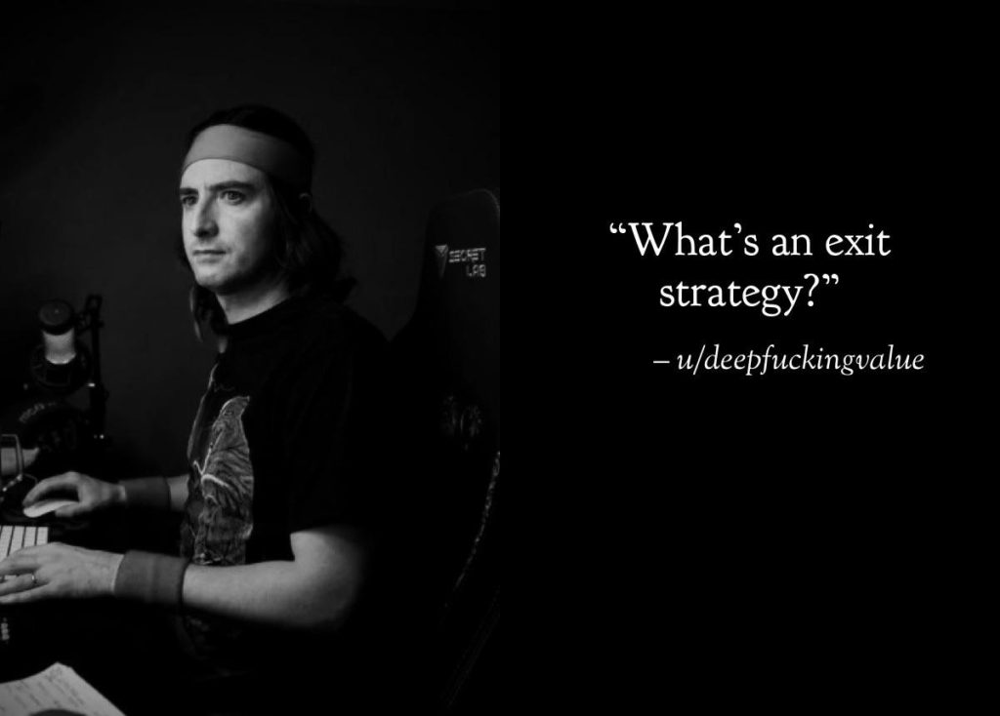

_Disclaimer: This is not investment advice or any sort of investment thesis on whether you should invest in GME stock or not._ 

## **GME is everywhere**

<figure>

<figcaption>

GME in the Times Square

</figcaption>

</figure>

The media is full of content related to GME. It is impossible to escape it. In this article I do not dive into what is happening with the stock and what you should do about it. 

Instead, I would like to touch upon what it means to your portfolio and your FIRE journey as a whole

## **A very brief summary of what is happening**

GameStop is a Brick&Mortar retailer of gaming stuff. The business model seemed to be under stress and COVID only exacerbated its woes. Short sellers led by Melvin Capital sensed blood and decided to short the company stock. 

The short interest, which measured the percent of stock sold short in relation to the total float is above 100% (at the time of this writing)

### **The Reddit Warriors**

A once small group on the online forum Reddit started discussing this as a short squeeze opportunity and many members like u/DeepFuckingValue started buying the stock.

<figure>

<figcaption>

DeepFuckingValue in Deep thought perhaps!?

</figcaption>

</figure>

Over the last couple of weeks the stock bounced up by almost 1000% . This sent the shorts i.e. the Hedgefunds panic and started taking action to fight this tsunami of retail buying that is coming in and putting pressure on their shorts.

### **Thursday January 28th , 2021**

A date that might be recorded in infamy when it comes to financial markets. Hedge Funds along with retail brokerage like RobinHood, Interactive Brokers etc, colluded to prevent small investors i.e. the Reddit Army from buying anymore GME stock. In the meanwhile the Hedge Funds tried to load up on more shorts and get out of their positions.

By this time this had become a bi-partisan agenda where even AOC and Trump Junior were on the same page!!! The movement overflowed the borders of US and international investors are getting into this.

### **A movement** 

By this time, this has stopped being a trade and has become a movement. Many people believe that this is payback time for the 2008 financial crisis that left many middle and lower class people -  the 99% with a raw deal.

As of this writing, it is unclear how the whole thing will unfold but it is important to take stock of this as this is a historic event that can set the course of investing for the masses going forward.

## **Back to Basics?**

For the most part of 2020, many small investors opened their first brokerage accounts and started trading individual stocks. Many proclaimed that the indexing or buying ETFs on indices like S&P 500 was a boring way to invest. 

But, the key take-away of the GME saga for someone on the FIRE movement is that the individual stock picking/trading is a game for the professionals (no pun intended).

When the small investor was winning they just changed the rules to suit them. But, it is all fair and square when things are going their way. This means that it is harder to beat these large Brokerages, Hedge Funds, Market Makers at their game. As a small investor (relatively) we don't have the skills or the resources to outsmart them.

The alternative is to buy and hold index ETFs for the long run. It is very highly unlikely that any brokerage or Hedge Fund would stop trading in index ETFs (well, not impossible but very unlikely)

In fact, it is possible to totally skip the stock market and buy the index funds directly from companies like Vanguard, Fidelity etc. in the case one chooses to avoid going into capital markets.

I hope the small investor rights are protected! 

**POWER TO THE PLAYERS!!!**
