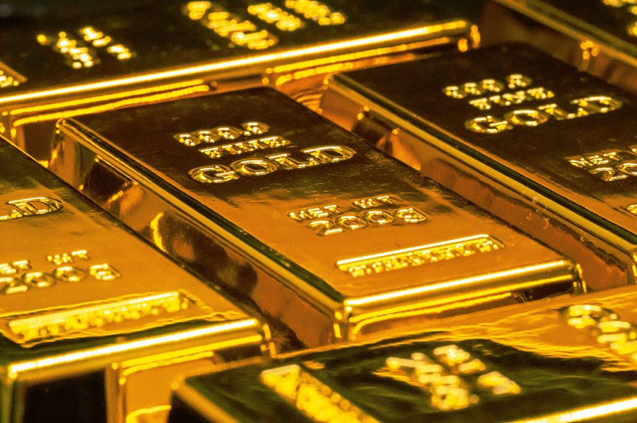
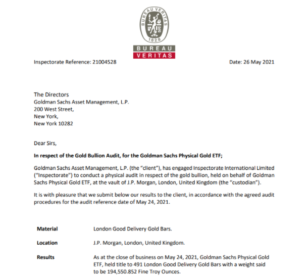

<figure>

<figcaption>

Gold Bars - Photo by [Jingming Pan](https://unsplash.com/@pokmer?utm_source=unsplash&utm_medium=referral&utm_content=creditCopyText) on [Unsplash](https://unsplash.com/s/photos/gold?utm_source=unsplash&utm_medium=referral&utm_content=creditCopyText)

</figcaption>

</figure>

Gold has been a go-to asset to invest in for several thousand years. These days it is not necessary to invest in physical gold and secure it with lockers and get insurance against theft etc.

All of the chores of maintaining custody of the physical Gold can be outsourced to professional custodians which allows the small investors to invest in Gold similar to investing in any ETF (Exchange Traded Fund).

There are several ETFs to consider and the list may be confusing. Here is a criteria that I have used to wade through the list. 

## A short-list of criteria

- LOW MER - Management Expense Ratio

- Large Sponsor

- Actual Gold and not Miners

## AAAU - Goldman Sachs Physical Gold ETF - Expense Ratio 0.18%

This [ETF from Goldman Sachs](https://www.gsam.com/content/gsam/us/en/individual/products/etf-fund-finder/goldman-sachs-physical-gold-etf.html) has about ~400Million USD in assets. It holds actual physical gold in a vault located in London.

This physical gold is periodically audited physically. Which means verifying the Gold bars location and weighing a sample of the Gold Bars to make sure they represent the actual weight as per the accounting records.

_(See sample below)_

<figure>

<figcaption>

A sample of the Audit

</figcaption>

</figure>

One important thing to note is that the investors do not have a right to take physical delivery of the gold their investment represents.

Tax treatment - Because the investment is made in physical assets and not in stocks. The tax treatment would be different. Any gains made upon selling after more than a year are taxed at 28% instead of the 20% capital gains tax. 

Every individual has a different tax scenario, so consult your tax advisor for the specifics.

The biggest red flag however is that the physical gold is not insured. This means that in the event of theft or any other adverse events resulting in a loss means that as an investor you would have no way to claim your assets back.

I feel this is very similar to buying your own physical gold and storing it in a secure location. In such a scenario, you are responsible for every sort of risk that arises. 

## IAU - BlackRock’s Gold ETF - Expense Ratio 0.25%

[Structurally IAU](https://www.blackrock.com/us/individual/products/239561/ishares-gold-trust-fund) is very similar to GoldmanSachs AAAU. Both are setup as trusts which hold physical Gold. IAU’s gold is held by custodians in London, NewYork and other cities.

They are also similar in terms of the tax treatments. There are only two key differences, the expense ratio is 0.25% which is on the higher side. The other is the size of the ETF. IAU has about 28Billion USD in assets. Making it the second largest Gold ETF to GLD.

BlackRock has a similar ETF called IAUM where the M stands for Micro. I was unable to find any difference between the two funds other than the expense ratio and the size of the funds. IAUM has an Expense Ratio of 0.15% and only 580M in Assets.

## GLD - Expense Ratio 0.4%

The [largest Gold ETF](https://www.spdrgoldshares.com/) at about 58Billion USD in assets. It is also the most expensive in terms of the Expense Ratio at about 0.4%.

Other than this, the structure is exactly similar to the other ETFs described above. 

Just like IAU has IAUM, GLD has an equivalent lower cost and smaller ETF called GLDM. The expense ratio is lower at about 0.18% and smaller Asset Base at about 4.4Billion USD

## Conclusion

All of the funds discussed above have physical gold so there is nothing to differentiate. The only dimensions to differentiate are the expense ratios and the size of the ETF. 

GLD is more suited for institutional buyers rather than smaller investors. GLDM might be a good match for the needs of the retail investor as it has a lower expense ratio at about 0.18% and a large enough Asset size at about 4.4Billion USD which is almost 10x that of the other two low cost ETFs like IAUM(0.15%) and AAAU(0.18%). 

I would personally strike out AAAU which is sponsored by GoldmanSachs which I think lacks any sort of ethics or even a sense of fair-dealing. 

In conclusion it is a tie between GLDM and IAUM.

_Disclaimer: this is not investment advice. All content is for educational purposes only._
