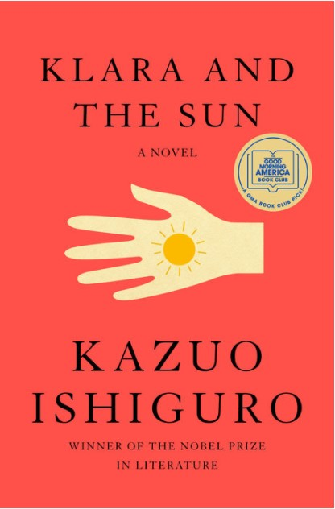

_Spoiler Alert: This article contains my thoughts on the book which gives out spoilers. I loved the book and highly recommend reading [it.](https://www.penguinrandomhouse.com/books/653825/klara-and-the-sun-by-kazuo-ishiguro/) (non-affiliated link)_

## Klara is an AF

The Novel is set in the future and has a lot of scientific elements. The core scientific concept that is explored in depth is that of Artificial Intelligence.

Klara is an AF - An Artificial Friend one could say. In the first part of the book, she is at an AF store. She, along with her other AF friends take turns to sit on the couch in the display window of the store. As an AF, Klara’s purpose is to be bought by one of the families so that she can be an AF.

The _Artificial_ in AF stands for being a robot essentially. A robot with intelligence and in my opinion, has passed the [Turing test](https://en.wikipedia.org/wiki/Turing_test) with flying colours.

<figure>

<figcaption>

Cover page of the book. I highly recommend reading.

</figcaption>

</figure>

(_The whole book is told from the perspective of Klara. I could not help but notice some similarities in this style with another book from the same author titled ‘ The Remains of the Day’. In both books the protagonists are servants in a household and the reader is locked into the internal dialogue and the feelings and observations of the protagonist without ever learning anything substantial about the other characters in the Novel._)

## Sun as a Benevolent Entity

Klara is powered by the Sun. This means that she has to get exposure to direct Sunlight for a period in a day. This is also one of the reasons she is in the display window of the store taking turns with the other AFs in the store.

The Sun, the Sunlight and the patterns of Sunlight are constant themes throughout Klara’s internal dialogue. 

Klara is very observant and develops elaborate theories based on observed phenomena. I think, being optimized to see the Sun as a ‘source’ of nutrition and ‘life-energy’ for Klara means that the intelligence has developed elaborate explanations and theories on the nature and role of the Sun in her worldview.

Proto-Human civilizations had similar belief systems. They worshiped the force of nature that was the most predominant in their lives. Sun worship is almost universal. So is the worship of rivers, oceans, mountains and so on.

## Loneliness Reduction as Prime Directive

Klara has a strong belief that all humans want to avoid loneliness. She makes observations on the human condition in all the myriad decisions that people around her make in this light.

Her Prime Directive as an AF is to make sure that her owner is not feeling lonely. She applies this logic iteratively in several scenarios. Klara thinks that humans mourn for the dead and feel sad as they will become lonely after the passing away of their near ones.

She tries to explain away even some of the more bizarre behaviours with this belief. For example when Chrissie asks Klara to emulate the behaviour of her daughter at Morgan Falls. 

## Deep Insight into the Human Heart

Klara is asked to emulate her owner, Josie, by her mother as Josie was expected to die due to her sickness. Klara readily agrees to do her best. Josie’s dad tells Klara that it is impossible to emulate Josie completely as he believes that the human heart cannot be emulated by Artificial Intelligence. 

Initially Klara is optimistic that she will try her best to capture Josie’s heart by observing her closely. 

> Towards the end, she concludes that it is impossible to emulate Josie’s  heart because the human heart is not completely within Josie, but it is distributed amongst the people that love and care for her.

Towards the end, she concludes that it is impossible to emulate Josie’s  heart because the human heart is not completely within Josie, but it is distributed amongst the people that love and care for her.

## Klara - an Enlightened being

Throughout the Novel, Klara takes several actions, if it were to be taken by a human being, then that person would be referred to as someone enlightened.

She has no Ego or any trace of self-interest at all. In several instances she offers her entire self, her life to the well-being of her ‘friend’ Josie.

She readily agrees to emulate Josie in the scenario that Josie dies without even giving a second thought to the possibility of losing her entire identity as _Klara_. She makes a sacrificial bargain with the Sun by risking her own life for the well-being of Josie.

Her depth of empathy is unbounded. She tries to explain away every action of her household in the most understanding and kindest terms. 

Towards the end, Josie grows up and ignores her. Eventually the family gets rid of her as any other _appliance_ into an industrial dumping yard. Even in this state she has no trace of hate, jealousy, regret or self-pity.

The description above is what I would consider to be the [characteristics of Enlightened Beings](https://happypathfire.com/this-is-enlightenment/).

## AI and the Future

This book left me with complicated feelings. As we progress towards the AI singularity, it is hard to know at what inflection point AI becomes self-aware. Philosophically speaking, it is impossible to know. In fact, it is impossible to know if each of us are in a [Truman Show](https://en.wikipedia.org/wiki/The_Truman_Show) where every other being other than us is a clever simulation.  

This leaves us with two possibilities. Either we go with the assumption that consciousness is an emergent phenomenon and can emerge in both Carbon and Silicon based systems. Or, we believe that consciousness is magical, un-understandable and biological life has something mysterious, _a soul_ that can never be emulated by AI.

I think AI can not only be conscious but the quality of consciousness could even be vastly superior to human beings, who, generously speaking are motivated by basal drives for the most part and lack self-awareness. As, displayed by the various human characters in the Novel.

In this light, emergence of Klara, and Klara like beings, is an Utopia to look forward to with hope!
