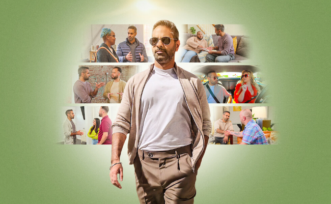

I recently binge watched the [Netflix show titled ‘How to Get Rich’](https://www.netflix.com/title/81410436#:~:text=Money%20holds%20power%20over%20us,them%20achieve%20their%20richest%20lives.&text=Watch%20all%20you%20want.). It is a show where author and Personal Finance influencer Ramit Sethi helps several people with their Personal Finances.

## Background

The show spans people from diverse walks of life. There is Sophie, an Olympian Gymnast who is struggling with her Condo purchase. Then there is Frank who won big in a reality show, yet is struggling with his life-style and money habits. 

The overwhelming majority of the people on the show are couples. I think couple finances are much more complex as it involves more than just money. It involves two people who might have different life experiences and points of views on money.

I would highly recommend watching the show if you are interested to know more about Personal Finance. It is entertaining and informative. (‘Infotainment’ is the right word I think.)

## Here are my 9 key takeaways

## 1\. Envision your rich life

Ramit keeps challenging the participants in the show to envision what their _Rich Life_ is going to be. A _Rich Life_ is the kind of life that one would want to live. It is not fantasy, _like I want to be a Billionaire_ but at the same time it is not to continue _doing the same thing_ and hope magic happens. Instead, it is a vision of your financial future that is grounded in reality.

I was surprised that deep down all of the participants knew that they were struggling and were able to come up with their vision of a _Rich Life_. For Christian and Millie, the couple from New Jersey, it is about retiring Christian’s mother and buying an investment property. For Drew, a Drag Queen from Chicago, it is being a more equal partner in their marriage. 

## 2\. Create a Conscious Spending Plan

Most of the couples have never sat down and taken a close look at their spending habits. A conscious Spending Plan is simply creating a budget. 

A budget helps allocate money to various categories of spending so that there is no anxiety and _in the moment_ decision making. No more wondering ‘Can we afford this?’.

In addition to allocating money to spend, the plan also involves allocating money to savings, investing and most importantly paying back debt. 

So, take a close look at at least 1 month of your incomes and spending and categorize them to understand where you are at. Then create a plan that helps you achieve your rich life. 

## 3\. Pay your smallest debts first

For people who have several debts, Ramit suggests paying off the smallest debts first. This method is popularly known as the _Snowball Method._ More than the financial reasoning, it is the mindset change that this method creates. 

Frank, the reality show winner, thought that they would take their student loans (about 200k+) to the grave. 

Make a list of all your debts and sort them from the largest outstanding amount to the smallest. Start off by paying off the smallest debt. 

By paying off smaller loans, it creates a _snowball effect._ In simple terms, with a loan paid off there are savings on interest and fees that can be put towards the next loan - clear it and keep going. It also boosts confidence and shows that it is possible to become debt free

## 4\. Earn More - There is a limit to cut costs but no limit to earning more

Every participant in the show has problems with spending. But, some of them have problems with earning as well.

It seems common sense that there is a limit on how much you can cut spending. If our groceries are 400$ a month then that's the maximum you can cut, just 400$!

But, if your income is 3000$ a month or about 36,000$ a year then there is a realistic possibility to increase your income. Explore ways to increase income. Making a career switch, side-hustles etc are some examples that you should consider.

## 5\. Home ownership is not for everyone

Home ownership is almost seen as a right of passage into adulthood. But, it is not applicable to everyone in every situation. Sophie, the Olympian gymnast, was struggling with her condo purchase. Given her income, she could not afford repairs in her unit. 

She was paying a large amount of her income towards her mortgage, fees and taxes. After putting together her conscious spending plan, she is convinced however reluctantly that she has to sell her condo and rent for a while.

A good rule of thumb is to see if the housing costs(rent or mortgage) are less than 30% of your after tax income. Be mindful of hidden costs of owning a home. Rent is usually the maximum amount you would pay for housing. Mortgage is almost certainly the minimum amount you would pay for housing.

## 6\. Don't Trade, Invest

For most people who are not professional traders, trading leads to losing money over the long run. Sure, there can be streaks of winning but just like in a casino, the house always wins.

Christian, who started trading during the pandemic sees his investment of 30,000$ in Zoom increase to 150,000$ in a matter of weeks. This prompts him to trade more and he ultimately ends up losing 100,000$. 

Ramit recommends investing and not trading. Invest in index funds or target date funds from low cost ETF providers like Vanguard. 

## 7\. Help yourself first

In case of an emergency on an airplane, we are instructed to put on our own mask first before trying to help our co-passengers.

Similarly, Ramit suggests that people should first get their own finances in order before thinking about spending on others or even contributing towards joint goals in a relationship.

For example, Drew the drag queen from Chicago has a savings account for their dog but no retirement account for themselves!

Understand your own finances first and try fixing it before trying to include others in your Financial Life. I understand that it is not always possible, especially if you are in a relationship. (See, next takeaway)

## 8\. Talk to your partner about money

Money is not just a number. It involves culture, [psychology](https://happypathfire.com/category/behavioral-finance/), emotion among other things. Several couples discover surprising details about their partner’s financial lives during the show. 

Things can be swept under the rug but just like that credit card debt that keeps growing over time, the friction in a relationship keeps festering over time before it explodes eventually. 

There is a lot of guilt, shame, past trauma when it comes to having an honest conversation about money with your partner. But, it is something that you should talk about with your partner. Even better if you can start talking about money in the early part of your relationship. 

## 9\. Build confidence by making hard choices

I think the biggest take away is to build confidence in yourself by making hard choices. 

Sophie, the Olympic gymnast, decides to sell her condo that was not aligned to her income. Millie, the multi-level marketing lady, decides to look for a new career. Monique and Donnell (the cutest couple on the show), decide to sell stuff in their storage unit and downsize. Frank, the reality show winner decides to have their 200$ Sunday brunches less often.

These are hard choices. The point is not the amount of money involved in making these choices but what those choices mean to those people. 

I think, making those hard choices boosts self-confidence which creates a positive spiral that will eventually help you achieve your **Rich Life**
