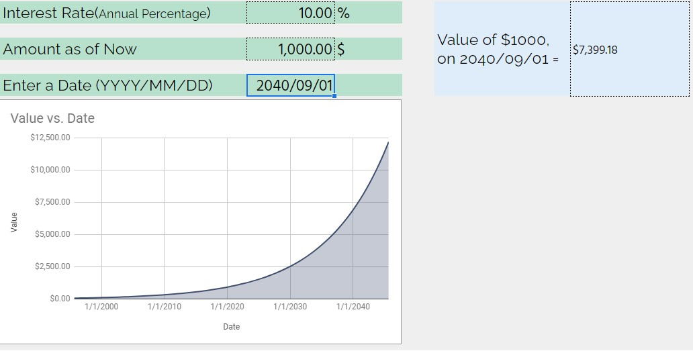

Firstly, apologies for the click-baity sounding title. I say ‘sounding’ because I believe the title is true and through this article allow me to prove it to you.

In some sense this is related to the article I published recently titled ‘[How much is money worth anyway?](https://happypathfire.com/how-much-is-money-worth-anyway/)’where I had cautioned against getting comfortable with the money you have and becoming complacent in achieving your target Financial Goals. 

Here, I take a slightly different approach in telling you not to worry too much about getting to your financial goals, or, for the purpose of the rest of this article about 1 Million Dollars.

I assure you that there is no contradiction between the two and I think you would be able to appreciate this by reading this.

## **The first X is hard the next X is easier**

You may have heard this said in several situations. It does not matter what the value of X is. It could be 1000$ , 10,000$ , 1Million $ , really anything. 

The first 1000$ is hard the next 1000$ i.e. getting to 2000$ is easier.

## **Money makes money**

I am not sure of the origin of this phrase but I think I know the reason for it. To put it simply, it is because as you accumulate money, the flywheel of your wealth starts to generate more money without you doing anything much. 

Of course, if you leave all your money in a checking account nothing much would happen. However if you invested that amount even in the most risk free bond portfolio you would start earning some kind of returns. 

## **The 8th Wonder of the world**

What is more intriguing is the fact that the returns that are generated from financial assets compound in case you re-invest into your investments instead of withdrawing. At least on a net basis. That is you invest more than you withdraw. 

Like all famous quotes, ‘Compound interest is the 8th wonder of the world’ is a saying attributed to Albert Einstein.

In any case, no matter whom this is attributed to , it is really a wonder. The effect of compounding is hard to notice at first but as time goes by the effect becomes non-linear and becomes explosive!

## **Look at this graph below.**

<figure>

<figcaption>

The power of compounding!

</figcaption>

</figure>

An amount of  1000$ compounds to over 7000$s in 20 years at a mere 10% annual interest rate. So, an additional 6000$ was added with almost no effort but due to pure compounding (not considering inflation in this case)

The higher the annual return or higher the initial amount or longer the duration of the investment the higher the final value of the investment.

Now that we understand the basics let us now look at how can we get to 1Million $s

## **Start with 10,000$s**

We could start off with any amount but for simplicity sake, I will start off with 10,000$. Assume that you invest the amount and in addition to not withdrawing from the 10,000$ you continue to contribute regularly. After some time, this 10,000$ grows to 20,000$. Let's assume that the time taken to get to 20,000$ was 1 year.

## **The next 10,000$s**

Keeping everything the same, I mean similar contributions, similar investments. You continue your FIRE journey and soon your portfolio is now worth 30,000$. If you check how long it took, it would be less than 1 year!

The reason is not magic but simply due to the fact that your investment will appreciate over time.

When you went form 10,000$ to 20,000$ there was only 10,000$ that was giving you returns, at about 10% it amounts to only 1000$ (I am ignoring the monthly contribution and the slope of contributions and returns for simplicity). 

But, in the case of going from 20,000$ to 30,000$ you get a 2000$ boost from your portfolio. This is how the acceleration works. The more money you have the easier it gets to reach the next x of your portfolio.

## **7 steps**

I know that I set an arbitrary start of 10,000$ but it is with good reason. It is a reasonable amount to start investing as an early investor with time as your ally which allows for really long term compounding.

Using the 10,000$ as a start, this is how the steps would look like. Treat it as a mile-stone marker rather than a map. 

1. 10,000$
2. 30,000$
3. 60,000$
4. 100,000$
5. 300,000$
6. 600,000$
7. 1M$

You might notice that the difference between each step is not the same at every step. For example the difference between step 5 and step 7 is a whopping 700,000$s, while the difference between step 2 and step 4 is 70,000$. 

But, if you take the ratios, i.e. step 7 to step 5 1M$/300,000$ it is 3.33. This is the same ratio between step 4 to step 2. 

The effects of compounding dominate contributions as the amount increases. It only seems like the next milestone is further away but with the power of compounding it is actually not as far away. 

## **Be patient not complacent**

Like I mentioned in the opening, it is possible to become complacent and lose focus on the goal as you now see that you are getting wealthier without contributions as the effect of compounding is immense. While in the article I did prove that the wealthier you get, the higher is effect of compounding than contribution ( which is the essence of [Coast FIRE](https://happypathfire.com/coast-fire-best-kind-of-fire/)) , I would still suggest not to ignore contribution and more importantly be aware of the complacency and life-style creep that can push you off-track.

So, celebrate each step along the way while keeping note of the time taken for each step and using that feedback to stay focused until you reach your FIRE goals!
