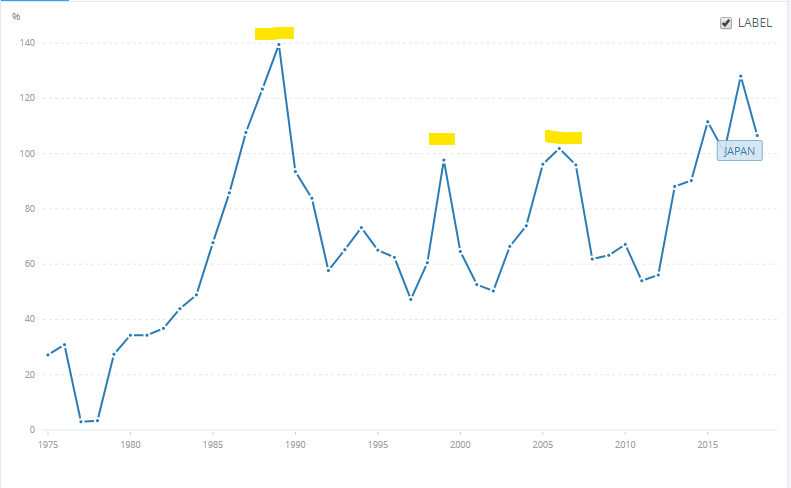
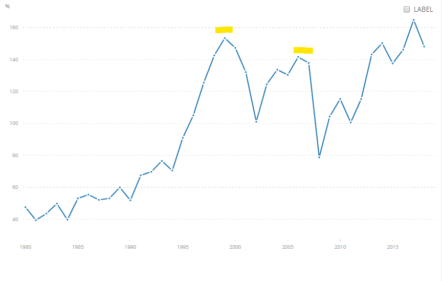
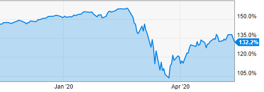
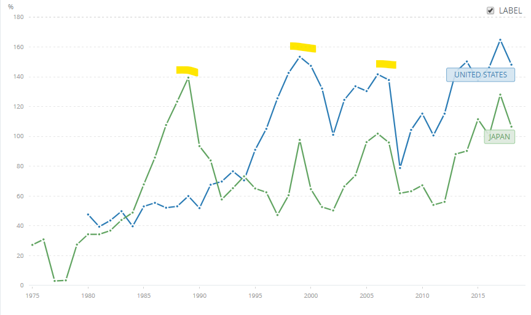

Previously I had written about Geographic Arbitrage (Read the article [here](https://happypathfire.com/geographic-arbitrage/)). The key idea is to move to a target country or region with a lower cost of living. Of course, lower cost need not mean lower quality of life. If you do your homework, it is possible to find something which is not only lower cost but also higher quality of life.

## **International Diversification**

One other related idea that goes with Geographic Arbitrage is international diversification. The concept is similar to diversification within your portfolio. Just like you spread out your investments into different Asset types/classes like Stocks, Bonds, REITs etc. you spread out your investments beyond your home country.

One approach to spread out your investments is to purchase a broad index fund that tracks the world markets. Another approach that could be much more targeted is when you invest in the country that is your target retirement destination.

The advantage in investing in a country of your target retirement destination is that you are protected from inflation and currency exchange issues during your retirement.

Whatever your reason for international investing, it is useful to evaluate the value available in the target country of your choice. 

This is a hard problem. You may know quite a bit about the country where you lived and built up your FIRE portfolio but you may know very little about the target country. In this scenario a useful metric to consider is the Ratio of Market Cap to GDP. I will refer to it as MC/GDP from now.

## **MC/GDP**

Let me first define what this ration actually means and then see it in action.

Market Cap - Think of it as the total value of all the locally listed companies. Every listed company big or small is included in calculating this aggregate value. This is measured in $s.

GDP - This is the total productivity of the country in $s

If the market cap of the country moves further from the reality of what that country can produce then it means that the market is **_overvalued_**. 

In the opposite scenario when the market cap of the country moves lower than the GDP of the country then the implication is that the market of that country is **_undervalued_**.

## **A few examples**

### JAPAN

<figure>

<figcaption>

MC/GDP ratio for Japan from 1970s-2018 -

</figcaption>

</figure>

My favorite example is the overheated Japanese economy of the late 1980s. The Japanese stock market sky-rocketed and then had a spectacular crash. It has taken well over 2 decades to recover to the same highs again.

The MC/GDP ratio at its peak (highlighted in yellow) was about 140% (The ratio is multiplied by 100 to convert it into a percentage). 

Soon after, the MC/GDP ratio stayed below 80% only to peak at around the dot-com bubble.

This pattern is repeated again in the 2008 financial crisis as well.

### USA

<figure>

<figcaption>

MC/GDP ratio for USA 1980s to 2018

</figcaption>

</figure>

Let us look at the MC/GDP ratio for USA. It follows a similar pattern. 

The dot-com bubble peak is at about 140%, similar levels are seen during the 2008 financial crisis at around 140%. 

<figure>

<figcaption>

A sharp drop in the MC/GDP ratio in the recent crash

</figcaption>

</figure>

More recently, early 2020 we saw even higher levels at above 150%.

The recent crash however lead to a drop in the MC/GDP levels to sub 110%

<figure>

<figcaption>

MC/GDP ratios of USA and Japan for comparison

</figcaption>

</figure>

Here are the graphs of the two MC/GDP for comparison.

## **Something to consider before you take the plunge**

### Big is Safe

International investing may not be so relevant if the market cap of your country is a significantly large component of the World market cap. The USA for example represents about 45% of the total world market capitalization. 

Being invested in the US stock market means that you have an indirect international diversification built in. For example, Apple has a significant presence in countries around the world and is the largest company by size in the US stock market (at the time of this writing).

### Diamonds in the Rough

The approach presented here is Macro-economic in nature. This means that we made a judgement call about a country looking at the economy as a whole. It can be argued that it is a very broad brush and that there are _diamonds in the rough_  that will be missed out using this method.

I think looking for such _diamonds_  is a task that is best left to the stock pickers. 

If you choose broad index fund investing, then this method works well. The main reason is that the broad index reflects the realities of the economy and our method evaluates just that.

### Private Companies

Another weakness of this approach is that not all countries have a mature capital market economy. The Market capitalization in the MC/GDP does not capture several privately owned companies, government enterprises, partnerships etc. 

For the above reason I think the trendline of MC/GDP is highly specific to a country. This means that it is incorrect to use this ratio for direct comparison between countries. For example 110% for the USA is normal whereas 110% for Japan may be higher than normal.

I would recommend using it to see if the target country for your analysis is overvalued or undervalued based on the trend of its own MC/GDP values. 

Although I started off with suggesting to use this ratio for international investing, this is just as relevant for investing in your home country as well.

This ratio gives you the ability to make a better judgement call when it comes to evaluating your investment choices.

_Data sources for all the graphs above - [World bank data set](https://data.worldbank.org/indicator/CM.MKT.LCAP.GD.ZS?locations=US-JP)._
