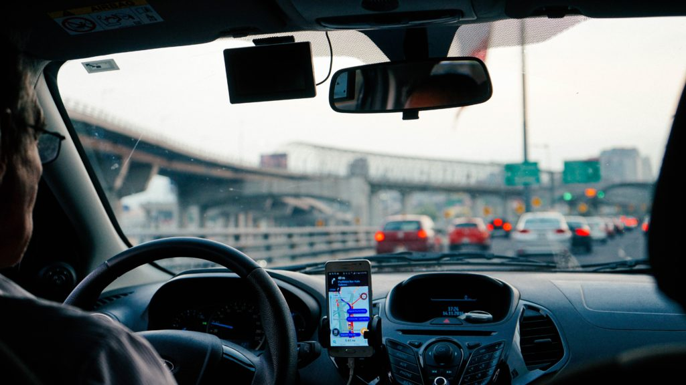

<figure>

<figcaption>

A familiar view from the backseat of a Ride-share

</figcaption>

</figure>

When was the last time you took an Uber? Or checked into an AirBnB? I am pretty sure it is before the outbreak of the COVID-19 crisis.

The pandemic has brought in a lot of changes to the economy and the way we live, work and travel. I had previously written about the [impact on travel](https://happypathfire.com/corona-virus-and-tourism/) and the [stock markets](https://happypathfire.com/recession-cancelled/).

In this article I would like to focus more on the sharing economy.

## **Nothing new under the Sun**

The sharing economy always existed in some form or the other. It is especially commonplace and no surprise to you if you are from a developing country. Given the economic state of scarcity everything is shared in a way. 

Jeepneys in the Philippines, Tuk-tuks in Thailand, Rickshaws in India are all examples of shared transport services.

## **Uberization**

The biggest contribution of Uber is to use technology to disrupt the ride hailing industry and bring sharing to the developed world. 

They were so successful that this model itself was _shared_  across the world and several fast-followers emerged ex: Lyft, Grab, Ola, Didi etc. 

The process was so rapid that the world [_Uberization_](https://dictionary.cambridge.org/dictionary/english/uberization) has come to become a symbol for the technology backed sharing economy.

## **Beyond Ride Hailing**

In fact the concept of sharing went way beyond that of just ride hailing in to other forms of sharing as well. Sharing your own home or part of it to outsiders for a fee i.e. AirBnB, OYO etc.

Sharing of workspaces was a rapidly emerging trend with the famous (or now infamous) WeWork. 

With the fuel of VC money entrepreneurs pushed the boundaries of what could be shared. The most Bizarre thing that I came across was families sharing the same house as each of them alone could not afford to buy the house themselves. 

## **After COVID-19**

The emergence of the pandemic and the subsequent government actions towards a lockdown changed everything. Even after the lockdown is being relaxed in several regions of the world the rules put forth by the governments are very stringent.

## **Social Distancing Kills Uberization**

The single biggest enemy of the sharing economy is Social Distancing. When human beings refuse to gather in proximity to fellow humans then a lot of business models fail.

Using technology to bring together complete strangers to exchange services is the cornerstone of Uberization. With social distancing in place that thesis is completely out of the window.

## **Beyond just Ubers of the world**

It is to be noted that sharing is not something invented by Uber even in the developed world. If we look closely, many aspects of the way we live, work and travel are built on the model of sharing.

We share workspace with fellow co-workers in the office, we share the public transport systems, we share entertainment together in movie theatres, concerts, bars and clubs. 

Even the common-place act of eating out is an implicit way of sharing the kitchen and the dining table!!!

With social distancing, all of these services now face new challenges if not existential crises.

## **It is a 99% problem**

Based on the examples that I have used you might have noticed by now that the problems of Social Distancing are mostly felt by the 99%. The 1% of the population or even the 0.01% of the population don't notice much change. The reason?

The wealthy seldom share anything, in every sense of the word. With Private Cars, Private Jets, Yachts, Private vacation homes and even whole Private Islands. 

With toys like these they are completely secluded and isolated from the masses. The only downside for them is the lack of staff and attendants to take care of them and their toys.

## **The real big question ‘Is Social Distancing Permanent?’** 

Only time can tell if the Social Distancing brought about by the pandemic is something that is here to stay and will permanently alter consumer behaviour and preferences or if it is something that is only a transient response to a situation.

The best case scenario is that an effective vaccine can instil immunity and the confidence in the population to overcome the fears and get back together as before. The worst case is that we are in this state for the long run and there is no effective preventive measure other than a permanent mask and social distancing protocols across service industries.

As a member of the 99% I really hope and pray for the world to overcome the pandemic and get back together as soon as possible!!!
