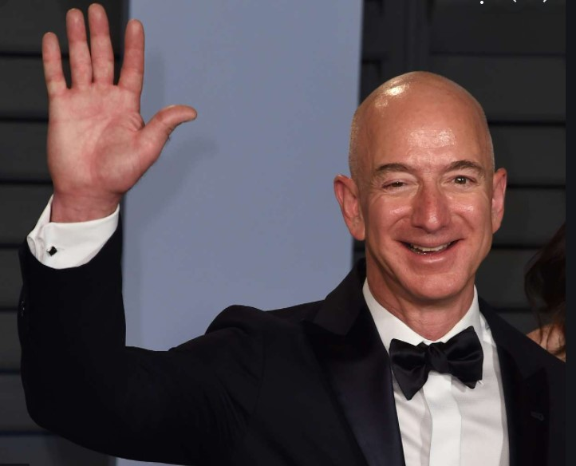

## Well, not Exactly

<figure>

<figcaption>

Jeff Bezos (Obviously)

</figcaption>

</figure>

I admit it seems like a click bait title but, if you are a regular reader of this Blog or if you are a follower of the FIRE ‘movement’ then it comes as no surprise.

FIRE - stands for Financial Independence, Retire Early. I have [written extensively](https://happypathfire.com/the-fat-and-lean-of-fire/) about what FIRE is and what it is not. FIRE is all about the pursuit of happiness after being unburdened from the obligation to earn for the sake of paying the bills.

Jeff Bezos is going to step down as Amazon’s CEO on July 5, 2021 and Andy Jassy is slated to take his place. It is silly to even consider Bezos has only now become Financially Independent. However what is important to note is that Bezos actually decided to ‘retire’ something that can be a great inspiration for many pursuing FIRE.

## Rise above the Golden handcuffs - A Tough decision

Firstly I would like to acknowledge the magnitude of Jeff’s decision. It is hard to imagine quitting at the peak of one’s career. Being the CEO of one of the world’s largest and most successful companies must be the ultimate in terms of [_Golden Handcuffs_](https://en.wikipedia.org/wiki/Golden_handcuffs), (Diamond Handcuffs?). Yet, Bezos, admirably, has chosen to step-down and focus on other things.

## Avoid the traps of Just one more year!

This is something that is commonly observed. The Phenomenon of _Just one more year_. People generally have a target $s in networth in their mind like a Million Dollars. People think, ‘If I have a Million Dollars in Networth, then I will quit my job and go do something meaningful’. But, once they reach that number they move the goalpost a bit further thinking ‘Just one more year and I will be much more secure’. This cycle keeps on going and before they realize they are in their late 60s.

It is a hard decision but I think the reason is the fear of the unknown. It is self-doubt, anxiety among other things. People don't realise that life does not give a second chance. Surprisingly enough, often new and meaningful opportunities come in the way of people who just want to follow their dreams and passion rather than work for the sake of earning a living. 

There are several examples of people who have become more successful after FIRE. I should try to limit my own optimism as this is more of an exception, _a surprise side-effect rather than the norm._

## And a few other things to help pull the trigger

In case you are nearing or have already achieved your intended $s but you are hesitant to FIRE, then here are a few tips on how to go about implementing your decision to FIRE.

**Start Small** - Like all major changes in life one approach is to start small and keep ramping up. For example, if your post FIRE goal is to become a tutor. Consider creating some online e-learning material or provide one-on-one tutoring on a part time basis. This will give you a taste for the post FIRE life and also help you test the waters and get real feedback.

**Exchange Money for Time** - Depending on how flexible your workplace is try to negotiate fewer hours and responsibilities with a corresponding reduced pay. This could mean a 3 Day work week, more vacation time etc. Use this time to get a feel for how you react to more free time.

**Mini-Retirement** - [Mini-Retirement](https://happypathfire.com/mini-retirement/) could be an option. As the name indicates, this involves doing a test run of a post FIRE retired life for a substantial chunk of time with the option to return to work. A sabbatical is the best way to go about it. I think, taking such an extended time away from work broadens your perspective to realise that there is life beyond the cubicle and the next promotion. This broader perspective can make the decision to FIRE more permanent.

## It is A Leap

When it comes to actual FIRE it is a leap of Faith. It is like 0 on the number line. No matter how many decimal places after 0 we can get to,  it is still infinitely far away from 0. FIRE is similar to getting back to 0. You might have spent all your early teenage, adulthood in the pursuit of a career and it really pulls at you when it is time to quit. We are creatures of habit afterall.

It is in this context that the decision of Jeff Bezos to quit at the peak of his career success can be of inspiration. If Jeff can do it, so can you!

Lastly in Jeff’s own words, 

> ...I will stay engaged in important Amazon initiatives but also have the time and energy I need to focus on the Day 1 Fund, the Bezos Earth Fund, Blue Origin, The Washington Post, and my other passions. **I’ve never had more energy, and this isn’t about retiring. I’m super passionate about the impact I think these organizations can have.**...
> 
> [In a recent Email to Amazon Employees](https://www.aboutamazon.com/news/company-news/email-from-jeff-bezos-to-employees)

Have a productive retirement Jeff!!!
