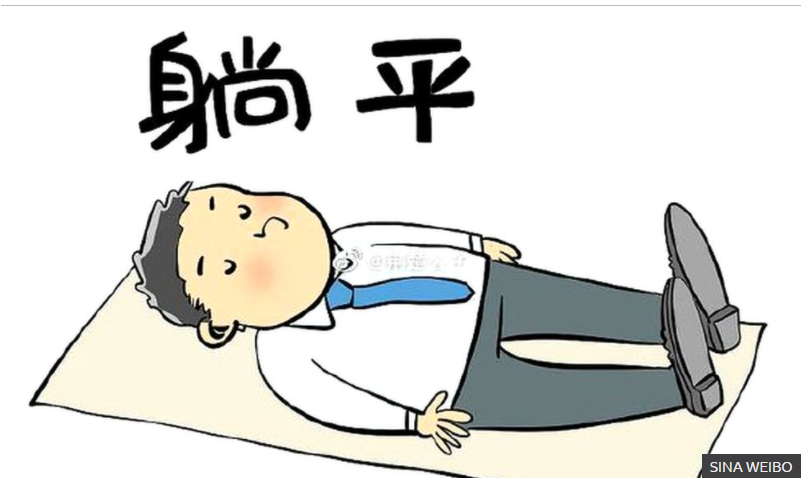

<figure>

<figcaption>

Lying Flat - _Source - Sina Weibo https://www.bbc.com/news/world-asia-china-57348406_

</figcaption>

</figure>

China as a nation is perceived as being industrious. This has been more true beginning in the late 20th and continuing to this day. This has coincided with the meteoric rise in the [economic might of China](https://en.wikipedia.org/wiki/Economy_of_China). The correlation is obvious. The greater the productivity of the population, the higher is the GDP.

I have a superficial understanding of the work culture in China as I have never worked there. However, I did have a chance to visit the country quite recently. Based on my observations and my interactions with the Chinese people I was able to get a sense of what the work-life of most Chinese is like

## **9-9-6**

The Chinese work-life is described as 9-9-6 in short. This means working from 9 AM in the morning until 9 PM  in the evening, 6 days a week!

This amounts to 72 hours a week. The western standard is mostly 40 hours a week. Almost half as long as the Chinese work week.

## **More home**

Culture plays a significant role when it comes to setting life goals. Most life goals are material in nature (need not always be but more on this later). The Chinese culture puts a lot of emphasis on a man having a home in order to get married. 

This has created one of the most expensive real-estate markets in the world. Forget not being able to afford to buy, the Shanghai Real-estate marker for example is too [expensive to even view!](http://flatsh.com/stunning-shanghai-real-estate-you-cant-even-afford-to-look-at/)

The voracious appetite of the Chinese for real-estate has spilled over its borders into many countries like Australia, New zealand, Canada, Europe etc.

## **Lying Flat**

Behind all this glitz is the untold story of hardwork and struggle of millions of youngsters and migrant workers. Recently, I came across a couple of articles that talk about an emerging trend in China where young people are choosing to break away from the rat race.

The first article is from [NYT](https://www.nytimes.com/2021/07/03/world/asia/china-slackers-tangping.html). This article describes the so-called phenomenon of - **_‘tangping’_** or **_lying flat_**. It describes the choice of Mr Luo, who chooses to move to a low-cost location while surviving on odd jobs and about 60$/month from his savings!

[Another article](https://apnews.com/article/business-d2b9f71d73219b32d78709b0afb443ca) talks about a similar topic where youngsters are choosing a low-desire life where they are not as ambitious to follow the standard path that society expects them to follow - graduation, job, marriage, buying a home, kids etc.

Instead they deliberately choose a life that is anti-consumerist and non-materialistic.

This article talks about a 27 year old woman who wants to ‘retire’ after saving up about 300,000$ , a result of saving since her teens.

## **FIRE perspective**

In some sense, I cannot help but see that this is some sort of an early beginning of a FIRE-like movement in China. I think FIRE is a global phenomenon which is a result of the way the modern capitalistic- materialistic society is structured.

I believe it is the result of an entire generation that feels that they cannot do any better than their parents. The previous generation could buy a home, send kids to college and have a retirement - all with a single income household. Whereas the current generation can only choose one of the above that too with great difficulty and planning in spite of being a Dual income household.

This results in the disillusionment with the structure of the modern society and many people who are able to see through the bad deal this is are choosing to sit out.

FIRE in its many incarnations is one such resultant phenomenon. The instances from China - Lying Flat is analogous to [Lean FIRE](https://happypathfire.com/the-fat-and-lean-of-fire/). I believe that as time progresses we will see more instances of people choosing Lean FIRE ( as other forms of FIRE are less accessible to the majority FatFIRE, barista FIRE etc.). This sort of disengagement could lead to an existential threat to civilization due to population collapse. There are some early indicators of the same in China with the recently announced policy change allowing Chinese to have upto 3 children.

From a FIRE perspective, I believe that starting early and avoiding the materialistic traps along the way allows one to not only achieve Financial Independence but also be able to fulfil other life goals one might have. Lying Flat is an extreme case but I believe there is a middle path possible.
