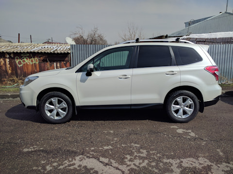

_Spoiler Alert: This article is based on Haruki Murakami’s novel ‘_[_Killing Commendatore_](https://en.wikipedia.org/wiki/Killing_Commendatore)_’. I highly recommend reading the book._

## A White Subaru Forester

The White Subaru Forester is the car which features the most in the entire novel. The protagonist comes across the so-called ‘ Man with the White Subaru Forester’ on his forlorn wandering after his separation from his wife. 

<figure>

<figcaption>

Man with the White Subaru Forester

</figcaption>

</figure>

The character haunts the protagonist so much that he ends up painting the ‘Man with the White Subaru Forester’ . The essence of the stare from the man is captured in the unsaid words “I know exactly where you’ve been and what you’ve been up to”. (I believe this to be the protagonists own projection of guilt for having rough sex with a woman he just met)

I felt the approach of using the car as a source of identity for a character to be something quite unique in this novel.

## A Red Peugeot 205

The protagonist drives a Red Peugeot 205. After separating from his wife, he loads up the car with some gear and goes on a trip all over Japan. The car just about holds up and finally breaks down. The protagonist leaves the car in the Fukushima area. Years later, after the massive earthquake in the region, he is momentarily tempted to re-visit the area to check on his car but decides against it.

## A Black Volvo

Masahiko Amada, the protagonist's friend, drives a black Volvo station Wagon. He is the son of Tomohiko Amada, the original occupant of the house in the hills and the painter of ‘Killing Commendatore’.

## A Red Mini Cooper

The protagonist’s married girlfriend drives A red Mini Cooper. It is described as shiny and new. She is more interested in automobiles than the protagonist. She manages to get all the details including the cars owned by the mystery man - Wataru Menshiki

## A Blue Toyota Prius

Mariye’s Aunt drives a blue Toyota Prius. She is also quite interested in cars. She takes a particular liking to Wataru Menshiki due to his taste in cars.

## A Toyota Corolla Station Wagon of unknown colour

The protagonist does not care about cars in general other than their utilitarian aspect. This is in contrast to some of the other characters in the book. In that sense he seems to be the odd one out in the group. The protagonist is self-aware of this fact. He even mentions this in a reflection at one point in the book where he mentions that all sorts of cars have been on his drive-way off late.

## A Silver Jaguar and many more

[Wataru Menshiki, as a](https://laksvajjhala.medium.com/wataru-menshiki-an-intriguing-character-from-haruki-murakamis-killing-commendatore-4278408674b2?readmore=1&source=user_profile---------8----------------------------) character, is  clearly the most interesting. At least in my opinion. He owns several cars but is seen mostly driving his silver Jaguar.

He seems to like cars with British heritage. His collection consists of 2 Jaguars, A Range Rover, A mini Cooper( It is not clear if he owns the black chauffeur driven Infinity.)

It is intriguing how Murakami is able to tie the characters to cars of all things. I find it interesting that the colour of the car is mentioned unmistakably. I feel that the kind of car and its colour somehow defines the characters.

Starting with the savage toughness of the ‘Man with the White Subaru Forester’ to the chic sophistication of Wataru Menshiki’s Silver Jaguar. Masahiko drives the boringly reliable Black Volvo.

This association of cars with characters applies to the women too. The naughty married girlfriend drives the fun - red mini cooper. While the elegant Mariye’s Aunt drives the reserved Blue Toyota Prius.

The case of the protagonist is much deeper. He starts off in the brightly coloured red French Peugeot 205 when his marriage is on the rocks and ends up with the colorless and unremarkable ( at least on the surface) Toyota Corolla Station Wagon while in seclusion.
