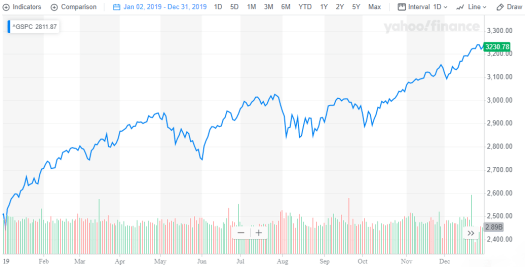
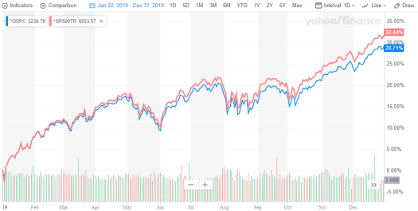
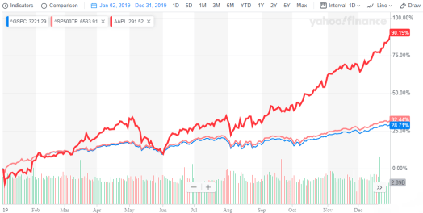
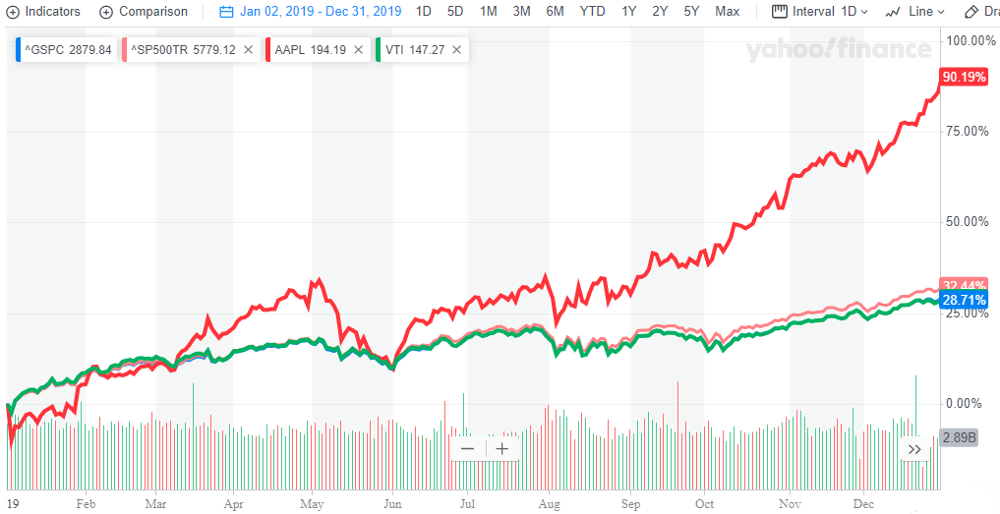
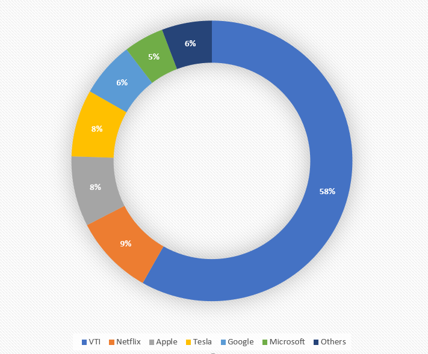
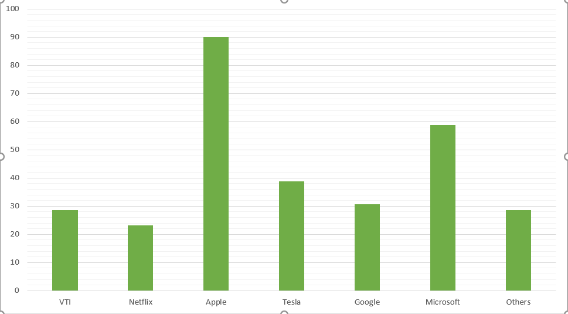

# Happy New Year 2020!!! 

The New year and the decade has started, it is time to take stock of the previous year from an Investment Performance perspective.

## 2019 was a phenomenal year!

There is no doubt about it, 2019 was incredibly rewarding for investors in the Capital Markets. Take a look at the S&P 500 Index below.

<figure>

<figcaption>

S&P500 Returns 2019

</figcaption>

</figure>

The index started at ~2500 levels and ended the year at ~3230 yielding a massive **~28% return!!!**

Things look even better when you look at the **total returns** on the index taking into account distributions like reinvesting the dividends.

<figure>

<figcaption>

S&P500 and S&P500 Total Returns - 2019

</figcaption>

</figure>

The total Returns are **~32.44%!!!**

Note that these returns are on a broad based index i.e. the S&P 500 Index. Which means the top performers within the index returned even larger sized returns!

## If you invested in Apple you made a killing!!!

<figure>

<figcaption>

Apple Stock Returns in Comparison to S&P500 Returns 2019

</figcaption>

</figure>

The bright red is the Apple Stock which returned **~90%!!!**, this dwarfs the returns from the Index itself.

## My Portfolio - Humblebrag

I could go on and on about individual stocks but there are so many of them, literally thousands!!! Instead I will talk about my own portfolio and its performance. I will, for the purposes of privacy, not talk about the size of my portfolio but will share the components and performance of my portfolio. 

## Index ETF + 5 stocks

I use a **_relatively conservative_** _(debatable)_ investment strategy where most of my investment is into a very low cost (0.03% or about 3$/year for 10,000$ Invested) **Total Market Index fund**. I use the [Vanguard Total Stock Market ETF](https://investor.vanguard.com/etf/profile/overview/vti) \- VTI. This ETF invests in the total Market of USA consisting of approximately 3500 stocks. 

The weighting is capitalization based which means their highest holding currently (as of this writing) is Microsoft which is>1 Trillion in Market Cap. The broad nature of the ETF means that in spite of such a high market capitalization, Microsoft accounts for only ~3.7% of the index. In fact the top 10 companies in the ETF account for only 20% of the Index. 

<figure>

<figcaption>

VTI Returns overlay on S&P500 Returns

</figcaption>

</figure>

It may be hard to differentiate but the green line is the return on VTI which unsurprisingly follows the S&P 500 index returns i.e. **~28%**.

The remainder of my investments are into **_Five Stocks_** of very large companies with a sprinkling of small companies bucketed as **_Others_**.

## Here is how my portfolio composition looks like

<figure>

<figcaption>

Portfolio Composition as on 6-Jan-2020

</figcaption>

</figure>

As you can see, the majority of my investments are in VTI ~60%, the next ~35% is in a few large companies. The remaining ~5-6% is in a bunch of small bets on companies and strategies, bucketed as **_Others._**

I find having the **_Others_** useful, mainly to keep me engaged with the capital markets and also give me an off chance of hitting a home run (Statistically Unlikely). In some of these companies I just own a single stock. This works like a bookmark to keep track on the company rather than as an investment.

## Here is how my portfolio Returns stack up

<figure>

<figcaption>

Returns in Percentage over the Year-2019

</figcaption>

</figure>

As you can tell, Individual stocks in general have over performed the index as represented by VTI.

## Portfolio Return - 35%

The portfolio overall return is approximately **35%**. I have to caveat this number. The main reason being that I invested varying amounts throughout the year which distorts the number.

The distortion depends on the size and the timing of the investment among other factors. In my particular case I did not make any sales this year and also, I did not make any additional stock specific investments after March 2019. This means that there are less drastic distortion effects overall. (_Calculating returns is tricky and I will try to address it in a future post._)

## Looking ahead - Y2.02K

After a stellar performance by the US stock market last year, I see little reason to expect a similar performance in 2020. The Broad Stock Market returns should revert back to the long-term returns driven by **Earnings + Distributions (Dividends, Stock Buy-backs etc.)**. This is in the region of **~7-10%**. 

Personally, I will continue with a similar strategy I followed in 2019. I will most likely not invest any additional funds into specific stocks but will continue to invest in the Index ETF - VTI. This will slowly move my portfolio towards a FIRE portfolio over time.

I may also look at index funds focused on emerging markets like the [Vanguard Emerging Markets ETF](https://investor.vanguard.com/etf/profile/VWO) - VWO as a means to gain some exposure to the fastest growing economies of the world. In terms of size, I will start small and see how it goes. 

Of course, I will continue to try out new ideas within the allocation under the _**Others**_ bucket. This segment gives me the **_biggest bang-for-the-buck_** in terms of excitement at least!

A case in point being **Tesla**, which was my risky side-bet in the **_Others_** bucket in 2018 [but graduated to becoming my 5 large individual stocks after a run-up in 2019](https://happypathfire.com/tesla-bear-to-bull/). If the stock continues to rally I may soon be able to afford a Model 3!!! Tesla to the Moon!... sorry **Mars!!!**
