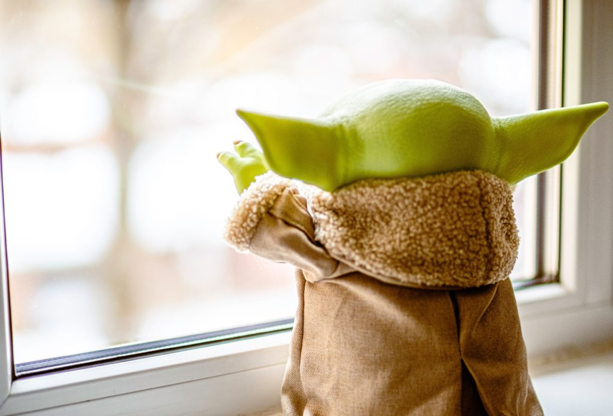

# The Marshmallow Test

[Marshmallow test](https://en.wikipedia.org/wiki/Stanford_marshmallow_experiment) is a popular test in psychology. It is used to test for delayed gratification in Children. The setup of the test in general involves a child is given a single Marshmallow and is given a choice. 

One is, the child can eat the marshmallow immediately. The alternative is, If the child does not eat the marshmallow when the test administrator briefly steps out, then the child is given an additional marshmallow as a reward for waiting.

The intention of the test is to find out if the child prefers _instant gratification_ or _delayed gratification_. I will not get deep into the details of the test but the results indicate that the children who chose delayed gratification _on average_  did better in their personal and professional lives.

# Budgeting - a.k.a Adulting

One of the key aspects of personal finance is Budgeting. It is the engine that drives both the wealth accumulation and the wealth preservation stages of personal finance. Budgeting at its core is an exercise of delayed gratification. 

You choose to put off certain expenses for lateri.e. _delayed gratification_ . Not only that, you fine tune the level of gratification by setting limits to your expenses. For example, a limit on the $s spent on alcohol per month is 100$. 

# Regret

Life is more complicated than the simple Marshmallow Test. What if the test administrator gets hit by a bus when they are away and you end up waiting forever? 

How long should you actually wait?

What if you just eat the Marshmallow and in that instant the test admin walks into the room?

Within the FIRE community forums on the internet I have seen several accounts of people who have some regrets on following the FIRE lifestyle. For example, a person was trying very hard to FIRE and when they were just about to or near their number they got diagnosed with terminal illness which gave them less than a few months to live.

Such people regret not having lived their life to the fullest, they regret all the small and large sacrifices they made along the way. 

This should not prompt us into splurging all the time and building up thousands of $s of debt, only to live into the late 90s while working into your 70s.

I don't have a solution or an air-tight answer to this. 

<figure>

<figcaption>

To Eat or Not to Eat ........ there is NO TRY!

</figcaption>

</figure>

# Travel Regret - an example

Instead, I will try to use my personal experience as a possible example. Travel Regret is something I struggle with. I regret not having travelled enough when I had the chance to. I have written a lot about me missing the experience of flying/traveling on these blog posts ( See [here](https://happypathfire.com/corona-virus-and-tourism/) , [here](https://medium.com/@hvlncan/learning-to-fly-8c3e4925f25b?sk=b0f8327b4c1d2e53d8ab7aa1ce354567))

The last time I had the chance to travel was in 2019, and at that time little did I know that it would be more than 2 years at least before I would be travelling again. 

Looking back it fills me with mild regret. I say mild because given the current circumstances I was at least able to travel towards the end of 2019, just before the pandemic hit. This was just lucky timing. 

The regret part is that while on the vacation, I was still budgeting and hustling hard out of habit. I would find out the cheapest hotel rates and switch hotels if I found a better deal. Scouted whole areas for good value restaurants. Completely avoid expensive looking activities like scuba diving, sailing thinking that I can do it _next time_. Little did I know that the _next time_  would be years and years away!!!

# Middle Path

The learning for me is to find some sort of a middle ground. Not just when I travel but also in my FIRE journey. Looking back to my trip, I feel I should have worried less about the small things. For example, haggling with a street vendor in a touristy area for a few cents should be something that I should have saved myself from. In fact, given the way the tourism industry has been hit, I even feel guilty right now.

Same goes for everyday life in my opinion. Allocating a fixed ‘FUN’ budget can help alleviate some of the future regrets. It does not matter how big or small the amount is, all that matters is that within those limits one is free to ‘splurge’. 

I think there is more to this concept of ‘FUN’ budgeting and I would like to explore this in future posts. Stay tuned!
