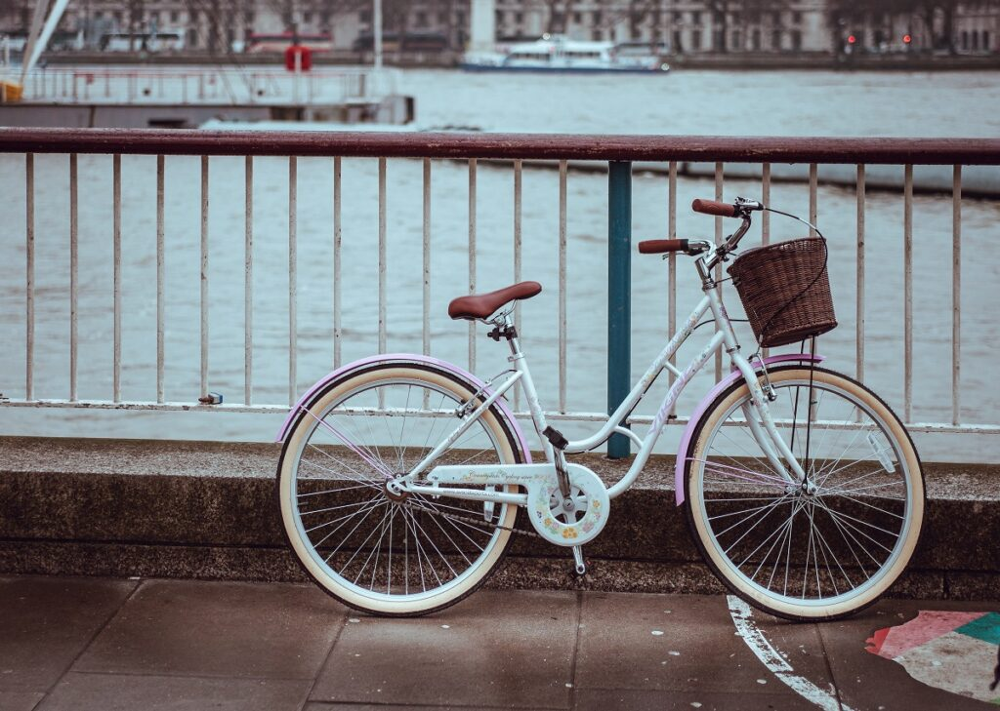

Everyone has their own personal journey on how they learnt about the relationship between money and happiness. Some, probably will never learn for various reasons including luck, wealthy family and so on. 

The very fact that you are reading this article means that you are a person who is willing to invest the effort and do the due diligence when it comes to decisions regarding earning , spending and saving in order to achieve [FIRE](https://happypathfire.com/start-here/) (Financial Independence Retire Early). 

This is my personal story on how I learnt about money. It highlights the events and circumstances that ultimately led to my pursuit of FIRE. It starts off a bit dark but I can assure you that this story has a happy ending.

## All Children are Equal

I was born and brought up in India. It is where I spent the early part of my life until my mid twenties. During school, having uniforms and timetables meant that the differences between social classes was not very evident. We all dressed similarly and ate and played at the same time as dictated by the timetable. It was easy to make friends and wealth differences had no bearing on life experiences.

We were not poor, but my father was the sole bread-winner of the family and we were a family of five - Father,Mother,myself and my two younger siblings. We were poor on a per-capita basis and Father was an extreme saver. He would not spend on himself nor on the family, instead he would try to save as much as possible for the future. In hindsight, it all makes sense because India has no social security. There is a very thin veil that separates a livable life from destitution.

## When small pleasures become hard to get

It was only in highschool that our poverty slowly became evident to me. I dreamt of having my own bicycle. It meant freedom of mobility. I could go wherever I wanted to. The thought felt magical to me. 

All my friends were getting bicycles for their birthdays and there was no indication that I would be getting one soon. When asked, the answer was a flat no. I felt left out a lot.

 My mother came to my rescue. My mother was a house-wife, and she worked really hard to make life as comfortable as possible within the budget that dad allocated to living expenses. 

Mother, being independent minded, worked as a tailor on top of being a housewife and taking care of three children. She made alterations and stitched clothes in the neighborhood. She would stitch by hand for the longest of time and only much later she bought a sewing machine. 

Seeing my plight, mother found an unused bicycle at one of the neighbors' homes. It was a Women’s bicycle which was in pretty bad shape. 

I vividly remember paying 200 rupees or about 3$ and pushing it back home (it could not be ridden yet and needed new tires).

<figure>

<figcaption>

_Luckily my bicycle did not have a basket_

</figcaption>

</figure>

Although I was euphoric, the experience at school was unexpected. It was high-school afterall and I was ridiculed for riding a women’s bicycle. I did not mind and learnt to live with being **different**.

## Reality Check

Things changed drastically when I started Senior High.  It spans two years and most students spend long hours at cram schools trying to study to crack hyper competitive entrance exams to get into top universities. 

Senior High School was almost like college. We were no longer required to wear uniforms. This meant that students would now be able to express themselves through their clothes. 

This was one among the many new experiences that clearly showed my low socio-economic status. Take pocket-money or allowance for instance. Hearing how much allowance my classmates were getting made me drool. 

Dad's answer to my ask for an allowance was logical and disappointing. I had a bus-pass that allowed me to take the bus without needing to pay. I had a packed lunch , so I did not have to buy food to eat. So there was no need for money. 

Once again mother came to the rescue. She started giving me 50 Rupees or about 75cents a month as my allowance. To put things into perspective, a meal in a modest restaurant would cost 25 Rupees in those days.

## Daily Grind

Here is my typical day during those two years in Senior High. Wake up at 4am, drink a glass of milk and get ready for cram school. Walk to the main road and try to flag-down random vehicles to get to cram school. 

_Public transport during the early 2000s was dismal, things are better now but only relatively speaking and nowhere close to what we see in several developed countries in East Asia like Japan, Korea, China etc._

6AM to 9AM study math, Physics, Chemistry, Biology then take a couple of public buses to reach Senior High school. 10AM to 4PM classes with a lunch break in-between. My lunch is always packed from home. 4PM Walk from Senior High school to cram school about 5 km or 3 miles away. Cram school would start  at 5:30 PM and go on until 9:30 PM. 

## Long way home

By the time I chat with classmates and walk to the bus-stop it would be after 10PM and the entire locality would be asleep. Public buses follow no timetable so I had to wait in uncertainty. I would almost always be the only person in the dark-unlight bus-stop. 

Many times the bus would just pass by without stopping because the driver might not have seen me. Even if I get on the bus I would be the only student and several drunks. 

Standing out in any social situation attracts attention and so it was, my interactions with drunks on a public bus were not always entertaining. Luckily , I was the victim of only a few physical assaults. 

On days when I waited beyond 11PM then it was certain that there would be no buses today. This meant I had to go to the traffic light and now hitchhike from random bikers.

 _Note - this is not a common practice in India. People almost always avoid giving rides to strangers for  safety reasons. This meant my strike rate of getting a ride was less than 10%._ _Still grateful to those who did give me a ride_

I would reach home close to midnight and have dinner. This was my schedule 6 days a week with only the School off on Sunday while the Cram school would still be on.

## When it rains it pours

Of special mention are rainy days. When it rains in India, it pours. The monsoon rains are heavy, continuous and lead to power outages. On those days, things would be worse than usual. Soaked head to toe, with no public buses or rides from strangers, every such day would be an anxiety filled nightmare. 

In contrast, almost all of my classmates had now graduated from bicycles to scooters or motorcycles. Given the license restrictions, they would not be able to give me a ride. My attempts at getting the cheapest possible scooter were trashed and even mom could not help.

## Getting less bad

Relative to this, my undergrad degree felt like utopia. Yes, I had to travel thrice the distance on unreliable public buses but there was no more cram school. I was now able to leave home at 8am after having a normal breakfast and come home by 7pm on most days.

We were in peak teenage years between the age of 18 to 21. My classmates were having new experiences like trying beer or going on rides, cafes and so on. I was still on my 50 Rupees a month allowance. This only meant that I had to only hear about cool things one could do.

## Silver lining

I was lucky to get a job offer in an asset management firm as a software engineer a few months before graduation. My salary was one of the top 5 salaries offered on campus. I started working but wasn't paid at the end of the first month as my joining date was after the payroll cutoff date. I was still on my 50 Rupees allowance and tried to dress up in the most formal clothes I had. I wore my father's dress shoes and still brought my lunch box to work.

I finally got paid in the second month. It was about 400$s. I went to the ATM just to see if the money was real and withdrew A hundred rupees or about a Dollar to test. 

There was a cascade of emotions that ran through me , mainly it was that feeling of being rich and a sense of relief. It is a feeling that cannot be described in words. 

For perspective, if your annual pay is 100,000$ and you suddenly get a raise to 50 Million$s a five hundred fold increase, how would you feel?

## Money enables happiness

After the initial rush had passed I contemplated and wondered why people say _money can't buy happiness_. I was surely happy. But, at the time I was trying to make up for my lost teenage years, trying to live in the moment and enjoying little luxuries that were denied to me. 

Only in hindsight I can acknowledge that I was lucky in so many ways when compared to millions of people who do not even have the kind of opportunities I have had. It is embarrassing, but only in hindsight, that I made a big deal of my experiences at the time. However, personally, I treat those experiences as valuable life lessons.

I now know how money can bring safety, security, comfort and confidence. All of these are absolutely necessary to have a chance at finding happiness and self-actualization in life. 

This and several other life-experiences forged in me an attitude of reverence and self-discipline towards money. I know what money can give and what it cannot. Money cannot buy happiness but it can definitely increase your chances of finding it.
