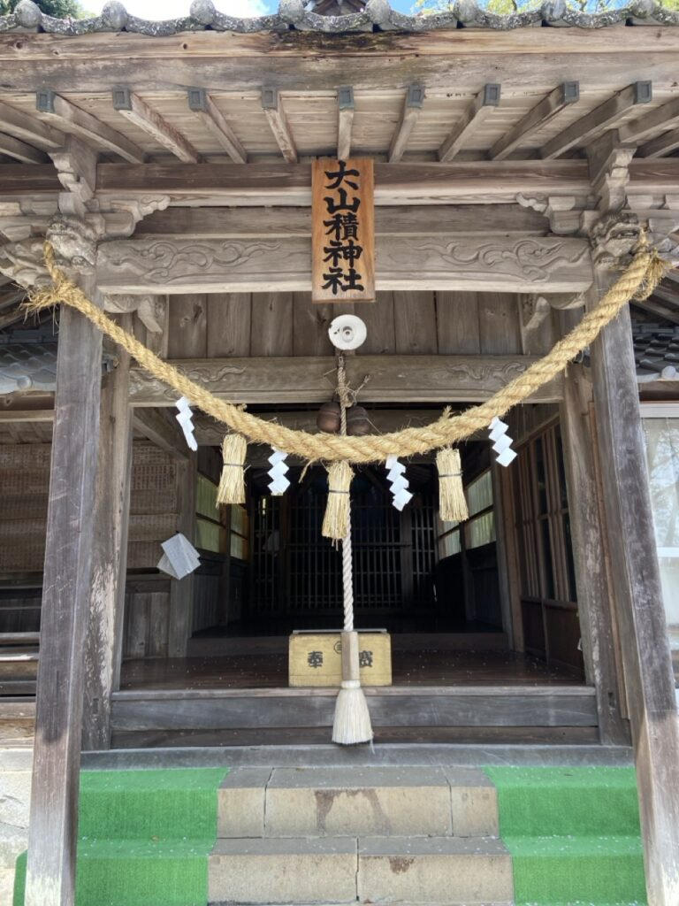

These are my experiences from my first ever Zen retreat. In the spring of 2024 I went on a trip to Japan. I had been in Japan several times before so I was not in a rush to do all the touristy things. Instead, I chose to slow travel and just experience 'living' in Japan for a while.

Zen has always been one of the things that has intrigued me about Japan. To learn more I decided to go on a Zen retreat.

I decided to do a [7-day retreat](https://beppuzenretreat.com/) but as the start-date approached, I was questioning my choice of the duration. 7 days seemed too long. I suspected that it would be boring. One of the reasons was that the location of the retreat was in a remote Village on the Island of Kyushu. After having stayed in bustling cities like Tokyo and Osaka, I expected this to be a rather dull and un-stimulating endeavor.

## Bungo-Toyooka

The retreat was in a small village near Beppu called _Bungo-Toyooka_. It is a tiny town next to the ocean and when I arrived the sakuras were in full bloom on the platform of the small train station. I began to like this serenity almost the moment I stepped out of the train and onto the platform.

Right on time, Zen monk Yodo came to pick me up. The Guesthouse was a short two-minute uphill ride from the station. 

The guesthouse is an old Japanese style family house with almost no modifications other than perhaps a Zen rock garden. It is a minute away from the 600 year old Gyateji temple - the location of my Zen practice.

My room was quite spacious with an adjacent veranda overlooking a Zen garden.

The fresh smell from the tatami mats in my room and the elegant altar of the Buddha along with futons for sleeping gave me an immediate sense of calm and tranquility.

The Guesthouse has four rooms in total and can accommodate upto six visitors with some of the larger rooms capable of hosting couples.

Yodo gave me a quick tour of the house and gave me a small booklet about Zen to pre-read before the actual Zen practice starting the next morning.

## Food

Meal times are communal activities at the guesthouse and I was happy to be involved in the cooking of typical Japanese dishes. Keiko, the adorable wife of Yodo (Zen monks in Japan do have a family) brought some wild bamboo shoots that were foraged by her brother. I found it really endearing that in just a matter of a few hours I felt like I was among close family!

After a great meal and doing the dishes I settled into the veranda to get myself fully familiar with the booklet Yodo had given me earlier. Yodo co-authored the booklet with Aileen, a Filipina PhD student at the Ritsumeikan Asia Pacific University.

Through the book I learnt that there are two main schools of Zen - Soto and Rinzai. Yodo is a monk of the Rinzai school. The booklet was really easy to read but had several deep insights that kept me thinking long after I put down the booklet. 

I slept with a sense of excitement that I used to have when school began after the summer holidays.

## Zazen

I woke up early to begin my first Zazen (Zen meditation) experience. I met Yodo and other guests in the kitchen of the guesthouse at 6:50 AM and proceeded towards the temple. 

The first thing I noticed was the sakuras in full bloom everywhere. Along the streets, in the mountains behind the village and along the downward slopes all the way to the Blue ocean. 

I entered the Gyateji temple and I was struck by the beauty and simplicity of the temple and the garden. 

While I was still in the process of taking it all in Yodo pulled me aside to give me instructions on _how to do Zazen_. 

I was all ready for a lengthy philosophical and intellectually entertaining discourse. But all I got was nearly a _sixty second_ instruction!

At the time, I was highly disappointed, but I find my disappointment funny now, only in hindsight. I now understand that Zen is a very **practical** and **practice** oriented path and sophisticated philosophical discussions and debates are seen as pointless and futile. It is only the continued practice that leads to spiritual progress. The process is more important than the outcome. There is a Zen saying that goes something like this - 'Before enlightenment chop wood carry water. After enlightenment chop wood carry water'

Here is a summary of Yodo's instructions to me:

## Three things about Zazen

1\. Posture - Sit upright in a full or half lotus position on a cushion. Palms resting in your lap one on top of the other. Keep your eyes open and look down at a roughly 45 degree angle

2\. Breath - Breathe normally and count your breath with full concentrated awareness from 1 through 10. Once you reach 10 start over from 1

3\. Thoughts - It is only natural that some thought will distract you and cause you to pause your counting and shake your concentration. At that point, let-go of the thought and start over by counting from 1

## Overcome by beauty

As I sat on the veranda of the temple overlooking the garden I was overcome by the sheer beauty that surrounded me. Since I had my eyes open, I was continuously distracted by the beauty of the garden and over the horizon I could see the ocean too. To add to all of this it suddenly began to rain heavily, accentuating the overwhelming splendor of nature. 

Over the course of 40 minutes of Zazen I think I did not reach the number 10 even once. I was constantly struggling to let-go of the thought that 'this is beautiful', 'I will miss this moment when I go back home' and so on.

## Real Zen training

After the Zazen session we had a simple Japanese porridge for breakfast and got back to the temple at 10 AM to do **Samu** - Basically chores for the upkeep of the temple.

Yodo gave me a rag and asked me to clean the wooden sliding doors of the temple. Almost immediately as I started cleaning several negative thoughts arose. First was the thought that 'I should be doing something more productive and not something as menial as this'. 

Later, it was some amount of self-pity along the lines of 'I am such a successful person and what series of life choices led to this situation where I am doing this menial work?'. I even found it absurd that I paid good money to just do chores all day!

As all these thoughts went through my head I saw that the other guests were diligently doing their work and so was Yodo. That was when I recalled what I had read in the booklet the previous day. As I cleaned I reflected on this and very slowly I began to understand a little.

The three key ideas that I learnt were **No-separation**, **No-hierarchy**, **Ichigo-Ichie**.

Here is how I currently understand (At the time of this writing) these ideas.

## No-separation

This idea implies that there is _no-separation_ - between I and you, us and them, mine and yours. This view of separation is the source of all conflict and dissatisfaction in life.

The Zen view extends this idea of non-separation beyond other human beings to all of life, in fact, it extends to all objects of the world. It sees the world as **one** rather than breaking it down into groups which are usually along the lines of some idea or a narrative.

## No-hierarchy

Closely related to the idea of no-separation is the idea of _No-hierarchy_. I understand this as something that arises due to thinking of the self as separate from others. 

For example, If I see someone more rich or successful than I then I feel sad for myself thinking that I am more deserving than the other person. I do this while I completely ignore the fact that I might be better off than a huge number of people.

In a more practical sense, I understand no-hierarchy on a day to day basis as 'all tasks are equally important'. 

I generally hate doing chores like cleaning my house or doing the laundry. I would rather spend the time doing something important like improving my programming skills or learning a new language. No-hierarchy means that both activities - cleaning house and programming are equally important and deserve the utmost care and mindfulness while performing them.

I had a hard time accepting this idea completely. 

Upon discussing this point with Yodo, he suggested **striking a balance** between western logical thinking and planning which involves prioritizing and the Zen way.

## Ichigo Ichie

_Ichigo Ichie_ roughly translates to 'once in a lifetime'. The Zen view is that every moment and every experience in life is precious as it occurs only once in a lifetime and can never repeat.

This reminds me of the words on an old bridge across the Don river in Toronto, Canada 'The River you see is not the river you stand in'. The river changes constantly and the river I see is not the same river I stand in.

The implication of this view is that we should be present in every moment of our lives and treat it as precious as it is something that is fleeting and will not reoccur. 

The other implication is also that we should not be sentimental and cling to the past as nothing lasts forever by its very nature.

## It slowly dawned upon me

Over the course of the next few days I tried my best to apply these ideas into my practice. Not just during the meditation sessions but throughout the day as well. 

While doing chores like Samu (temple work), cooking, doing the dishes, relaxing, walking in the mountains, reading etc.

As I was doing this repeatedly I noticed a tiny amount of realization dawn upon me.

All my anxiety, frustrations, conflicts were due to a strongly and deeply ingrained habit of thinking about everything including people and relationships in terms of hierarchies and clinging to a past experience or craving for a future experience. 

This insight helped me understand the source of so much of personal suffering and as a result, unintentionally, caused suffering for others too.

Personally, I think there is a long way to go but I see this as the first step on this long journey of personal transformation.

## Not just Tea

During my stay, Yodo's wife Keiko and his mother performed a traditional tea ceremony which has a rich and long history and association with Zen. The ritual which seems tedious and inefficient to the western mind makes sense only when viewed in the context of Zen.

There is no separation between the tea utensils, the tea and the self. There is no hierarchy between the host and the guests. Every tea ceremony is unique and occurs only once in a lifetime. 

To show-off my _culturedness_ I recounted the Japanese movie titled '[Every day a good day](https://happypathfire.com/every-day-a-good-day/ "Every Day a Good Day")' that I had seen. Yodo carefully listened to what I had to say and agreed with me and in the end said, 'If every day is a good day then no day is a good day'. 

I was dumbstruck for a moment and realized I had understood it all wrong. I was trying to _**make**_ every day a good day and would get frustrated when it was not the case. But, no-hierarchy means that you are not bothered by a day being good or bad but focus on the moment and do what is supposed to be done mindfully.

## Learning to write

The traditional Japanese calligraphy workshop conducted by Keiko was probably the most fun experience at the retreat. Mainly because of the radiant energy that Keiko brings in as a Calligraphy teacher and a practitioner with over 40 years of practice.

I had imagined calligraphy to be just like writing but with a brush instead of a pen. I was very wrong. It is hard and I can now better appreciate the works of calligraphy.

The same Zen principles apply to the practice of calligraphy too. No-separation between the writer, the brush, the paper and the surroundings. No-hierarchy between the character one is writing now versus the one that came before or after. Every stroke of the brush is unique and happens only once in a lifetime and requires our complete presence of body and mind.

## Onsens, Sakura and Shorinji Kempo

The retreat is located close to Beppu, the onsen capital of Japan and perhaps the world. During breaks I thoroughly enjoyed going to these onsens and trying various local cuisines. 

I even went on hikes around the surrounding hills and biked to the Hiji castle guided by Aileen (The PhD student). The castle overlooks Beppu Bay and looked marvelous with blooming Sakura.

Yodo is a Zen priest but is also a full-time parent. Every week Yodo takes his young son Iki to martial arts classes and I opportunistically dropped into one. 

I learnt about **Shorinji Kempo**, a martial art that I had never heard of before. It was a bit embarrassing for myself to see the 75 year old master performing moves that I can barely even attempt doing. 

I was there only to watch but I was asked to join their practice with such openness and acceptance by the entire group that I was skeptical at first only to realize later that it was just my own closed-mindedness. I wondered if this is also a manifestation of the Zen way - no-separation and no-hierarchy?

## Last day

While I was immersed in my Zen experience time passed quickly and before I knew it, it was time to leave.

After my morning meditation I packed my things and later participated in the lunch preparation. Post lunch I had one small thing to do which I had been putting off. 

Calligraphy displayed in Zen temples are only made by Zen monks as per Japanese tradition. So, Keiko's work could not be displayed in Gyateji. 

However, the Shinto shrine called 'Oyamazumi' in the town had her calligraphy displayed. I wanted to see it before I left.

The day was gloriously sunny and the sakura was still in bloom. The path to the shrine was uphill but it was only a 15 minute climb. Upon arriving at the shrine I realized that I had the entire shrine to myself. It was a small shrine with several sakura trees and the views from it were truly spectacular. I could see the town below and the blue ocean beyond it. 

I saw Keiko's calligraphy at last and paid my respects at the shrine and came back to the guest house.

Back at the guesthouse Yodo surprised me with a souvenir and he was kind enough to drop me off at the train station. During the drive I asked him if he had ever felt attached to some of the guests when they leave, especially if they had stayed for a long time. I was surprised by his answer. He admitted quite openly that he did feel attached but then he also said that he lets that feeling pass and returns back to living in the moment.

I thought that was a great lesson for me to conclude my first Zen experience. 

## The practice only begins

I took the sonic train to Fukuoka from where I was to fly out of Japan. While on the train I was struggling with mixed emotions. I felt lucky to have made the decision to go on this retreat but at the same time I was feeling low to leave the place and people behind. 

Before feeling any lower I decided to change how I felt about the experience. I decided to cherish the moments and practice my learnings and apply them to my day to day life.

With these thoughts I slowly dozed off on the train hurtling towards the bustling city of Fukuoka. Images of the temples, onsens, delicious food, the shrine, the people and Yuzu (the Shiba Inu puppy I befriended) kept arising in my mind and filled me with joy.

<figure>

<figcaption>

Gyateji Temple

</figcaption>

</figure>

<figure>

<figcaption>

The Veranda adjacent to my room in the guesthouse

</figcaption>

</figure>

<figure>

<figcaption>

Humbled student with homework next to teacher(Keiko San)

</figcaption>

</figure>

<figure>

<figcaption>

From left to right - Keiko, Yodo, Me, Yodo's Mother

</figcaption>

</figure>

<figure>

<figcaption>

Oyamazumi Shrine with Keiko's Calligraphy

</figcaption>

</figure>

<figure>

<figcaption>

Yuzu Chan! (Super Kawaiii!)

</figcaption>

</figure>
