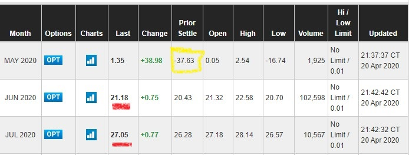
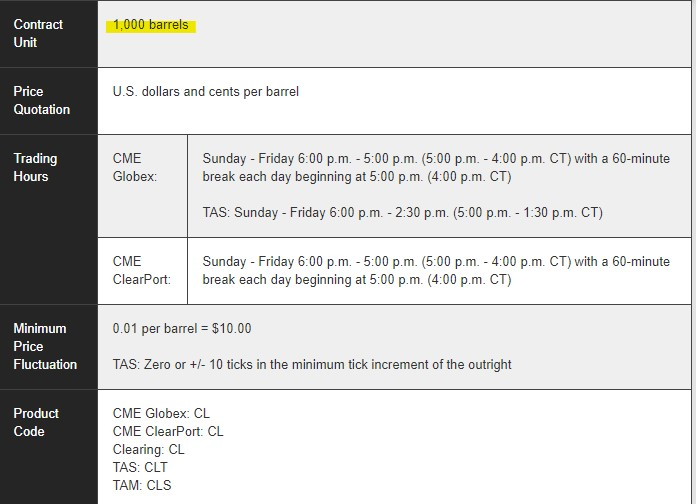
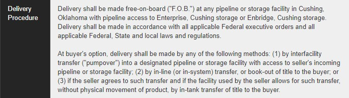

## **Negative Oil Prices**

I have seen negative interest rates so far but today is the first time I have ever seen negative Oil prices. During the course of the day the price of a barrel of oil fell down to -37$ for a Barrel of Crude Oil.

## **What does negative price mean?**

A negative price means that the **buyer gets paid to buy the oil**.

Imagine you going to the gas station and fill your car up and then _collecting money_ for the Gas!!!

## **Capital Markets are dead!**

Do these negative prices show that the capital markets are not efficient? Does it mean that all market participants, the investors, traders, market makers etc are all irrational?

The short answer is **no**.  To the contrary, these negative price are a great indicator that the capital markets are working very efficiently.

Let us look at the pricing mechanism more closely. 

## **Futures Contracts**

The headline grabbing number of the Oil price is not the price of Oil in the market but the price of a Futures contract on Oil. More specifically it was the price of 1 particular contract that was expiring today. 

<figure>

<figcaption>

Oil Futures contracts from the CME

</figcaption>

</figure>

The above is the image from the [CME Exchange](https://www.cmegroup.com/trading/energy/crude-oil/light-sweet-crude_quotes_globex.html). As you can see highlighted in yellow is the low price we saw today. The prices for June and July (underlined in red) are positive and far higher. Indicating that the negative price seen today is a blip.

Note that although it says that it is the May contract the expiry of that contract is set to 20th of April.

Now, for some additional context. I know that this site is dedicated to investing and not trading but for the sake of understanding let us look into this topic of Futures.

Futures are contracts between two parties. They could be between people or companies. These contracts are traded in the market like any other instrument. 

In the case of the Oil contract, each contract controls 1000 barrels of oil. So if you buy 1 contract then it means that you agree to buy 1000 barrels of oil on the date of the contract expiry. 

Here is a part of the contract spec for the Oil futures

<figure>

<figcaption>

The Oil Futures contract spec (partial)

</figcaption>

</figure>

## **Things can get physical!**

Oil is a physical commodity. It is not something invisible like an interest rate or a dividend. The contract has details about the type. Location, form of delivering the commodity specified in the contract. In this case it is crude oil.

<figure>

<figcaption>

An extract of the Oil Futures contract Delivery terms and conditions

</figcaption>

</figure>

There are 2 types of players in the Futures market. Traders and industry. Traders do what they do best, which is to trade and make a profit while the industry here refers to both companies that produce oil and companies that consume oil.

Oil consumers like refineries take delivery on expiry so that they can use the crude in their manufacturing process. Traders seldom take delivery. Imagine if a trader has 100 contracts that is like 100,000 barrels!!! This much oil can actually fill-up a mid-sized oil tanker!

## **It is all about storage**

So, this is what happened today. Traders found themselves having a lot of oil futures contracts on their hand which they were not able to sell. In addition to that, today was the expiry day of the contract. The big refineries and other consumers did not want to buy any more oil as there is no demand thanks to the covid-19 shutdowns.

Usually large hedge funds rent out storage facilities and store the oil and sell it when the prices pick up. But all the storage facilities including oil tanker at sea are now at capacity.

This meant that the traders **had to pay** buyers of the contract to take the delivery. This payment was towards the storage and transport costs.

## **Conclusion**

The negative prices are an anomaly but are not an error. The prices reflected the realities of lack of storage in the short term, although this situation is neither long lasting nor economically viable.

As an investor, firstly you should not be swayed by the hype. Look deeper and further to get an understanding of what is actually happening. I think this Covid-19 stock market chaos is a great test and learning opportunity for investing. 

Like always, my opinion is simple. [Stay the course. Keep investing.](https://happypathfire.com/start-here/)
