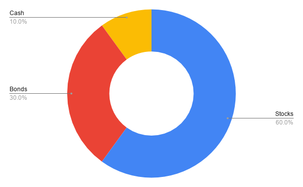
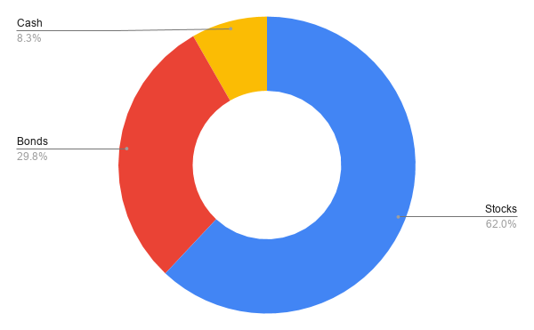
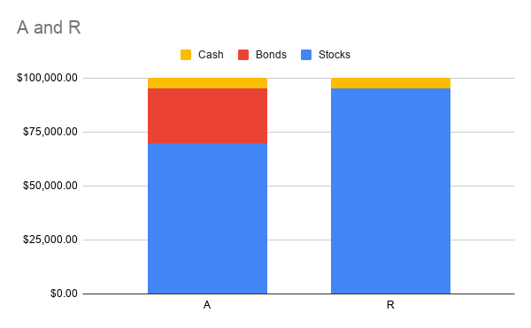
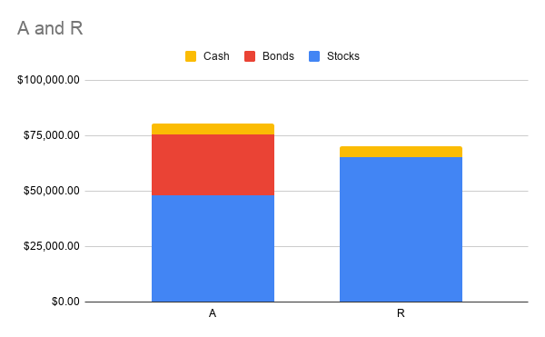
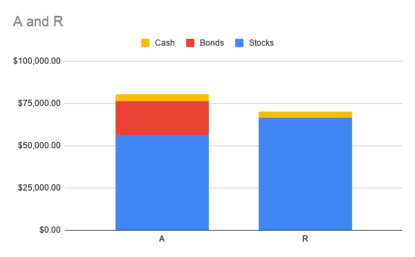

# **Rebalancing - Benefits of having Bonds in your Portfolio.**

I have previously written about the [Corono Virus impact from an investing point of view](https://happypathfire.com/corona-virus-investing/). I also think this is one of the [biggest opportunities to invest](https://happypathfire.com/sell-sell-sell/) in the stock market.

In this article I would like to talk about the importance of having Bonds in your portfolio. I think the sudden drop in the stock market is an ideal scenario to illustrate this point using actual examples.

But first, a few concepts to make things clearer.

## **Asset Allocation**

In very simple terms Asset Allocation is all about the size of each asset class in your portfolio.

For example, an example of an **Asset Allocation** could be  a portfolio of - 60% Stocks, 30% Bonds and 10% Cash. So if you would like to allocate 100,000$ of funds into such a portfolio, then you would invest 60,000$ in Stocks, 30,000$ in Bonds and 10,000$ as Cash.

## **Rebalancing**

Rebalancing is a consequence of Asset Allocation. The stock market is volatile, prices of stocks keep changing continuously. Over a period of time the actual portfolio may drift significantly from your target Asset Allocation. This is when you would have to _Rebalance_ your portfolio.

<figure>

<figcaption>

Asset Allocation at the begin

</figcaption>

</figure>

Continuing from our previous example, let’s say that after a year, the stocks went up by 25% whereas the bonds increased by 2% and Cash was unchanged.

The new composition of the portfolio will be 75,000$ Stocks, 30,600$ Bonds and 10,000$ Cash.

The **Allocation has changed to** 62% Stocks, 29.8% Bonds and 8.3% Cash. 

Rebalancing is the process of making changes to this portfolio to make it align with your intended target Asset Allocation.

<figure>

<figcaption>

Asset Allocation after the market moves

</figcaption>

</figure>

## **Rebalancing Approaches**

Without getting into the details of **Why?** and **How?** of rebalancing , I would like to touch upon two of the more popular approaches to Rebalancing.

## Periodic Rebalancing

As the name suggests, you arbitrarily choose a day on which you would look at your portfolio and rebalance it to your target Asset Allocation. This could be once a year or several times a year.

Popular choices could be your own birthday, year end for taxation benefits etc.

## Threshold Rebalancing

In this type of rebalancing approach the choice of **_when to rebalance_** depends a lot on the price action in the stock market. The basic idea is that you set thresholds for each of the different types or classes of Assets in your portfolio and you rebalance if the Assets breach those thresholds. 

For example, if your Stock Asset Allocation is 60% stocks, then your threshold could be + or - 10%. This means that if your portfolio moves in a way that the allocation of Stocks is now above 70% or below 50% then you would step in and rebalance.

I personally prefer and recommend the threshold rebalancing. I will explain the reason in the following section.

## **Rebalancing 2020**

The main goal of this article was to show the importance of having bonds in your portfolio. Now that we have the basics of rebalancing behind us, let us get to the exciting bit.

## **The setup**

Assume that there are two investors A and R. Investor A follows disciplined asset allocation and has the following Asset allocation - 70% Stocks, 25% Bonds and 5% Cash.

Investor R has a more YOLO approach to investing and has 95% Stocks and only 5% Cash.

Assume that at the beginning of the year their portfolios were worth 100,000$ each. I will be using actual stocks and values so that things get as real as possible.

## **The Instruments**

Stocks, I would be using the ETF [SPY](https://finance.yahoo.com/quote/SPY/) \- this is an ETF that intends to replicate the returns of the S&P 500 index.

Bonds, I would be using the ETF [TLT](https://finance.yahoo.com/quote/TLT/) \- this ETF tries to replicate the returns of the US 20-year Treasury Bills

Cash, I assume a 0% Checking account which is fairly indicative of the current interest rates.

## **The Time Period**

For the sake of illustration I would be choosing Feb 20, 2020 (3X 20s) and Mar 20,2020.

On those dates, the value of SPY was **334.98$** and **228.8$** respectively. 

The TLT was **146.24$** and **159.2$** respectively.

## **The Portfolios on Feb 20,2020**

Both A and R have 100,000$ portfolios but the difference is the composition.

<figure>

<figcaption>

Starting portfolios of A and R

</figcaption>

</figure>

A has 70% in SPY, 25% in TLT and 5% Cash. 

R has 95% SPY and 5% Cash.

## **The Great Corona Crash of 2020**

Within a matter of weeks the market has fallen by a lot. The Stocks on average have fallen **25-30%** from their peaks. 

However the bonds have not fallen. You might have already seen that the TLT price has actually increased by March 20 (159.2$) compared to its level on Feb 20 (146.24$).

## **Post Crash Portfolios**

> **_‘Having Bonds in your portfolio makes it more stable’_**
> 
> \-almost every Fin 'expert' ever

We all might have heard it a million times, but this is what it means in real-life.

After the crash both A’s and R’s portfolios have taken a beating. This is how they will stand at the end of the day on March 20, 2020.

A’s portfolio is worth **80,407$** and R’s portfolio is worth **70,171$**s.

<figure>

<figcaption>

The portfolios of A and R after the crash

</figcaption>

</figure>

~10,000$ difference on a 100,000$ portfolio. Imagine if this was a 1 Million $ portfolio? The difference is a cool **100,000$!!!**

## **Post Crash Rebalancing**

> **_‘Having Bonds provides opportunities to buy Stock low and Sell high’_**
> 
> \- every after-the-fact advisor

This is far more powerful in long-term investment success than it appears at first. 

Following the crash, the Asset allocation of both A and R has changed. This is how they stand.

A’s portfolio is now 59% Stocks, 34% Bonds and 6% Cash. R’s portfolio is now 93% Stocks and 7% Cash.

## **Rebalancing Intuition**

Let us stay away from the mechanics and understand the intuition for a bit. The stock market has taken a beating and the immediate instinct if you are a long term investor is to buy more. 

But unfortunately, crashes come with other financial constraints like job-market uncertainty, business income uncertainty etc. Given this situation, let us see how having Bonds helps. **A LOT!**

## **Assume that both rebalance their portfolios on March 20,2020.**

In the case of R upon rebalancing, R can buy **1,491$** worth of stocks (SPY). In the case of A, upon rebalancing, A can buy **8,264$** worth of stocks (SPY).

**A huge 6,700$ more than R!!!**

A was able to buy more stocks at a lower price level than R. This reduces the average cost of investments resulting in higher returns when the market bounces back. 

Not only that, A was able to fund this purchase through selling his bonds (because of rebalancing). He sold 7,200$ worth of Bonds. This is also advantageous as he now sold Bonds **at a high!** 

These two positives compound massively over a long time horizon yielding superior portfolio performance.

<figure>

<figcaption>

A is inching closer to R in terms of dollars invested in stocks!

</figcaption>

</figure>

## **Final thoughts**

Stock market investing is prone to uncertainties. In just a matter of weeks many stocks went from 52-week highs to 52-week lows. 

Having a balanced portfolio keeps you sane in these nerve wracking times. In addition, doing some strategic threshold rebalancing allows you to take advantage of this situation without needing extra cash to invest. 

This opportunity to rebalance and buy stocks at their lows would not be available to the _religious periodic rebalancer_. 

This is the reason I would prefer the threshold rebalancing approach. Of course, there are several nuanced implications that I have not mentioned, like the tax implications, transaction costs and very high volatility. I hope to cover these topics in the future articles. 

**Happy Rebalancing!**
