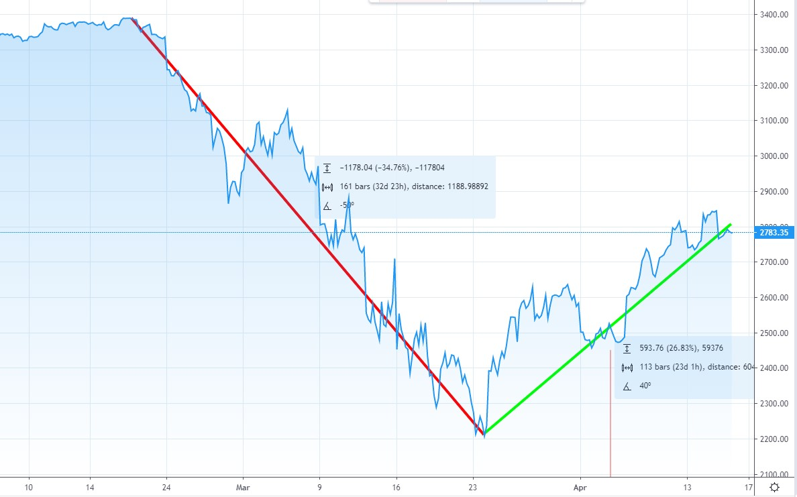

# **Recession Cancelled? - Has the US government successfully fought off the recession?**

Please see the chart below. 

<figure>

<figcaption>

The Down and the Up

</figcaption>

</figure>

The chart is of the S&P 500 index. The line in red approximates the fall from the peak to the _bottom._ The line in green approximates the bounce from the said _bottom._

It took about 32 days to go from the Top to the Bottom. A total fall of approximately 35%. It took about 23 days to go from the Bottom to the current level. This is up about 27% from the Bottom.

_Note that I may be flipping back and forth from the **US** centric view to the **global** view and often use the words interchangeably. The main reason is the interconnectedness of the world economy and the relative size and importance of the US economy._

## **Recession Cancelled?**

The Covid-19 pandemic resulted in the lockdown of almost the entire world including the US. This sparked intense fears of a recession if not a depression around the world including the US.

Not surprisingly, the stock markets got spooked. There were sellers everywhere. People began to sell what they had rather than what they should. (See this [article](https://happypathfire.com/rebalancing-portfolio/) about the selling)

## **Where do we go from here?**

Generally speaking, I would not speculate on the direction of the markets. But, these are not ordinary times. Well, no time is ordinary in the ever-changing world of the stock markets one could say, but, these are objectively so. The VIX (The volatility  index that is an indirect measure of Fear) is at an all time high. The Fed benchmark interest rates are at 0. Unemployment is in the double digits.

## **The outlook**

From an overall outlook perspective. I would like to use this post as a sort of a journal to note my current line of thought. This is by no means a prediction or a recommendation of any sort.

## **Factors that support the continuation of the recovery**

**Corona Peaking** - It seems like the so-called Corona curve is indeed flattening around the world. Epicentres like Italy, Spain and even NewYork may have passed the peak. This is the single biggest potential reason and the driver for the bounce back.

**Fed Pump** - the US fed announced a slew of stimulus packages. Literally sending cash to people. Interest rates cut down to zero. And the start or in fact the continuation of the QE - Quantitative Easing. Literally printing money and buying off financial assets.

**Safe Haven** - With the US being the defacto world Reserve Currency and safe haven, there is a huge influx into the US dollars in spite of the Fed printers running at full steam. This rush into US financial assets offsets the effects of lower interest rates and QE.

**Oil Deal** - It seems like the diplomatic channel for the Oil deal is open with Trump speaking to Putin and MBS. This is reflected by the bounce back of oil prices from the lows. There is still hope for the US Shale Fracking and the Canadian Oil sands companies.

## **Factors that can halt and reverse the recovery a.k.a recession not Cancelled**

**Corona Relapse** - There are some speculative theories that the Covid-19 infection could come back after the relaxation of the lockdowns. The Fall (Oct-Nov) is also a typical Flu season in the colder climates of the Northern hemisphere. This could spook the markets yet again and kill off the nascent recovery.

**Persistent Unemployment** - There is a danger to losing demand in the economy due to unemployment that is not just short term but something that is more persistent. Small and medium businesses may not be confident enough to restart or may have declared bankruptcy and shuttered for good. This reduced demand can push the US and the global economy to a multi-year contraction and potential global recession.

**Worsening Geopolitics** - There is already a blame-game in the air. Countries are pointing fingers at each other. There is a real danger where the world could become polarized yet again and we may see a sort of a Cold War 2 between China and the USA. In my opinion this is a far greater risk than any of the others mentioned here

## **Conclusion**

I believe that there are several low-probability but high risks looming on the horizon and I hope that they do not materialize.

I would be cautiously optimistic. In all honesty, I was not expecting such a rapid recovery. In fact I expected a U-shaped recovery ( See the [article](https://happypathfire.com/shape-of-u/))

I would recommend staying the course and continue to invest. Use the power of [dollar cost averaging](https://www.investopedia.com/terms/d/dollarcostaveraging.asp) to your advantage.

 From a budgeting point of view, It would make sense to increase the allocation to your emergency funds.(More on this in another article)
