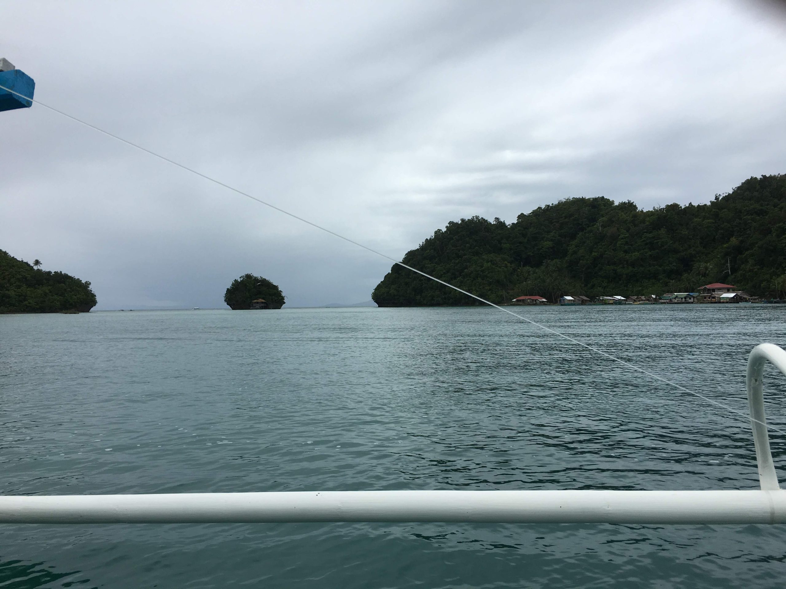

# **Why should you Retire in the Philippines**?

<figure>

<figcaption>

Which island will you Sail to? - A photo from my trip to the southern Philippines.

</figcaption>

</figure>

The Philippines is a South-East Asian country with a growing Economy and spectacularly rich Natural and Cultural Heritage. Here are the reasons why you should consider retiring in the Philippines.

_This article among many upcoming articles, is a follow-up on the concept of Geographic Arbitrage. Read the detailed article on [Geographic Arbitrage here](https://happypathfire.com/geographic-arbitrage/)._

_In brief, FIRE(Financial Independence Retire Early) has two stages. The accumulation phase and the consumption phase. In both these phases it is essential to strategically choose your location._

## **They want you to!**

I mean the government REALLY wants you to. Consider this, the Philippines Department of Tourism has an entire Organization called The **Philippine Retirement Authority (**PRA) setup. The sole mandate of this government organization is to help expats retire in the Philippines. 

The Vision of the [PRA according to it’s website](https://pra.gov.ph/mandate-vision-and-mision/) is

> **To make the Philippines the preferred retirement destination in Southeast Asia by 2022.**

## **Simple VISA process**

Visa is almost always one of the biggest hurdle when it comes to moving to a different country other than your own.

The Government of the Philippines has a special Visa for retirees called the [Special Resident Retiree’s Visa (SRRV)](https://pra.gov.ph/srrv/). Subject to a few conditions, it allows for almost indefinite stay in the Philippines. 

## **Lower Cost of Living**

The primary motivator for Geographic Arbitrage is the cost of living. In the decreasing order of the cost of living, the Philippines ranks [92 on the list of 132 Countries around the world](https://www.numbeo.com/cost-of-living/rankings_by_country.jsp).

Of course, the cost of living varies vastly within a country depending on where you live. The cost of living in Manila for example is higher than living in one of the many islands. Other than _party islands_ like Boracay.

## **Good Weather**

Philippines is a tropical country and the weather is warm pretty much all through the year. It can get relatively cooler in the highlands though. Cities like Manila are hot and humid and can become unbearable in the summer. 

If you like living by the sea and enjoy the sun then there are almost limitless options in some of the other 7000+ islands that make up the Philippines.

## **The English Language**

English is widely spoken and understood throughout the Philippines. This makes it easy to adjust and navigate the daily life if you are also comfortable with English.

## **Affordable Quality Healthcare**

Healthcare in the Philippines is both affordable and good quality. It is one of the major destinations for the global Medical Tourism Industry.

It has to be noted that the majority of the facilities are located in and around Manila and other major cities like Cebu City. Depending on your personal needs choose a location within the Philippines that caters to you.

## **Friendly People**

Last but not the least, the Filipinos are a friendly people. They are very welcoming to foreigners. I have found that it is easy to strike a conversation, share a beer and some laughs. There are not a whole lot of places in the world where a complete foreigner can experience this.

Added to this there are a huge number of expats from almost every part of the world. This gives a sense of community a sort of home away from home.

## **Conclusion**

For all the above reasons, I think you should consider the Philippines as one of your potential retirement destinations.

At least travel to the country and stay for sometime to get a sense of it before deciding. I can assure you that [its more fun in the Philippines!](https://www.itsmorefuninthephilippines.com/)
