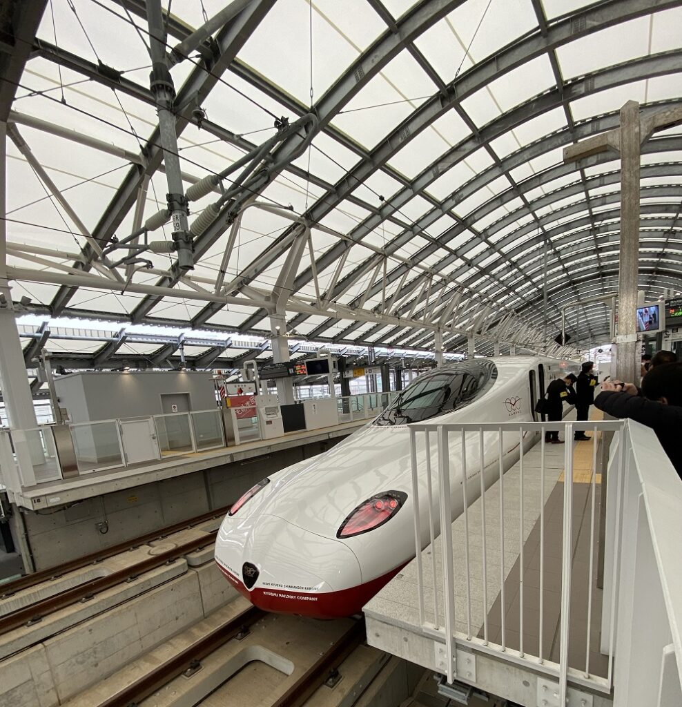

Japan is one of my favorite countries to visit. I have been there several times. The unique cultural heritage, the unbelievable convenience and the tastiest of food are some of the reasons it is one of the most visited countries in the world. In addition to all of these, Japan has something that I really love - Trains!

<figure>

<figcaption>

JR Kyushu Shinkansen, one of the newest! Opened in 2022 and I was able to ride in it :)

</figcaption>

</figure>

I just came back from my recent trip to Japan and was wondering what it would be like to move there as a retiree. I.e. Post FIRE. 

## Japan has it all!

Some of the obvious positives that jump out are things like safety, with one of the lowest crime rates in the world. A stable economy and a currency that is seen as a safe haven. 

When it comes to infrastructure of special mention is public transport. I think public transport in Japan is one of the best in the world. It is both reliable and efficient. 

Japan is not only a man-made wonder but the nature in Japan is both rich and diverse. One can Ski in the mountains of Nagano, swim in the ocean in Okinawa, relax on the beach in Miyazaki and go on hikes in pristine nature trails all over Japan. Japan has it all, in a land area that is both small and very well connected by all means of transport.

Being a developed country, Japan has great healthcare services. The public healthcare system is subsidized by the government. Residents in Japan usually pay only 30% of the cost of healthcare services.

## With so many positives, why aren't people moving to Japan to retire in droves?

Here are some of the challenges when it comes to retiring in Japan.

Firstly, the Japanese government does not promote Japan as a retirement destination like other countries in the region like the [Philippines](https://happypathfire.com/retire-in-philippines/), Malaysia, Thailand etc.

This means that any retiree has limited visa options when it comes to moving to Japan on a long-term basis.

The second reason is the language barrier. In my personal experience, the Japanese have been extremely polite and make a real effort to understand and speak english. It is workable in a tourist setting. But to live life, day to day, language indeed becomes a barrier. Things like accessing government services, visiting a hospital, a police station etc, can be a hassle without knowing the language.

The third reason is the risk or at least the perceived risk of natural disasters. It is a fact that Japan sits on the edge of continental plates and is part of the Pacific Ring of Fire. This means that Japan experiences frequent natural disasters like earthquakes, tsunamis, typhoons, volcanic eruptions and landslides. 

However, the Japanese government is aware of such risks and is well prepared to operate rescue and recovery efforts post natural disasters.

Finally, Japan is not a place to retire if one is constrained by a budget. Japan is a developed country and can be expensive. The big cities like Tokyo, Osaka are convenient but are also some of the most expensive cities in the world to live in. 

Choosing to retire in Japan is not a straightforward choice as there are both pros and cons. It all depends on the individual. If the value placed on the pros is higher than the cost of the cons then Japan can be a great place to retire in. 

Personally, I find living in Japan fascinating. I think I would at least try living in Japan for a longer duration before making up my mind about retiring in Japan.
