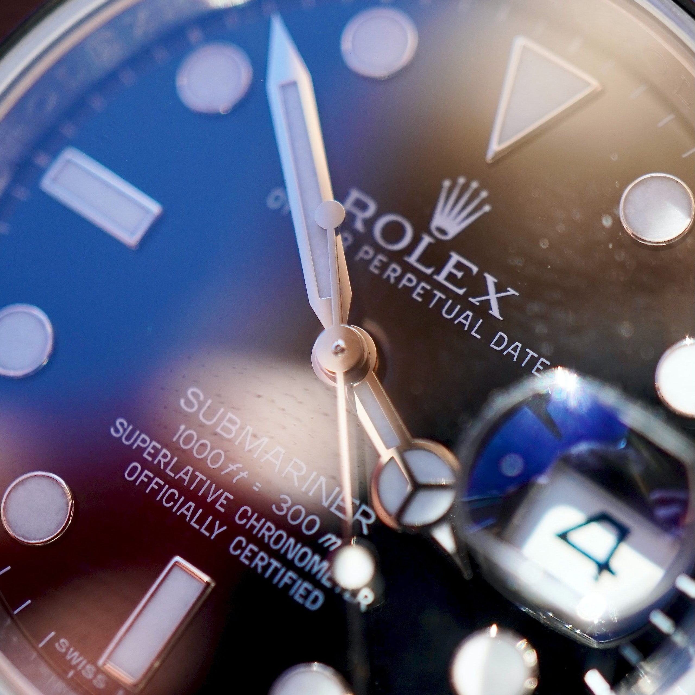

The Rolex Submariner is an expensive watch. Functionally speaking, it is no comparison to the marvel that is the Apple Watch. Yet, it currently sells for about twenty times more than the Apple Watch!

<figure>

<figcaption>

A Rolex Submariner - Photo by Adam Bignell on Unsplash

</figcaption>

</figure>

Luxury watches are an example of a [Veblen Good](https://en.wikipedia.org/wiki/Veblen_good). The more expensive they are the more they are coveted by their connoisseurs.  These watches can cost anywhere between a few thousand dollars to several millions of dollars.

## After Sale Market

After Sale or pre-owned watches were mostly bought and sold within the cozy circles of rich odd-ball collectors. Up until recently these markets were small and had little to do with main-stream investors. Of course, a few eye-brows are raised when there is news of a watch being sold for an astronomical figure once in a while at an auction.

## Buy-Low Sell High

All of that is changing now. There has been an ever increasing interest from investors of all types and sophistication. These investors as they call themselves want to treat their purchases as _investments_ . The old maxim Buy-Low Sell-High seems to be the mantra.

The reason for such an interest from the more regular folks is mostly due to price. The very [rapid price appreciation](https://www.nytimes.com/2019/03/20/style/collectible-watches.html) to be more precise. 

The NewYork Times article mentions 100% price increases in less than two years in some instances.

## Romantic at best

The idea of finding a timepiece forgotten by time in an old shoebox bought at a garage sale for a trifle and sold in the millions is romantic at best. In reality, the process of identifying genuine value and keeping a tab on the ever-changing tastes and preferences of the fickle buyers is part art, part science.

## Not Just Watches

The idea of buying luxury items with the intention to sell it at a higher price to collectors later is not just limited to watches. The same goes for cars, sneakers and even Lego sets!

Investors are not just buying old and classic items but are also buying brand-new items and are preserving them in their original packing. The hope is once again that, preserving the items in their original packaging, unused can fetch a higher price in the After Sale Market.

## Expense or Investment

More recently people have a different opinion when it comes to buying overpriced luxury goods. They justify it as an investment rather than an investment. They believe their luxury watches, cars, bags and even Lego sets will not only hold their value but also produce returns.

This is a bit controversial. Many of these so called investors are not really investors. The reason is that they might claim that their portfolio of luxury goods has increased in price but they would **NEVER SELL**  them at any cost. 

They have developed emotional attachment to the item. These kinds of people are collectors and not investors. So, the distinction is quite clear, in my opinion. One is either an investor or a collector there are no overlaps. 

## Choose who you are

If you love these luxury items for their own sake and would love to own them. Then you are a connoisseur or a collector and treat them as an expense item and never as an asset. 

In the odd chance that you are an investor or would like to be an investor in this space then I would recommend hiring a specialist. The Watch Fund for watches is a good example. If you choose to be an investor then all the rules of investing come into picture and treat your investments as just that - Investments.
