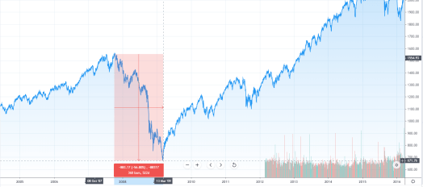

# **Sell! Sell! Sell!**

Last week I wrote about the shape of the recovery, I expect it to be in [the shape of U](https://happypathfire.com/shape-of-u/). I still believe in this conclusion based on the data that is available at this point in time and my analyses.

In this article I will try to provide some more evidence towards my optimism. 

## **The Great Recession of 2008-09**

I lived through the 2008-09 crisis as an aggressive trader. My broker panicked when my positions went deep red and the market was closed which meant that the broker could not even liquidate! 

I guess I will write about it at some point and compare how I have fared in this ‘crash’.  
The point of interest is the difference between these two crashes. 

Look at the graph below.

<figure>

<figcaption>

A -56% drop in ~500 days

</figcaption>

</figure>

(Apologies for the low quality screen shots)

Basically from the peaks in October, 2007 to the lows of March 2009, the market fell **\-56%**. The important thing to notice is the time taken to reach the bottom from the top.  It took approximately **522 Days!!!**

## **The 2020 Crash**

Look at the graph from the recent (still on-going) crash.

<figure>

<figcaption>

\-30% in 30 days!!!

</figcaption>

</figure>

The very first thing that comes into sight is the sheer steepness of the graph. It has been only about **30 days** and the market has lost nearly as many in percent points **\-30%!!!**

This is a stupendously short time for such a massive drop!

Just for the sake of comparison, let us see at how long it took for a similar percentage drop in 2008 Financial Crisis.  

<figure>

<figcaption>

\-30% in 363 Days

</figcaption>

</figure>

It took a whopping 363 Days!!!

<figure>

<figcaption>

\-33% in 69 days at it's steepest

</figcaption>

</figure>

Even if I pick and choose the region of the fastest drop during the financial crisis. It took **69 Days** for a near **\-30% drop.**

## **Sell! Sell! Sell!**

Now the fundamental question is to know who is selling so much in such a short time.

The selling pressure is not only on stocks but also in commodities like Crude Oil, Bitcoin and also Gold!!! Something that has been seen as a safe haven.

Worse still, even the super safe treasury bills of the mighty US government are falling in price. Despite one of the biggest single day cut in interest rates!

<figure>

<figcaption>

Even T-Bills are not spared!

</figcaption>

</figure>

It fell down by **\-15%** in **9 Days**.

## **Nowhere to go!!!**

> **people are literally selling what they can! Rather than what they should.**

It almost feels like people are literally selling what they can! Rather than what they should.

What should you do? Follow the analogy of the toilet paper crisis. Where you panic buy toilet paper because everybody else is hoarding toilet paper, which creates an infinite feedback loop!

Should you sell because everyone else is selling? So that you are not the one holding the bag in the end?

## **Don’t Panic!!!**

I have said this once [before and I will say this again. Don’t Panic!!!](https://happypathfire.com/covid-19/)

I have several reasons for optimism. Firstly, from a pure market action perspective, the sellers seem to be traders and aggressive hedge funds rather than the average investor.

Secondly, people are saying that you have to pick and choose stocks in this market as the passive index investing is dead. The data however shows the opposite.  
This recent article on Schwab - [_Who Fueled the fastest bear market ever_](https://www.schwab.com/resource-center/insights/content/who-fueled-fastest-bear-market-ever) explains this in great detail. This graph is from that article

<figure>

<figcaption>

Source: [https://www.schwab.com/resource-center/insights/content/who-fueled-fastest-bear-market-ever](https://www.schwab.com/resource-center/insights/content/who-fueled-fastest-bear-market-ever)

</figcaption>

</figure>

You can see that there have been net inflows into the passive index ETFs. Sure there are sellers but on a net basis there are buyers in these funds. Some 20 Billion$ in March alone.

## **Buy!Buy!Buy!**

Sure, the market may go down further from here. I, like you, have no way of knowing for sure. One thing that is for sure is that this is the time to buy rather than the time to sell.

The **VIX index** also known as the **_fear index_** (one of my favorite instruments, and the subject of my research thesis at university) is at a ridiculous high!

<figure>

<figcaption>

VIX in orange towers over the S&P 500!!!

</figcaption>

</figure>

The line in orange is the VIX percentage movement, while the blue line is the S&P 500 for the purpose of scale.

The VIX is at about **72** at the time of this writing. The usual average is about **12-14**. VIX is observed to be mean reverting. This is expected to hold true into the future. 

**The time-tested adage of being greedy when others are fearful is valid in these times.**
