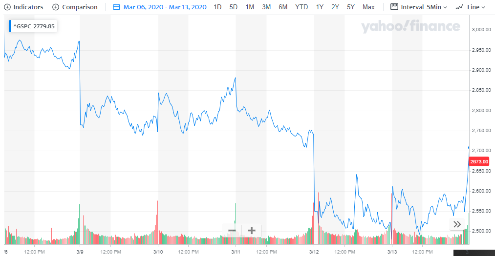
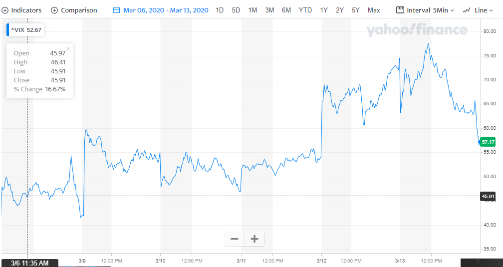

# Shape of U

_This is a follow-up article to my previous piece titled [‘Don’t Panic’](https://happypathfire.com/covid-19/)._ 

## **The Virus has Arrived!**

At the time of this writing Covd-19 has now reached the shores of the mighty USA. All the posturing and ignoring the facts by president Trump has failed to work. 

The markets seems to have wisened to the fact that there is indeed a deeper and far reaching economic impact. This is evidenced by the sheer cliff-drop seen in the markets in the past couple of weeks.

Last week in particular is worth mentioning. There were 4 Circuit breakers in the span of a week in the US stock markets!

This is unprecedented in the history of the stock markets!!!

## **A brief note on Circuit Breakers**

Circuit Breakers are mechanisms that are put in place to prevent adverse price movements in the stock markets.

For example a lower circuit breaker over a benchmark index could be 5%. This means if a benchmark index falls by 5% then the circuit breaker is triggered halting all trading on the exchange for a period of time. Fifteen minutes in this case.

Circuit breakers can be triggered in both directions, i.e. when markets fall and also when markets go up. 

Last week there were 3 circuit breakers triggered when the markets went down. Twice on the same day and there was one circuit breaker on the upside.

## **FEAR is the mind-killer**

<figure>

<figcaption>

Look at those sharp drops!

</figcaption>

</figure>

These wild fluctuations are nothing but a sign of Panic. This is captured in the level of the [VIX Index](http://www.cboe.com/vix), also called the _Fear Index_. As you can see from the chart below. It has spiked up dramatically over the past week.  

<figure>

<figcaption>

See hoe it has spiked up!!!

</figcaption>

</figure>

It is hard to understand people and it is even harder to understand Crowds. Of course there is the popular saying called the ‘**wisdom of the crowds**’ but it is also equally true about the ‘**stupidity of the crowds**’.

I personally believe that the markets are being extremely irrational beset with fears. Some real but some unsubstantiated.

## **Shitcoin!!! Literally**

One way to understand this is using a real analogy. The most valuable currency at the time of this writing. No, it is not the US dollar I am talking about. It is  

There seems to be an unprecedented panic hoarding of toilet paper across the world. More so in the USA. The demand is so high that people are reselling toilet paper purchased at retail outlets in Amazon and other online stores for upto 10X markup!!!!

It is all cool to simply say that all these people are stupid but that is not useful as you may not be able to buy toilet paper yourself.

> **Because _Everyone_ thinks that it is valuable then IT IS VALUABLE.** 

The situation is such that you have to hoard and panic buy toilet paper because _everyone else_ is doing it. Because _Everyone_ thinks that it is valuable then IT IS VALUABLE. 

I was not joking when I said that this could in deed become a currency ( very unlikely,but, full-disclosure I have a long position on toilet-paper at home, don’t judge)

The panic in the stock markets is similar. People are selling because everyone else is selling. It is a negative spiral feedback loop. It is not just stocks that are down. Even gold, seen as a safe haven in times of crisis, is falling. 

## **What does it mean to your FIRE portfolio?**

Once again, it depends a lot on where you are on your FIRE journey. If you are in the accumulation phase then it makes sense to buy more.

If you are in the consumption phase then it is time to, firstly re-balance. The reason being that relative to bonds, stocks would have taken a big beating in your portfolio.

Follow this by trying to reduce your discretionary spending and look for opportunities to invest back into your portfolio if you have spare cash.

In short, the message is to **stay the course**  

## **My reason for the optimism**

People seem to be selling every financial asset. This means people are holding on to cash like dear life. It is likely that there will be a recession but a shorter one. The interest rates are low and are [expected to drop even further](https://www.reuters.com/article/us-fed-rates-poll/fed-to-cut-rates-again-in-march-but-effectiveness-challenged-reuters-poll-idUSKBN20T1SJ) reaching near zero in the US.

This means that it is only a matter of time before all the cash that was withdrawn from the markets in the panic selling gets redeployed. 

This means that there **has to be** a recovery in Financial assets like stocks and bonds. It is only a matter of when?

Given the sharpness of the sell-off and the nature of risks from global supply chain disruptions I think the shape of the broad based market recovery will be like a **U** instead of a **V.**

I believe that the markets will stay lower for a few months until the uncertainty settles down and people begin to realize that the world is not running out of toilet paper any time soon.

All the idle cash plus the [Fed Emergency 1.5 Trillion pump](https://www.wsj.com/articles/fed-to-inject-1-5-trillion-in-bid-to-prevent-unusual-disruptions-in-markets-11584033537) **WILL** need a place to go and a part of it will show up as Financial Asset price increases.

So, until then, stay positive! Stay the course and remember …. **Wash your Hands!!!**
