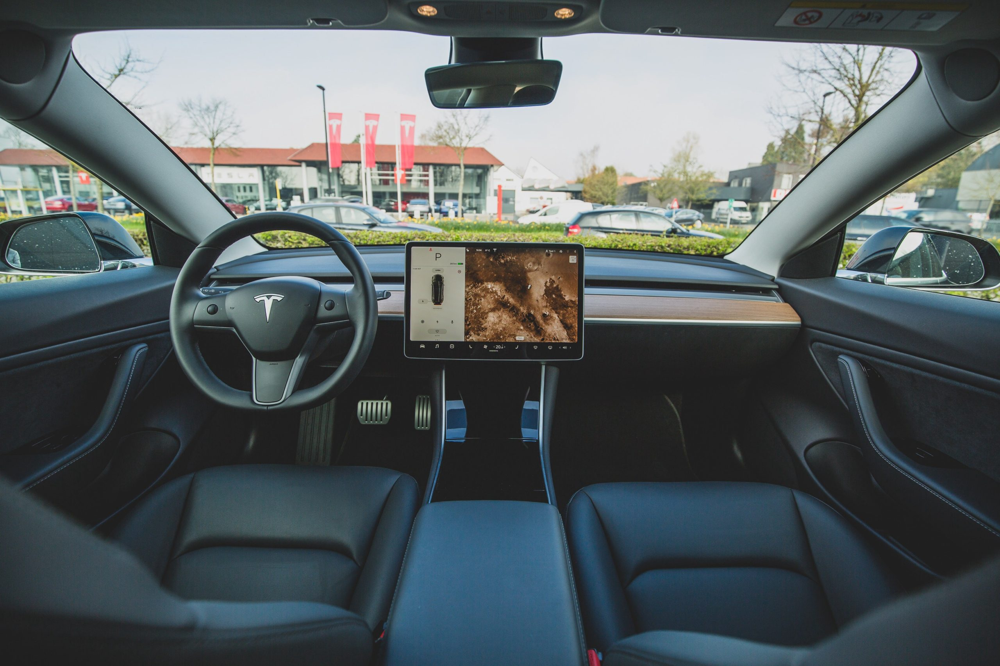

# Why I closed my Tesla Short positions

## TL;DR

I was a Tesla Bear but am net long now because I think it is the right thing to do.

_Disclaimer : This is an opinionated article and is not investment advice. This article was first published on my [Medium Blog](https://medium.com/@hvlncan/why-i-closed-my-tesla-short-positions-30c26985cdbb) in June, 2019_

<figure>

<figcaption>

A Tesla interior! Clean layout

</figcaption>

</figure>

## Why did I Short Tesla? — The Bear Case

Early this year I took a hard look at Tesla and saw that there was an opportunity to short the stock. I entered into a short position and locked in some decent profits. Here are some of the reasons why I decided to Short Tesla.

**_Risks_** _—_ Tesla is mired in them. It is a short sellers wet dream. The risks are stacked sky-high and so is the valuation of Tesla. The stock does not even have a positive P/E or Price to Earning Ratio although it is not too uncommon as the likes of Uber and Lyft exist.

Relatively speaking the case of Tesla is on a different playing field as it stands to disrupt a multitude of industries — Automotive, Transport, Raid Hailing, Oil and Gas, Dealership networks, Gas stations etc. This means there are relatively more firms who would want Tesla to fail rather than the ones that want it to succeed.

Lets dive deeper into some of the key points that support the Bear Case:

## Keyman Risk a.k.a Funding secured. 420$

One needs great powers to create great things but those same powers can potentially cause great destruction as well. **_Elon Musk is the single biggest risk to Tesla._**

It is astounding to see that a man as pragmatic as Elon likes to respond to short sellers and other detractors. He often takes to social media outlets like Twitter to directly make statements about Tesla. I think it is irresponsible towards himself and the millions of Tesla investors.

These minor spats came to a head in 2018 when he sent out his now infamous tweet saying that he had decided to take Tesla private at **420$**_(420 is a popular reference to marijuana)_ a share and the funding required for such a transaction has been **_secured_**.

This cannot be treated lightly as the stock market rallied sharply and the short sellers who had positions in the stock were burnt by huge losses. This is unethical and the SEC rightfully stepped in. He had to step down as chairman of Tesla and also paid a fine of **20Million $** which is shareholder money!

This is just an example of some of the unwarranted incidents that Elon has gotten himself into often endangering and eroding credibility and shareholder value.

## Financial Risk

Over the years Tesla has made some very unconventional and risky financial decisions. It has often chosen to raise **_debt instead of equity_**. The decision to raise debt vs equity is an important one and cannot be taken lightly as the implications are long term and taking corrective actions can be very expensive and at times impossible.

Explained in very simple terms. Let’s say you decide to start a cafe. You need **120,000$** to start the cafe. There are two options available to you to obtain that money. The first option is to take debt from a bank at the rate of 10% per year or you could ask your friends to invest in your cafe.

Suppose you took the bank loan. This implies that you owe the bank 10% of 120,000$ which is 12,000$ every year in interest. It means that you have to pay 1000$ every month in interest to the bank. In addition to this at the end of the term of the loan you still owe 120,000$ to the bank.

The bank does not care if your cafe is successful or not. It needs that money regardless every month. When your cafe is just starting you may have many customers but you may also have many expenses and some of them might be unexpected. The bank could care less about this. In case you miss a few payments then the bank can **_take away your cafe from you and sell it to someone else!!!_**

Suppose you took equity i.e. asked your friends to invest in the cafe. Your friends give you 120,000$ for 70% stake in the cafe. This means that they get 70% of all profits. This also means that they have to bear 70% of all losses (_Although you don’t lose cash, you still experience loss in the form of not being paid for your hard work_).

If in the first few months you make no net profit, then you are not under pressure to come up with a fixed payment every month. The best part is that there is no large amount due at some time in the future as well. The only downside though is that your control of the cafe is now only 30% instead.

Tesla is in a similar situation. It is a relatively new company and is in a serious growth phase where it needs all the cash it can to invest in building capacity and research. For example, some of the decisions on automation for final assembly had to be reconsidered as it was slowing the manufacturing lines.

In spite of this Tesla continues to raise debt and is almost always in a cash starved state. Being cash starved also means that it cannot invest in innovation which is the bigger long term risk as it can **_reduce competitiveness_**.

## HR Risk

Human Beings innovate and machines are tools to accelerate and implement those innovations. A fast growing innovative company like Tesla should nurture and grow its Human Resources as most innovative companies do. Google for example is known to provide excellent food and other incentives to its employees.

Employees at Tesla however work harder and longer with the constant threat of lay-offs and cost-cutting measures. These are a result of management efforts to meet short term cash-flow needs which is often a result of poor Financial decisions as mentioned in the previous section.

## Sector Specific Risk

This is more of a risk which is a result of being part of an industry rather than something that is very specific to Tesla as a company itself. The Auto industry is a very old business and competition is very fierce.

The fiefdoms of distribution channels through dealerships with incentivized marketing programs make this industry hard to compete in even though Tesla has a breakthrough product.

A quick looks at [margins by industry](http://pages.stern.nyu.edu/~adamodar/New_Home_Page/datafile/margin.html) shows that the auto industry Net Margins are at around 1.8% where the global average is 8%. These lower margins put a lot of price pressure on Tesla to be able to convince the customer to pay a premium while managing costs.

# The Bull Case

Having described some of the key points in the Bear Case it only makes sense to talk about some of the Bull Case points.

## Tesla not Tesla Motors

Tesla changed it’s name from Tesla Motors to just Tesla a couple of years ago. This was done to emphasize the fact that Tesla is not just an automobile company.

Tesla plays in multiple industries like Solar cells, Battery Packs, Grid Solutions. This also means that Tesla can potentially venture into other industries as and when opportunities arise.

Based on some of the recent announcements Tesla could get into the Ride Hailing industry, Auto Insurance, Mining etc. This diversity increases the possibility of additional revenue while reducing costs through operational synergies.

## Full Self Driving (FSD)

The Tesla **FSD investor day** presentation earlier this year was one of the biggest claims to be made in the business world. If these claims were to come true in their complete form then whole industries would get disrupted.

Essentially Elon and team claimed that very soon Tesla vehicles(_those produced after 2016_) would have the capability to **_completely self-drive_**. He even went as far as to say that Tesla would eventually **_delete_** the steering wheel as it may no longer be relevant.

Tesla is in a unique position when it comes to self-driving capability in that they have cars equipped with sensors that constantly send back information to the company to be used as the training data-set to constantly learn and improve its capabilities using state-of-the-art AI technologies.

As newer vehicles are added and as vehicles accumulate more miles the data available only increases with time and the self-driving capabilities would only get further and further ahead of the competition.

The further implication of FSD is the prospect of having **Robo-taxis**. Customers who own Tesla cars can **_send their cars out to work_** when they are not using them.

Using some very conservative estimates the Net Present Value of a Tesla Car can be as high as 250,000$. Usually, cars are depreciating assets in the sense that they lose value with time. But, in the case of Tesla it looks like one can actually make profits by owning/investing in their cars.

Taking FSD into account [some valuations](https://ark-invest.com/research/tesla-fsd) take the target price to 5X to 10X current price levels.

## Trucking

I believe the real game-changer is the Tesla Semi. Especially so when the Semi is coupled with FSD. The trucking industry in the US alone is close to a **Trillion dollars** in size. Getting even a moderate market-share can boost revenues along with diversification.

## Surprise Factor

This is something that scares most bear traders. On any given day it is perfectly feasible for Tesla to come up with something groundbreaking that can change industry paradigms.

One has to also note that the fact that Tesla can source innovations from not only within the company but also from some of the other Elon’s ventures like SpaceX, The Boring Company and Neuralink etc.

# Why did I close my Shorts and go Long?

To begin with, as a trader with my fair share of bruises and learnings over the past 15 years, I know that the market is always right. There is no room for emotions when it comes to trading.

One has to remain skeptical and always evaluate one’s investment decisions in the light of new information and manage risk.

It was through the application of these analytical and healthy skepticism that I shorted Tesla earlier this year and was rewarded by decent returns.

All of this changed after two incidents. First was the **[FSD investor da](https://www.youtube.com/watch?v=Ucp0TTmvqOE&t=11712s)y** and second was the **Second Quarter Shareholder** meeting. Without reiterating the content of those two presentations which I leave it to the reader to investigate I shall describe some of my reflections on these.

## What’s in it for me?

Firstly, I asked myself the question **What do I gain if Tesla goes Bankrupt?** i.e. if the stock price goes to _Zero_. Sure, with my short position I could make a few thousand dollars.

As a skeptic, I also asked myself the question **What do I lose if Tesla were to go Bankrupt?** It was hard to come up with a reasonable answer when I was thinking about this from a purely financial valuation point of view.

I had to expand the scope of the question from a _self-centered_ point of view to a _global_ point of view. I rephrased the question to **What does the world lose if Tesla were to go bankrupt?**

Then the answer came to me and after those two presentations it only got clearer.

If Tesla were to go Bankrupt the world would still be stuck with **gas guzzling cars** produced by companies that are an effective oligopoly. The only chance the world had to make the transition away from **Oil addiction** would be lost. We might be increasingly exposed to the risks of **Climate Change**.

A bankrupt Tesla may affect some of the other ventures of Elon like **_SpaceX — Making Humans multi-planetary species_** and **_Neuralink — A brain computer interface_** which are some of the most crucial initiatives that humankind as a whole should care about to ensure long-term survival as a specie, at least in my opinion.

In my own evaluation I found that the overall loss to humanity if Tesla were to go bankrupt was much higher than the few thousand dollars that I could potentially make by being short. In fact I would be guilt ridden for the rest of my life for contributing to the fall of Tesla.

Although I have been ruthless as a trader I think that I can allocate some capital to what I consider an **_Ethical Investment_**.

I hope Equity analysts can do an introspection of their own profession and ask themselves the question **What is the value add to humanity from their work?** . a.k.a see the bigger picture. Is it the Efficient allocation of capital ? or the selfish and short sighted next quarter and bonus thinking?

Just because only Elon has the balls to _call a spade a spade_, does not get mixed up with _Victorian niceties_ or _fakeness,_ he is often misunderstood and misinterpreted in the media. It seems like the general population does not like hard-working smart people anymore (_Trump?_)

People like Elon come about once a generation. They rally against the _status quo_ and burn themselves in making the world a better place. In my mind I would compare Elon to _Steve Jobs_ and _Wozniak_ combined. He has the vision and the technical competence **_to execute_**.

This guy is trying his best, working hard and showing up every single day and night to work (_Elon is a Billionaire, he can lead the Sheikh life if he wanted to_) while detractors are ignorantly trying to attack Elon and Tesla.

I concluded that **_shorting Tesla is unethical_** if not the **_highest treason against the future of humanity_**.

So I _closed my shorts_ and _went long Tesla_. In case Tesla becomes a **Trillion dollar company**, sure I will make some money. However, in the case that Tesla goes bankrupt then I and humanity as a whole will have more things to worry about than my invested capital.
