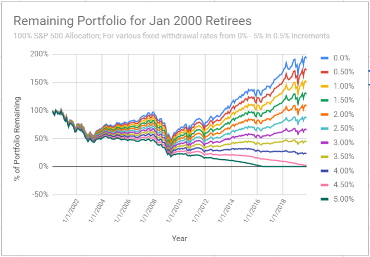

# Verifications and Validations

This is the first article of the year! happy new year 2020!!!! (_At what time in January is it appropriate to stop wishing?_) This is also the fourth in the series of articles on the 4% Rule. In case you have missed out on the earlier articles, you may find them here - [First](https://happypathfire.com/the-4-rule-part-1/), [Second](https://happypathfire.com/the-4-rule-part-2/), [Third](https://happypathfire.com/the-4-rule-part-3/).

In the earlier articles I highlighted the flaws in the studies that are considered the source for the 4% Rule i.e. The [Bengen](http://www.retailinvestor.org/pdf/Bengen1.pdf) and [Trinity Study](https://www.aaii.com/files/pdf/6794_retirement-savings-choosing-a-withdrawal-rate-that-is-sustainable.pdf) (B&T Study). I proposed an alternative to overcome those flaws through Monte-Carlo simulation.

I found that the survival rates when the 4% _Rule_ is applied in a rigorous (10,000 scenarios) Monte-Carlo Simulation is no where close to the 98%+ levels as predicted by the B&T Studies. I found the survival rate to be around ~60% which is far from reassuring for any retirement planner, early or otherwise.

In this article, I try to validate/verify the results from my study with another source. Recently I came across a post on Reddit from a user who tracked the actual portfolio performance of a retiree who FIREd in the year 2000. The link to the post is [here](https://www.reddit.com/r/financialindependence/comments/eik9f3/retired_in_2000_congratulations_on_surviving/)

## Retired in 2000 a.k.a Y2K?

<figure>

<figcaption>

Source: https://www.reddit.com/r/financialindependence/comments/eik9f3/retired\_in\_2000\_congratulations\_on\_surviving/

</figcaption>

</figure>

The above graph shows the portfolio performance of a 2000 Retiree. The Portfolio is 100% S&P 500 stock portfolio which is similar to the portfolio that I used in my study. The performance is tracked as the value of the portfolio over the period i.e. from the year 2000 to 2019.

Follow the 0% withdrawal rate indicated by the blue line in the above graph. That is the indicator of the performance of the Index. If the retiree had not withdrawn anything from their portfolio then the portfolio would have roughly doubled. The lines in various other colors in the graph show the value of the portfolio for those respective withdrawal rates. I am not sure if the author adjusted the withdrawals for inflation.

You can see that at a 5% withdrawal rate the portfolio value is down to zero by the year 2016!!!

The 4% withdrawal following the **_4%_** **_Rule_** does not fare any better! As concluded by the author of the post, the portfolio is running at uncomfortably low levels! At approximately 25% of initial value.

Imagine you FIREd with 1M$s in the year 2000 with a 4% withdrawal rate. Your portfolio is now at 250,000$ and you have just about completed only 20 years of retirement. It does not require a lot of math to tell you that a 250,000$ portfolio will very likely **not last the next 10 years**.

## What are the key take-aways?

This post aligns with my findings using simulation in general. The fact that it highlights a very real scenario where the direct application of the 4% withdrawal rule did not ensure portfolio surivival. It also shows the serious implications of the **sequence of returns** especially in the **earlier years** of retirement.

## A Safe-withdrawal Rate?

Lately I have been increasingly inclined to think that there is no fixed safe withdrawal rate that can be somehow discovered and then applied as a **Fixed Rule**!. People keep talking about the 3.5% Rule, the 3.75% Rule, 3% Rule etc. But, I hardly think there is just **1 number** that will last the **entire retirement** of **everyone** across **all time periods**.

This does not mean we chuck out the 4% Rule and start from scratch. I think the Safe withdrawal rate has to be adaptive to the market conditions. It may be something like **4% +/- x%**, where x is determined by market and personal circumstances of the previous year. This is nothing **_path-breaking_**, we already adjust for inflation and I think we need a few more additional factors that need to be considered.

As of now, I am only reading up on material on this topic online and also trying to do more analysis at my end as well. Will share the results here, stay tuned!
