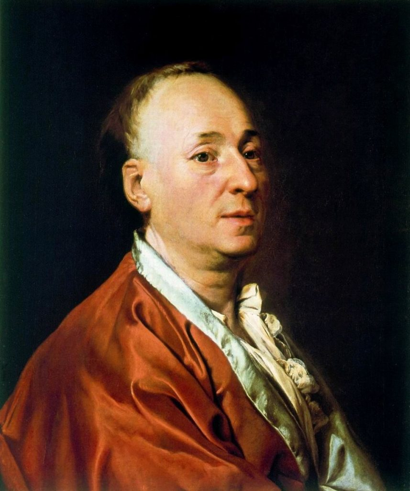

Diderot Effect takes its name from [Denis Diderot](https://en.wikipedia.org/wiki/Diderot_effect) an 18th Century French Philosopher. To be more specific,the idea originates from the essay titled ‘**Regrets on parting with my Old Dressing Gown**’. 

<figure>

<figcaption>

Diderot in his Red Gown - Dmitry Levitzky, Public domain, via Wikimedia Commons

</figcaption>

</figure>

In his essay Diderot talks about how an unexpected gift of an expensive dressing gown caused him financial ruin. The sequence of events is amusing. Long story short, he upgrades his writing desk, arm-chair and several other items to match his new luxurious gown. He ends up rearranging his entire life due to that one trigger of having an expensive gown.

The Diderot effect occurs when one acquires an object that is novel or outside of the ecosystem of things that we own. This novel object creates a hook for a new identity. In trying to fully absorb this new identity we end up buying complimentary things to the newly acquired object.

## **My Diderot Effect Experience**

When I first heard about this, I had a chuckle and left it at that. But, only later that I happened to notice that I have had a similar experience

I was living a city life when I happened to visit an adventure gear shop for a completely non-adventurous reason of buying a laptop bag. 

I was intrigued by all the displayed adventure stuff and started exploring unrelated parts of the store. It was a special sale that day and I ended up buying a 3 person tent. No, I did not buy the laptop-bag.

After buying this tent, my own Diderot effect sequence started. I started watching camping videos on youtube. I now wanted to go camping ASAP. This meant I had to buy a few other essentials. I bought a Hiking bag, because you would want to hike when you camp right? I also bought a swiss army knife because who goes camping without it? 

Things just kept piling up, large and small things - torches, insect repellents, LED lamps, Tarps, Fire Starters, Sleeping bags, Sleeping pads etc.

Soon, I had an ecosystem of things related to camping. I was now a nature enthusiast!

The Diderot Effect has succeeded.

## **A Deeper Problem**

Once this mental framework is in place, I am sure, just like me you would also notice this effect everywhere. Both in your own life and in others. 

This is especially true of new hobbies. I am sure you know at least one person who keeps buying musical instruments, because he or she loves to play music. They keep collecting instruments and electronics around it, yet, I am sure you have not seen them practise seriously or perform.

The deeper problem is some sort of insecurity, fear, false pride etc. I think, when a novel object is acquired, it allows us to break free of our old identity into what looks like a shiny new identity. In the pursuit of acquiring this new identity as fast as we can, we acquire objects that are complementary to this identity. What we conveniently ignore is the acquisition of the skills required to take on this new identity. 

Learning new skills is an excruciatingly painful process. One has to give up the old and the familiar however distasteful that might be and begin as an absolute beginner. 

Beginners make mistakes, go through frustrations of no actual progress, rejections, failures until through sheer grit they acquire the necessary skills to absorb the new identity. 

## **How to manage the Diderot Effect?**

We cannot avoid the Diderot Effect but can manage it in such a way that we do not go down the route of Diderot.

In order to manage the effect I would suggest to self-gamify by setting milestones to reach before you ‘reward’ yourself with new equipment. For example, in my case, it could mean, _If I go on 10 camping trips, then I will buy camping chairs_. For musicians it could be _if I pay 5 songs with my existing guitar then I will buy that Spanish guitar._

This pandemic, many of us have been indoors and with few social avenues for recreation. This means many of us have taken to several hobbies. Painting, Music, Baking etc. All of these require the acquisition of new **Objects** and **Skills**.

Through earning your gear, you would not end up in financial ruin by simply buying more stuff but you would acquire new skills as well along the journey.
