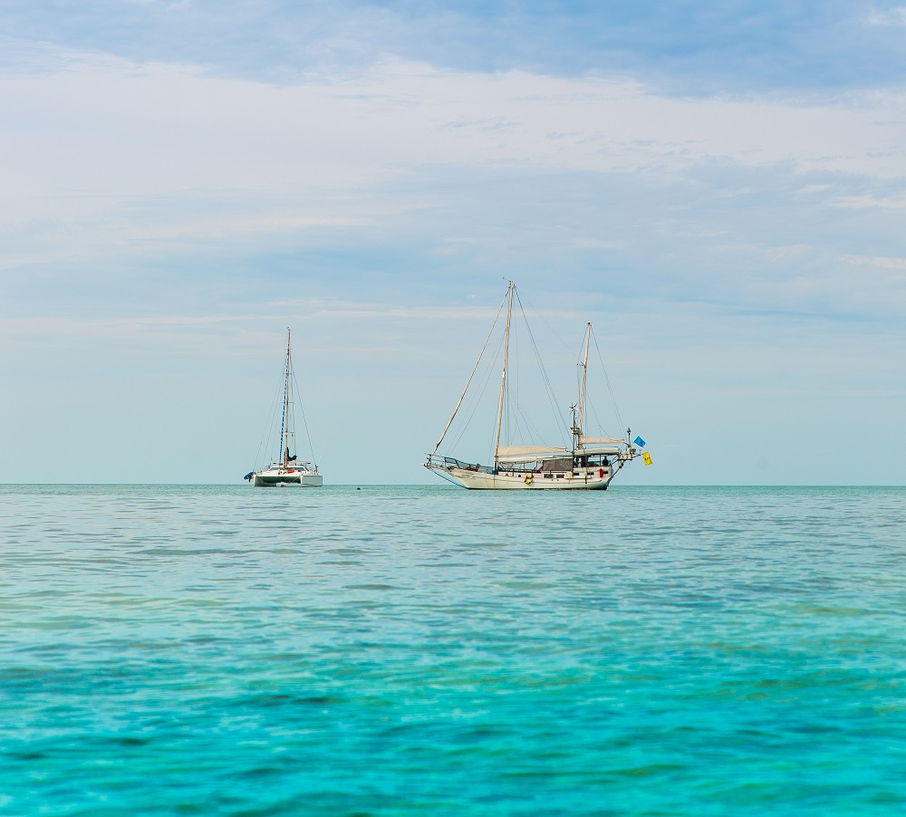

<figure>

<figcaption>

_Different Boats, Same Destination!_

</figcaption>

</figure>

## **Introduction**

FIRE-Financial Independence Retire Early, we talked about it [here](https://happypathfire.com/start-here/). In summary, one is supposed to have achieved FIRE when 4% of FIRE portfolio (A portfolio of Stocks and Bonds invested in low cost Funds) is equal to the Annual Expenses. Or in much more simpler terms, when the value of the FIRE portfolio is equal to 25 times the Annual Expenses.

For example, if the expected annual expense during retirement is 40,000$ then the value of FIRE portfolio required to FIRE is 25 x 40,000$ = 1 Million$s.  

## **Fat FIRE**

fFIRE - Fat FIRE does not have a formal definition, but, in general, achieving FIRE with a ‘higher’ annual expense during retirement is referred to as Fat FIRE. 

This of course implies that the FIRE portfolio to achieve Fat FIRE is bigger than just FIRE. 

For example, if one wants to be able to live a luxurious retired life which amounts to about 120,000$ of annual expenses, then the value of FIRE portfolio required to FIRE is 25 x 120,000$ = 3 Million$s.  

There is another type of fFIRE where one does not choose a luxurious retired life but chooses a life of _Extreme Financial Stability and Safety_. 

This is achieved by applying a withdrawal rate that is less than 4% on the FIRE portfolio. The 4% rule implies that a portfolio of Stocks and Bonds survives over a period of 30 years with 99% probability. 

The 4% is not set in stone. It is just a suggested optimal number for retirement. If the withdrawal rate is changed keeping the period(30 years) constant then the survival probability over that period changes. If the survival probability is fixed while we tweak the withdrawal rate then the period over which the portfolio survives changes. 

In general fFIRE  with a safety preference over luxury involves a lower withdrawal rate, which increases the probability of survival and the period over which the portfolio survives. 

It is highly likely that the portfolio survives beyond the lifetime of the fFIREd person which may be ideal if one wants to leave behind assets for family as inheritance. 

For example, if the withdrawal rate is chosen to be 2% with an annual expense of 60,000$, then the value of the FIRE portfolio required to fFIRE is 50 X 60,000$ = 3 Million$s.  

Note that with this withdrawal rate the portfolio survives longer than the case where one withdrew 120,000$s. A rough estimate is at least 50 years with a 99% probability.

The choice of the withdrawal rate depends on the individual circumstances (I hope to write a follow-up article with a deep-dive into all the scenarios involved at some time in the future). 

You might have noticed the size of the FIRE portfolio required to fFIRE which is quite high for most of us. This brings us to the more interesting aspect of FIRE - Lean FIRE.   

## **Lean FIRE**

lFIRE - Lean FIRE is my favourite type of FIRE for three main reasons:

1. Achievable - This is something that most of us can achieve regardless of where and when we start in life
2. Boosts Creativity - I believe creativity is a consequence of problem solving under constraints. lFIRE boosts creativity
3. Increases Responsibility - I believe people who achieve and maintain lFIRE are more responsible towards their families and the environment

I will explain the reasons in detail below through first-hand experiences, but first, let us define what lFIRE is. 

lFIRE is an approach to FIRE where one reduces the annual expenses during the retired life so that the size of the FIRE portfolio required is smaller. 

For example, with an annual expense of 15,000$ the size of the FIRE portfolio required to FIRE is 25 X 15,000$ = 375,000$.  

15,000$ of annual expenses is a low number but have used it for the purpose of illustration only. However, this ‘low’ number can be the actual living expenses in a LCOL (Lower Cost Of Living) geography (India, Philippines, Colombia etc.).

The main benefit of lFIRE is that a smaller sized portfolio can be achieved by most people in a shorter time-frame. On a personal note, I am on track to achieve lFIRE in a LCOL area. I currently live in a in a relatively HCOL High Cost Of Living area with a very average salary.

I started off with negative networth due to student debts. Through aggressive saving and interest rate shopping, I was able to pay off my debts in 1.5 years and am currently in year 4 of my 5 year goal to achieve lFIRE. 

I am sharing my personal experience to inspire and assure you that it is very much achievable!

The goal of lFIRE boosts creativity in so many ways. It made me a better shopper in every market. Using price match guarantee while grocery shopping, Credit Card points game to fly for free, Improved cooking skills etc. 

When throwing money at problems is not the first solution that comes to mind then it pushes us to become more creative and skilled at doing things, fixing stuff etc.

These skills are assets that not only help us to save towards the FIRE portfolio but also to keep costs low in the post retired life.

I believe, becoming a more responsible person is a side effect rather than a direct benefit of pursuing FIRE in general and more so in the pursuit of lFIRE. 

Buying less stuff, reusing and repurposing stuff, fixing stuff, staying healthy etc. all of these help achieve lFIRE but also leads to a much lower Carbon Footprint as a consequence. 

For example, the manufacturing process of an average car results in close to 6 Tonnes of CO2 emissions and the car releases about 20 Tonnes of CO2 during its lifetime. Not owning a car and using public transport drastically reduces costs and the carbon footprint by several tonnes!

## **Conclusion**

I believe, lFIRE, FIRE, fFIRE are not three different goals but more like stages. 

Think of it like this, imagine you are shipwrecked at sea and you are almost drowning. You don't know where you are or where the shore is.

Then, luckily a piece of drift-wood passes by. You hang on to it, that is lFIRE. You then relax a bit, catch your breath and look around. You see the outline of the shore far-way. You can reach it but it won't be easy. You need focused effort and discipline. 

While you are working your way towards the shore you find a small life-boat. This is FIRE. You are highly certain that you will not have to get into the water again which allows you to enjoy the scenery around you and relax and even enjoy.

While you are rowing to the shore in your life-boat you come across a 100ft Yacht with fully-loaded service staff and all the latest toys. Now, that’s fFIRE.  
_All of them get you to the shore the differences are mostly style or Life-style._
