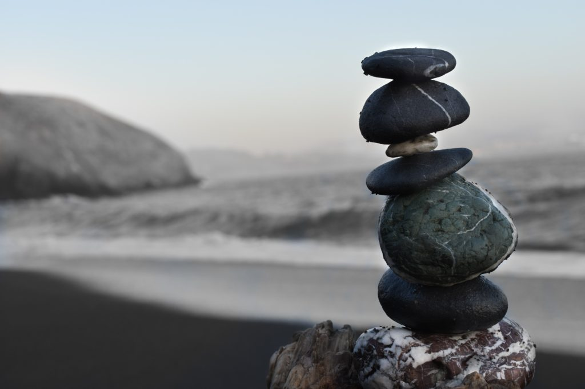

<figure>

<figcaption>

Zen State - Photo by [Colton Sturgeon](https://unsplash.com/@coltonsturgeon?utm_source=unsplash&utm_medium=referral&utm_content=creditCopyText) on [Unsplash](/s/photos/zen?utm_source=unsplash&utm_medium=referral&utm_content=creditCopyText)

</figcaption>

</figure>

_Disclaimer - the most important disclaimer is the fact that I am not Enlightenment by any definition and neither am I anywhere along the path striving for it. If anything I might be moving away from Enlightenment in the pursuit of Financial Independence. I hope to practice and consciously investigate these concepts after ensuring Financial security for me and my dependents._

_Next, all the ideas presented here are not my own, these are based on the books I have read and podcasts I have listened to over the course of several years, references are at the end of the article. I have tried to provide links to the sources wherever possible. In the rare instance where I do present my ideas, I provide the requisite emphasis to make the distinction._

# My presumptions about Enlightenment

Having been born a Hindu in India, Enlightenment or Nirvana has always been a part of the cultural fabric. Most Hindus know the word ‘Enlightenment’ in its various forms, Ex: Nirvana, Kaivalya, Moksha, Mukthi etc. These words are so deeply ingrained into the culture that nobody bothers to question or try to understand the real meaning of the word. All these words are used interchangeably but now I realise these are very technical words with precise meanings.

People associate some meaning to words, even if the meaning is not accurate. I too had some presumptions about the word called Enlightenment. These were my presumptions about Enlightenment until quite recently. 

I thought Enlightenment was a Super Power. Once someone attains it, they become God. They know everything about everything and everyone. They know the past, present and the future. Can manifest objects, people, entire worlds. Can levitate, travel out of body at the speed of imagination giving them omnipresence. Even if their body dies, _they_ don’t have an end called death as they can continue to live in the spirit body.

They are always happy and if something causes unhappiness they can just change it so that they are happy. I thought an Enlightened person was way stronger than Manhattan Man!

# Learning about Enlightenment

In 2011, about a decade ago, I had the opportunity to attend a 10-day Vipassana retreat run by a charitable organization founded by S.N. Goenka. Although the principles are based in Buddhism the actual retreat is secular in every sense.

I will save the details of my experience for another article. In summary, it was a truly life changing experience. It was during the retreat and the daily discourses is when I started to really care about Enlightenment. It was also during this retreat that I had the first in a series of disillusionments (and [mild disappointments](https://blogs.scientificamerican.com/cross-check/what-does-it-feel-like-to-be-enlightened/)) about what Enlightenment really is.

Over the course of the decade my practice (not worth using the word practice) is more of a sporadic and an opportunistic approach. I tend to meditate when life gets overwhelming but slouch off when life is easy. 

Only one thing that has been constant is my interest in learning about what Enlightenment really is. It is a casual interest. I am not an academic researcher or an expert practitioner in any sense. 

# Enlightenment - Basic Definition

> Enlightenment is the realization that there is no ‘thing’ called self, this realization permanently changes one’s perspective of experienced reality
> 
> \-From, the Science of Enlightenment, Shinzen Young

The definition is the most basic possible without any sort of nuance or further elaboration. The definition in this form states that the ‘self’ or the ego that we think of as a thing i.e. an object does not exist as a noun. When this feeling or the idea of the self is examined deeply one finds that it is ever-changing and not constant. This realized experience creates this change in perspective.

I have to caution you very early on, it may seem like Enlightenment means ‘Ego Death’ and losing your personality. To understand, the emphasis is on ‘thing’ i.e. self as a noun or an object does not exist, but self is now understood as a verb or an activity. 

So, there is a perspective shift in terms of how reality is experienced as something dynamic and far richer than a seemingly static reality.

I do have to re-emphasize on ‘Realization’. I know this definition, now you know too but this does not mean that I have realized. Just mere knowing does not mean that my perspective has changed. A simple analogy is knowing about a new flavor of ice-cream, sure there are definitions, descriptions, reviews of the flavor that I can read about but the only way to realize the flavor of the ice-cream is by actually eating it.

Now that we have the basics of Enlightenment let me get into the details of what I have learnt about Enlightenment so far. 

# Spontaneous Enlightenment

This is the first topic that I would like to talk about. It is not only fascinating but also changed my perspective on Enlightenment the most. 

There is nothing much for me to define here. People just go about their everyday lives and Enlightenment happens. What is REALLY important to note is that once this happens, no matter if they know the word or the concept called Enlightenment, their whole life and being changes. 

Here are some examples of what , **according to me**, are instances of Spontaneous Enlightenment. Note that none of the people in this example have explicitly claimed to be enlightened but based on my understanding of what Enlightenment is, I believe these are valid examples of the phenomenon of Spontaneous Enlightenment.

## Vemana

Vemana was an enlightened saint who lived in the south of India in the region of Andhra Pradesh about five-hundred years ago. His story of spontaneous Enlightenment goes like this. 

Vemana lives with his elder brother and his sister-in-law. Vemana, who had no parents adores them like his own parents, especially his sister-in-law whom he sees as a mother figure.

In his youth was wayward and indulged in the pleasures of the body. He used to patronize prostitutes and spent days at the whore house. He spent all his inheritance and allowances on the prostitutes. One day, a prostitute fancies the diamond nose-stud of his sister-in-law.

Vemana goes home and asks his sister-in-law for the nose-stud. He also reveals to her the reason for the ask. The sister-in-law wants to teach him some sort of a lesson and agrees to give it to Vemana upon one condition. 

She would go fully naked and bend-over, Vemana has to take the nose-stud from behind. As shocking as this is, Vemana agrees. But, just as he sees his naked sister-in-law from behind and attempts to take the nose-stud, he has a bolt of clarity (triggered by traumatic levels of guilt and shame perhaps). 

A spontaneous Enlightenment! He leaves the house, he leaves the prostitute and lives as a recluse composing poetry that is beautiful beyond measure. He used to spontaneously recite them and his friend scribed them and preserved them for posterity.

## Sadguru

This is my understanding of an [anecdote recollected by Sadhguru](https://www.youtube.com/watch?v=kbifaZdTfhY). Jaggi Vasudev is a modern day mystic from the south of India. During his twenties he used to run a construction business with a partner in the city of Mysore. 

Mysore is a charming former capital of the state of Karnataka. The city has a hillridge called Chamundi  Hills on the outskirts that offers great views of the landscape from the top. Many young people go there for a drive or smoke up etc. One day Vasudev had some time on his hands and decided to take a break and drove his bike to the top of the Chamundi Hills. 

He drove up and sat on a rock overlooking the city taking in the views. In an instant he had the Enlightenment experience. He thought he was there for a few minutes but several hours had passed. His shirt was wet with tears. After that experience he quit everything and followed the mystical path. He now runs a global organization called [Isha](https://isha.sadhguru.org/ca/en)

## Haruki Murakami

Haruki Murakami is one of my most favorite authors. He mostly writes fiction and the genre is magical-realism. The worlds that he creates in his books are mystical in nature and taps into a vast reserve of imagination that is almost superhuman. Haruki lives a life that is reclusive. Given his global fame he still keeps his life private and simple. 

The most enchanting part of his writing is the way he can capture the internal voice of his characters in such fine detail. It is as if he were to have actually lived their lives.

Haruki was not always a writer. He was in fact running a Jazz Cafe with his wife in tokyo. One day he was at a baseball game and he heard the crack of the bat against the base-ball, one of those perfect clean hits. In that instant, Haruki recollects he had  ‘an overwhelming warm feeling’ that instantly made him decide to write. He went straight home and sat down to write for ten months and sent a single copy to a single literature contest and won the first prize. The rest is history.

These are only a few examples and when I look back I feel that there are more people who are enlightened or have had an Enlightenment experience than I actually realized. Regular everyday people who have had moments of such intense clarity that their entire being is transformed such that they live inspired and fulfilling lives regardless of what they do and how much they have.

Spontaneous Enlightenment is a phenomenon that implies that Enlightenment is not exclusive to monks who have given up material possessions and constantly strive towards this goal. The spontaneity means that Enlightenment is a universal feature of  human life. 

Another conclusion that I can draw is simply mathematical. The older one is , the more likely that they are enlightened. In Fact, there are several instances of death-bed realizations and conversions.  It is like playing the lottery or the slot machine. The longer you keep playing, the more likely it is that you will win at least once.

In this sense Enlightenment is a type of self-awareness taken to the limit. This is the crux of formal Enlightenment practices like Buddhist Meditation.

# Global Enlightenment

If Enlightenment can be spontaneous then it has to be global. There is evidence that it is truly the case. Sinzen Young in his book, the science of Enlightenment, notes this global phenomenon. 

Enlightenment as  a concept is truly global cutting across religions, countries and cultures. In his book, he speculates that the Shamistic rituals often put people into an altered state of consciousness which could trigger an Enlightenment experience. Once someone gets enlightened in a tribe they are treated as an elder, the wise one, Shaman etc.

There are several accounts of such Enlightenment experiences in several cultures through time. Be it Christian Mysticism, the Sufi Order, the Tao, Zen, Native Indians etc. the only difference being the terminology and the stories built around the experience to help integrate it to the social circumstances of the individual. 

Before I go any further, I have to clarify the difference between having a mystical experience and an Enlightenment experience. A mystical experience is a personal subjective experience through an altered state of mind. It can be deeply meaningful or traumatic to the person experiencing it. In either case the experience is temporary with no significant change to the life one is leading.

An Enlightenment experience on the other hand is subjective but the intensity is far greater. Makes a permanent shift in perspective and dramatically alters the life of the person that experiences it.

# Formal Methods - Meditation

I think the biggest contribution of India to the world is Zero and Buddhism. More about zero later, but for now, Buddhism.

Buddhist meditation practices increase the probability of Enlightenment. It is almost like a science or I should say proto-science.

It is like making yoghurt. Cultures around the world have made yoghurt successfully over several millennia. There is a specific recipe that one has to follow and your probability of converting milk to yoghurt is high. This works even if you don’t know how milk becomes yoghurt or how each of the steps plays a part in its creation.

Buddhist meditation practices are similarly instructional but lack the real hard science behind the relationship of the steps or even a formal definition or some sort of a test for describing what is it that one is working so hard towards, i.e Enlightenment.

# Other Non-formal Methods

Before diving into the formal methods more deeply I would like to mention a few non-formal methods. There are several but the one that I find interesting is the practice of ‘Karma Yoga’ or basically ‘doing a good job’.

Top level performers in any sport attain a state popularly known as the Flow state. In this state there is **no doer** and **no object**. There is just **the doing**. (just do it!)

In Karma yoga, the belief is that as one practices to be in such a flow state through one’s profession regardless of what it might be, one can dramatically increase the probability of attaining Enlightenment.

We can notice this in top performers like Sachin Tendulkar, Michael Jordan etc. Not only in sports but everyday people experience such states. Artisans, programmers, actors, just everyday people.

When someone is working in this state even an outside observer can notice this. This does not require any special skill.

I was able to witness one such incident. I had a long walk around the city of Bangkok and was really tired towards the end of the day and I wanted to get a foot massage. I was cranky for some reason and was annoyed that I had to wait for long for my turn at the massage shop. 

I was arguing with the front desk when the owner of the massage shop, an older woman, came to the front desk and offered to provide me with a foot massage. I agreed. The instant she started the massage I could feel it. She entered into a state of flow and I could not help feeling guilty and shame. Her every move was completely intentional, focused and present.  It was by far the best massage I have received. Towards the end of it I was filled with only gratitude which I can feel even today years later.

# Buddhist Meditation Practice

When you look at the Buddhist Meditation practice with a broad lens then it boils down to very simple instructions. Investigate your subjective reality with a high degree of concentration(focus) and equanimity (chill) and you will eventually  ‘get it’ .

All the diverse techniques like observing breath, body sensation, mindfulness, thought noting etc are just that, techniques that are taught to help concentrate and be equanimous.

# Enlightenment - Slightly Advanced Definition

> “Do or Do Not, there is no Try”
> 
> \-_Yoda_

Most of what I am going to describe is based on the Buddhist definitions or descriptions of Enlightenment. The main reason being that this is the best ‘science’ we have presently on this subject. 

> “Enlightenment is the goal of life. All sentient beings are moving towards it. Every journey is different but the destination is the same.”

Let’s begin with a simple example - when at work one might be a serious and hard-nosed worker, but as soon as one gets home and meets his pet dog , he loses his mind and plays with it. 

This changes once again when this person is with his friends. In fact the personality changes depending on which friend-circle one is in. If one is with childhood friends he might let his hair down a lot more than with more recent friends.

Scientifically speaking this is referred to as behavior. Which then begets the question, ‘then what is the personality that is the most authentic and true  and not just behaviour?’

The Buddhist version of the Self - When one has sufficiently deep concentration and equanimity. One encounters the realization that the self-referential loop that we vaguely call the self is ever changing. It is in a constant state of flux. It is more like a collection of constantly evolving sub-personalities that emerge with the interaction with the outside world.

The buddhist techniques suggest looking at each of these personalities and their associated thoughts and emotions as an observer. Through this iterative observation all the identities that we assumed to be the self do not feel like they are anymore.

Enlightenment is the leap that one makes to become a pure or true observer, i.e. non-duality between a subject and the object. Being able to just experience with no understanding or bias.

Shinzen Young, provides yet another way to look at the Enlightenment state. He calls it the ‘Figure Ground Reversal’. In simple terms, Before Enlightenment, one experiences the transient nature of the self within the concrete mind-body. After Enlightenment one experiences transient mind-body within the concrete background of impermanence. This self-identification with impermanence dramatically changes one’s perspective permanently.

He further describes this as an active choice, in the sense that most everyday experience is had within the ‘prison’ of mind-body but after Enlightenment one has a ‘choice’ to either be in a state of concrete mind-body i.e. ‘personhood’ or be in the Enlightened state of ‘non-personhood’

# Enlightenment is Zero

Enlightenment is a rough word, Sanskrit has a rich set of vocabulary to describe these states precisely. One such word is ‘NIRVANA’.

Nirvana literally means extinguishing or collapsing. A collapsing into nothingness, featureless ‘space’. True Zero.

Everything comes from Zero and everything goes back to it. This may seem too esoteric but this is also the [current view of Physics](https://en.wikipedia.org/wiki/A_Universe_from_Nothing). Nothing breaks down into matter and antimatter and through expansion and contraction create whole universes, planets and life itself. This state is not permanent but collapses to nothing again.

Zero is the true state of nature and Enlightenment is ‘experiencing Zero’ (in quotes because there is no observer in Zero so no experiencing in the normal sense)  

It only becomes an experience when one recollects after the self emerges. And when the self emerges and recollects it , the pure experience instantly becomes biased and imperfect.

# After Enlightenment?

> “Before Enlightenment Chop wood, carry water. After Enlightenment Chop wood, carry water”
> 
> \-Zen Saying

Exploring what happens after Enlightenment can offer clues to what it is. In the book ‘After the Ecstacy, the laundry’ by Jack Kornfield offers a glimpse into what life is like after Enlightenment. Just as the title indicates nothing much changes. One still needs to ‘do’ as in apply the insights and the changed perspectives in real life. It makes Enlightenment a skill. The Buddhist doctrine lays a significant emphasis on the ‘skill’ aspect of Enlightened living.

> “There are no Enlightened People, there is only Enlightened Activity”
> 
> **\- Suzuki Roshi (Zen Master)**

Enlightened State is a state afterall. Like all states it has certain parameters. Even if the parameters are vaguely defined in an objective sense. These parameters map to a Zero or Enlightenment State.

Enlightened people do have personalities, in fact their personalities are more expressive than normal. It is free-flowing and un-repressed. The difference being that they are not holding on to this as the only anchor. There is freedom in having the choice to not identify with the personality. This is the context in which another sanskrit word makes more sense, ‘mukthi’ or liberation.

Enlightenment makes people less selfish, less resentful and less self-centered. This small change can trigger a sense of ‘universal compassion’  and greater empathy for the suffering of others. This post-Enlightenment state is referred to as ‘inter-being’ by Thich nhat hanh, a renowned Zen Monk.

In the post Enlightened state every moment can be filled with rich and deep meaning. Shinzen Young recounts such an experience when he smoked hashish and ate a brownie during his younger years. He now experiences it all the time in every moment, minus the hashish. 

> “Hell is where everything is absurd; Heaven is where everything is deeply meaningful”

# Enlightenment Tech

Now that Enlightenment has been somewhat understood one can speculate if it is possible to ‘science it’. Basically improve upon the buddhist meditation techniques to create a procedure that can improve the probability and the reach of Enlightenment to the masses.

I believe that it is possible indeed. Shinzen Young opines that such a procedure should be possible in the near future.

## Athymhormia

This disorder has some clues toward what regions of the brain such procedures can be applied to. In this disorder, the patient [has no conscious thoughts](https://en.wikipedia.org/wiki/Athymhormic_syndrome). They are completely normal physically. With no self-generated conscious thoughts the person has no motivation to do anything. 

But, if there is any external stimulus they react to it in a very normal way. There are numerous examples like the case of [Drowning of Mr M](https://www.scientificamerican.com/article/drowning-mr-m/). Mr M was swimming and at an instant stopped swimming. He had no thought or the motivation to swim anymore. He was completely aware of what was happening and knew he was drowning and he knew he must swim but he was not able to generate a motivation or a thought towards doing so. This is not depression as the patients have neither positive nor negative thoughts.

Aspects of this state correlate with the state of Enlightenment and further detailed studies can shed more light on Enlightenment.

# End Notes

I started my journey to understand Enlightenment with high hopes but as I learnt more about it I was disappointed as it was not as ‘cool’ as I had expected it to be. Enlightenment does not offer answers to some of the hard questions like ‘what is consciousness?’ , ‘Why is there something rather than nothing?’ etc.

All it does is to provide a perspective that expands one’s appreciation of THIS. The infinite richness of this very moment as I type these words. This very moment as you read these words. It removes the inherent dissatisfaction that is the aftertaste of grasping and aversion for sense objects. It creates the conditions to evolve our maturity over several orders of magnitude and become a more productive member of the world.

Over time, I have come to realize that these benefits are more useful than having super-powers. This ordinary nature of Enlightenment is also motivating in the sense that it means that everyone can indeed attain Enlightenment through formal, semi-formal , accidental  or future tech enabled methods. This means that it is possible for human civilization to evolve further into an enlightened society with lesser violence and more peace. This is a hopeful future to look forward to!

References:

The Science of Enlightenment: How Meditation Works: _Shinzen Young_

After the Ecstasy, the Laundry: _Jack Kornfield_

Various books by : _Thích Nhất Hạnh_

An Experience of Enlightenment: _Courtois, Flora_

Mindfulness in Plain English : Henepola Gunaratana

Becoming Enlightened : HH Dalai Lama

Podcasts : Daniel Ingram, Leigh Brasington, Naval Ravikant
