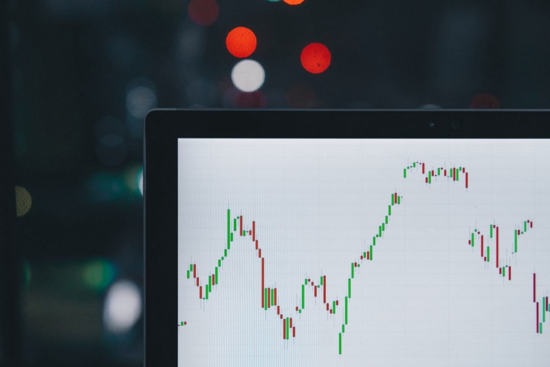

<figure>

<figcaption>

A Technical Chart of Candlesticks of unknown period

</figcaption>

</figure>

_This article is a review of the book_ **_‘What I learned losing a Million Dollars’_** _by Jim Paul and Brendan Moynihan. The stage for the book is set in the 1970s-80s. The review style is more personal, in the sense that it summarizes my thoughts on this topic from my days of being an aggressive trader. It does not strictly follow a standard ‘_**_review_**_’ format. Apologies to the reader if you had expected a faithful review of the book._

The book is divided into 3 parts or stages as I see it. In the first part the author details his life events right from his early childhood. The main focus is on how his childhood experiences ingrained within him the need to make money as an end rather than a means or a side-effect of pursuing something. This section is very biographical and is an easy read. I did not think much of it when I was going through it, but, after finishing the entire book I can now relate to the author in some sense. I believe I am not the only worshiper in the temple of money. The modern world measures success and failure in terms of money. Every human venture and action faces the downer question of ‘Monetization’ at some point or the other. This is the reality, for better or for worse.

In summary, this section depicts the author’s journey from _rags to riches_ through trading in commodities. It ends with a large trade in Soybean oil derivatives that goes well at first but later blows-up in the face of the author leading to the Million Dollar loss, loss of membership to the Chicago Exchange and Job loss.

The second section of the book is what peaked my attention. This section starts with the author narrating the events in his personal life at the time he was carrying the Soybean oil trade position on his books in spite of losing money regularly on a mark-to-market basis. His father is diagnosed with terminal Cancer and his mother commits suicide unwilling to process the shock. The author puts on a bold face and acts as if he is not broke to save his family from all the stress. The author also contemplates suicide at one point of time.

This, was the turning point in the life of the author, this is when he starts to question the rationale of all his trading decisions and begins the quest to understand trading from scratch. His preliminary research focus was to answer the question **_‘How to make money in the markets?’_** . This lead to contradictory answers. _Fundamentalists_ laugh at _Chartists (Technical analysts)_and vice-versa. There is no consensus even within the _Fundamentalists_ and _Chartists_. Every successful trader has an approach that works for him/her. To the author’s dismay the exact opposite approach also leads to success for another trader. Something was amiss , things did not add up and this is when the author has a moment of insight — **_‘ There are many ways to make money in the market but only a few ways to lose money’_**

The rest of second section goes into the details of the author’s study into the nature of market losses and the third section comes up with some high level recommendations.

Below is a list of the key take-aways from the book which I found to be interesting:

## _**#1 Decide who you are in the market?**_

According to the author the market participants can be one of Speculators, Bettors, Gamblers. Speculators are further divided into Traders, Investors and Hedgers. The basis for this division is primarily the duration of a transaction.

Speculators have a market view based on their own analysis (technical or fundamental). They act based on this view by taking on a market position.

Bettors take market positions based on their guess/gut-feel etc. Their primary objective is to be right and make money as a consequence.

Gamblers take market positions merely for entertainment purposes.

Personally, I think I did not know who I was in the market. Looking back, I believe I was a bettor who thought of himself as a trader. After going through several expensive lessons taught by the market I now think of myself as a _Speculator-Investor_.

## **_#2 Make a plan and stick to it_**

This is easier said than done. Many a times my trades that did not work out became long-term investments which meant that I lost money on them over a longer time horizon. I did not respect my own rules for putting in stop-losses before entering a position. One approach that the author suggests is interesting.

> **Start off from the price you think you would not want a position, add the $s you are willing to lose and then calculate the price at which you have to enter the position.**

In hindsight, it all makes sense now. Preventing blow-outs that takes one completely out of the market is something a trader has to prioritize. Calculating exposure and managing risk is vital for individual and prop-traders.

## **_#3 Do not internalize trading outcomes_**

I believe this is is the single biggest learning from the book. The author uses the model used to describe the emotional states of patients diagnosed with terminal illnesses. The five stages are Denial, Anger, Bargaining, Depression and Acceptance.

**Denial** — If a trade goes against my own expectation I do not update my opinion, rather I live in denial. I seek out information that confirms my point of view ( Confirmation Bias).

**Anger** — Once the fact is no longer undeniable, then it leads to anger. Angry with the broker, the system, stupid crowds etc.

**Bargaining** — This is the phase where I would be able to see the futility of anger and get down to bargaining. One classic situation is when I say to myself, ‘If this underlying goes up by x$s I will square off my position’, but then once it does go up,I would not stick to this bargain and go back to denial. A vicious cycle.

**Depression** — The emotional roller-coaster caused by internalizing trading outcomes comes at an emotional cost. It can vary from a mild feeling of self-disappointment to complete self-loathing.

**Acceptance** — This is the phase when the position is no longer sustainable and the system takes action. It would usually be the case when the broker gives me a margin call or auto-squares off my position.

In any losing trade the sooner one gets to the acceptance the better. Having a pre-determined stop-loss allows a trader to know before hand how much they are willing to lose and not lose sleep over their positions.

In summary, we can be very susceptible to internalizing trading outcomes. When the market moves in our favor, one would feel like a genius. The other side of the coin is that when the market goes against us then one can feel stupid and worthless. It takes a lot of discipline to stay neutral and unwaveringly follow the rules that one has set-forth. It is not acceptable to break the rules even when it eventually results in profit as it only postpones the disaster to a later period.

The author ends the book on a slightly relaxed note where he recommends one to do what feels good and have a very low tolerance for pain in the context of trading. I think that is a sane and healthy advice and completely agree with it.

_Disclosure : I was a very aggressive derivatives trader on the Indian Capital markets. I went through several cycles of boom and bust. Things have calmed down recently and I mostly do index investing primarily in the US, Canadian markets._
