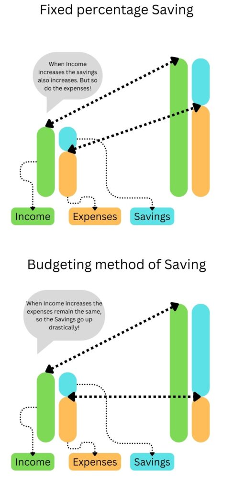

Over the course of time in my conversations with fellow [FIRE (Financial Independence Retire Early)](https://happypathfire.com/start-here/) aspirants, this is a very common topic - '_What percentage of my income should I be saving?_'

The answer to this question varies a lot. Some extreme savers recommend saving as much as 50% of your take-home income. While some are more liberal recommend saving as low as 10% of your take-home income. 

(Here take-home income is the after tax income but before any contributions to corporate or government savings plans like 401K, IRA etc.)

So, who is right? What is the right percentage?

## You are asking the wrong question

In my opinion the question of _'What percentage of income needs to be saved?'_ is the wrong question. So all answers in the form of any percentage are wrong.

Here is the reason why?

### Lifestyle creep

A percentage of income to be saved is also an assertion that the remaining percentage of income will be spent. As income increases, your savings in dollar terms go up but so do your expenses. 

This is popularly known as 'lifestyle creep'. It is a one way street. As your expenses go up you adapt to a lifestyle of higher expenses and if for some reason your income comes down then it is really hard to cut down on the dollar amount of your expenses. the victim in this situation is going to be your savings.

#### Here is an example using some dollar figures to make it clearer:

Assume that your monthly take-home income is currently 5000$s. Your goal is to save 30% of your take-home income. This is 1500$s a month saved. This means the remaining 3500$s are living expenses. 

Over the course of the next few years your income rises and your take-home monthly income is 10,000$s. If you continue to follow the fixed percentage of income saving path then you save 30% of your income or 3000$s. Your savings in dollar amounts has doubled. However, your living expenses which were 3500$s have now also doubled to 7000$s!!!

### Demotivating

Another reason for not following a fixed percentage of savings method is the demotivating effect.

When you are early in your career your income will be low. Sometimes life situations can go through ups and downs and for some reason your income could come down from a previous high.

In such situations, having a mindset of saving a fixed percentage of income can be highly demotivating. 

A new grad with a starting monthly take-home salary of 2000$s would be hard-pressed to save 30% of her income. With rent and bills, she can barely make ends meet. Looking at social media forums where people often flaunt their savings rates of 30% or higher can lead to demotivation.

## The right approach

I think the right approach is **not having any sort of fixed percentage for saving**. Instead follow the budgeting method. Design your lifestyle in such a way that suits you. Something that is not extravagant nor self-depriving. 

### Lifestyle design

What does such a lifestyle design entail? 

It is mostly the big three expenses - Housing, Food, and transport. Once you have made choices on these three aspects of life, start allocating dollar amounts to these expenses, NOT percentages.

The total expenses of your lifestyle are your budgeted expenses in dollar mounts. 

Now, everything that remains can be saved.

Let's look at how this applies using the dollar amounts from previous examples.

In the scenario where your take-home income is 5000$s you were saving 1500$s(30% of your income) and spending 3500$s. Assume that your budgeted expenses amount is 3500$s. WHen your income rises to 10,000$s , following the budgeting method, you continue to spend only 3500$s as before but now, you will be saving 6500$s instead of saving only 3000$s. This is more than twice that of the savings in the percentage method!

the same applies in the case of the new-grad too. Her frugal yet comfortable lifestyle costs her 1800$s a month. With a take-home income of 2000$s , she is able to only save 200$s a month(10% of her income) and that is ok.

She must focus on increasing her income rather than trying to save more through cutting the basic needs of life.

## Summary

Targeting a specific percentage of income as a savings rate is flawed. Income keeps changing over a lifetime and so do expenses. Instead of chasing some kind of a fixed savings rate it is better to have budgeted expenses that **reflect your personal life stage and situation**. This allows you to maximize your savings at the right time while also allowing you to stay motivated and **happy** on the long **path** of achieving **FIRE**.
