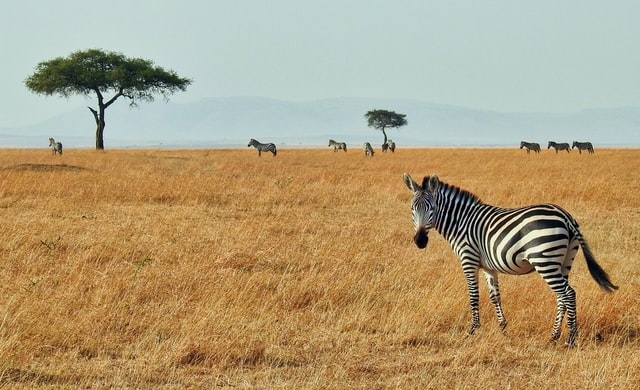

_Although I mostly write about Finance on this website, I feel this is one ‘apparent’ exception, where I write about Human Behavioral Psychology. I call this exception ‘apparent’ because I believe every long-term personal project depends a lot on your Mental fortitude as much as other external factors. Understanding yourself can be a powerful weapon in your arsenal to achieve Jaya (Sanskrit for Victory)_

_This monograph is not a review but it is more of a personal reading notes on the book  - ‘ Why Zebras don’t get Ulcers’ by Robert Sapolsky. I had read this book some time ago and I would highly recommend it to anyone who wants to understand human behaviour and through it understand oneself. I used_ [_this lecture_](https://youtu.be/D9H9qTdserM) _on the book as a go-to material to reference some of the concepts in the book. The lecture is from the author himself and I would recommend it to someone who is short on time to read the book._ 

## Zebra in the Savanna

<figure>

<figcaption>

Zebras in the Savanna - Photo by [Ron Dauphin](https://unsplash.com/@rondomondo?utm_source=unsplash&utm_medium=referral&utm_content=creditCopyText) on [Unsplash](https://unsplash.com/s/photos/zebras?utm_source=unsplash&utm_medium=referral&utm_content=creditCopyText)

</figcaption>

</figure>

Imagine you are a Zebra in the African Savanna. You are a part of a large herd of Zebras and you spend your days grazing and continuously moving in search of greener pastures. But, your herd is not alone. There is a pride of Lions that live off of your herd. They too follow the herd from a distance and keep a close eye on both the herd and other predators that want to have a piece of the herd.

As a Zebra, you do not worry about the presence of the Lions day-in and day-out. Yes, the threat is real, it is right there in the grass but you could care less. In fact everyone in the herd couldn't be bothered about it. 

Of course, once in a while the Lions do come down upon the herd and at that time there is great panic. The important point is that the panic only lasts a few minutes after which things settle down to the usual way. 

On the contrary, if you were a human in a similar situation things would be vastly different. The difference is mostly because of a special faculty of the mind that differentiates humans from the animal kingdom. Our ability to think, visualize, imagine, create etc. These abilities are a super power that has helped humans to dominate the planet but there is a price to pay for these abilities as well. 

Imagine as a human if you were in a similar situation as the zebra, you would have **_worried_** about the presence of the pride of Lions. You would have imagined all sorts of dangers they posed to you and your friends and family. Visualizing in how many different ways you might get mauled by those Lions and how you might escape. You would also imagine how miserable you would feel and react if the Lions killed your near and dear. You would also scheme on using the Lions as a means to get rid of your enemies. 

This is the essence of the book. The human mind makes us suffer and die millions of times in mental imagination/simulations before the actual event comes to pass. Our mind-body system hardly differentiates between the actual and imagined attach by those Lions. The Zebra on the other hand, worries about the Lion only when it is being chased.

Now that the title and probably the main idea of the book is behind us, let us dig deeper.

## Modern Man, Modern Diseases

Now, imagine the time is a mere century ago, the early 1900s. What was the major cause of death? You might be surprised to know that the biggest killers were ChildBirth, Flu and infectious diseases.

In fact, Tens of millions more died due to Spanish Flu during WW1 than in the actual war itself!

Zooming back to the present day, what is the biggest killer? Firstly, they are not the same as a century ago. Thanks to advances in medical sciences and development of vaccines and antibiotics, many of the nagging diseases of the past have been almost eradicated from most parts of the world.

Secondly, in place of the old diseases we now have new diseases. The biggest killers of today are Cardio-Vascular diseases (Heart Attacks, Strokes etc.), Cancer, Diabetes, Alzheimer's etc.

The overwhelmingly significant causation factor for these modern diseases is **STRESS**.

## What is Stress?

Thanks to all the new-age wellness movements there is no limit to the distortion to the definition and the remedies to deal with stress. In this scenario it is essential to revert to a more scientific and simple definition of stress.

Here’s one

> ‘Stress is anything that disturbs Homeostasis’

Homeostasis is what we understand and know to be the normal functioning of our mind AND body. I have to re-emphasise that stress is related to both mind AND body. 

It is hard to explain what feeling normal means to others but we ourselves know very well what it feels like. As an aside,  I think the rhetorical question ‘How are you doing?’ is a check-in on your state of homeostasis. 

To better understand the effects of stress on homeostasis let us return to the Savanna. The Lion is chasing down the Zebra. The Zebra’s homeostasis goes offline. The Zebra has to run, which needs energy so the body dumps huge amounts of sugar into the bloodstream. 

The muscles need oxygen so the adrenaline starts pumping increasing the heart rate. 

All long-term projects like Digestion, Sexual processes(ovulation, Sex drive, Testosterone production, erection etc) takes a break as resources are allocated towards survival. The immune system is on high Alert to protect against infections due to injuries. The brain is set to hyper vigilant mode to respond rapidly to external inputs. 

Remember, the Zebra stress response lasts mere minutes. Either the Zebra gets eaten by the Lion or it escapes. In both scenarios the stress for the Zebra ends.

The body’s stress response mechanism is built for such short term bursts. Humans like all mammals are no different. But, modern humans face chronic stress. It does not end in minutes but can last hours, days even years! Parents stress about their kids' success, Spouses stress about each other over relationships etc.

This is the second biggest takeaway from the book.

## Stress induced Ulcers

In the book, Sapolsky talks about the accidental discovery of how stressing rats gave them ulcers. Given our understanding of the fundamental concepts of stress we can now infer the relationship between stress and Ulcers. When the rats (or humans) are stressed, the digestive system goes out of tune. All long-term projects are deprioritized, things like damages to the stomach lining which require constant maintenance given the corrosive environment within the stomach is put off for later. This leads to opportunistic infection by the pylori bacteria leading to Ulcers.

## Short-term Good; Long-term Bad

Stress response, i.e. increased heart rate, high blood glucose etc, is useful. In fact it is an adaptation that helps survival. Imagine a Zebra with a weak heart that cannot pump blood hard enough? It cannot run fast enough and is taken out of the gene pool by the Lions.

Even for humans, the stress response is good, but only in the short-term. But, if exposed to stress for an extended duration then it is extremely bad. In Fact all the causes of death in the modern age that we talked about can be attributed to sustained stress response.

## Stress and Humans

Here is a summary of the effects of stress on Humans, each of this is based on a body of research and I would recommend reading the book for a deeper understanding.

**Cardio Vascular Disease** - Sustained increased blood pressure leads to several forms of heart diseases

**Gastro-Intestinal Diseases** - Shutdown of the gastro-intestinal systems over long durations leads to Ulcers and other kinds of gastro-intestinal diseases

**Adult Onset Diabetes** - Having high blood glucose due to stress over long durations leads to Adult onset diabetes

**Psychogenic Dwarfism** - In young children, stress causes reduced secretion of growth hormones leads to Dwarfism

**Reproductive System, Women** - Women stop ovulating, periods are irregular, sex hormones are unbalanced

**Reproductive System, Men** - Men experience stress induced impotence, premature ejaculation. Erection requires the proper functioning of the parasympathetic nervous system (feelings of relaxation, like the feeling after eating a good meal) but stress excites the sympathetic nervous system which is part of the stress response system

**Immune System** - Sustained long-term stress leads to a suppressed immune system. My conjecture is that this is related to auto-immune diseases

**Brain** - Short term, stress enhances cognition and mood but long term stress response leads to memory loss, disconnection of neural networks, damage to existing neurons in the hippocampus (forming new memories) and expansion of the Amygdala (responsible for higher anxiety and fear)

**Psychological** - Toxic hostility, feeling that everyone is out to get me. Depression, Anxiety, Joyless striving, Low-self esteem,  Anhedonia - no pleasure in any activity etc.

## Coping with Stress

Stress cannot be eliminated but we have to learn to deal with it, also called ‘Coping’. 

Coping with stress is highly complicated. No matter what all the wellness gurus tell us, each person is unique. No one solution fits all. Different people respond to different kinds of stress differently. Some cope better than others, the reasons are mostly found to be psycho-social.

Some of the principles of coping with stress are

**Outlets for Stress** - A punching bag, stress ball, exercise, yelling, swearing etc. all seem to be helpful to cope with stress

**Sense of Control** - Having a sense of control over events and being action oriented can be helpful in coping with stress. Stress about a job interview can be overcome by doing due diligence, preparing methodologically etc, 

**Life is Good** - An outlook or a perception that life is improving in the big picture can help reduce stress. This helps contextualize small triggers as just noise, for example, someone cuts you off in traffic, no need to ruin your entire day because of that 

**Social Support** \- The single biggest resource for helping cope with stress is having strong social support. Having friends and family that you can share your feelings with openly, cultivating meaningful and resilient long-term relationships are the single biggest coping mechanism. The quality of your relationships are more important than the quantity of relationships. So, those thousands of friends and followers on social media do not amount to much.

There are thousands of books that talk about ways to deal with stress. This book is different because it explains what stress is and the effects of stress based on well grounded and well researched principles. This enables you to identify and seek out the techniques that work best for you. 

I wish you the strength to cope well with your Stressors!
